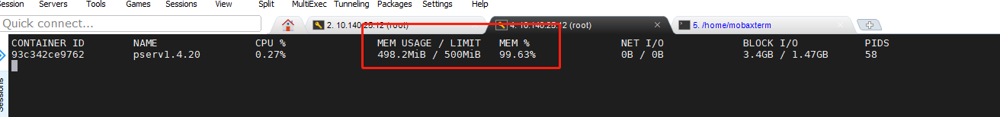

# leak check



## valgrind

[download](https://valgrind.org/downloads/)
[use](https://zhuanlan.zhihu.com/p/75416381)

## leak check with valgrind

```Shell
valgrind --leak-check=full --show-leak-kinds=all --tool=memcheck bin/protector-server -f -c /etc/protector/protector.conf


==952002==
==952002== HEAP SUMMARY:
==952002==     in use at exit: 364,554 bytes in 983 blocks
==952002==   total heap usage: 1,071,487 allocs, 1,070,504 frees, 642,510,809 bytes allocated
==952002==
==952002== 23 bytes in 1 blocks are still reachable in loss record 1 of 41
==952002==    at 0x4C31593: operator new(unsigned long) (vg_replace_malloc.c:344)
==952002==    by 0x5756A0E: void std::__cxx11::basic_string<char, std::char_traits<char>, std::allocator<char> >::_M_construct<char*>(char*, char*, std::forward_iterator_tag) (basic_string.tcc:219)
==952002==    by 0x57C47DA: _M_construct_aux<char*> (basic_string.h:236)
==952002==    by 0x57C47DA: _M_construct<char*> (basic_string.h:255)
==952002==    by 0x57C47DA: basic_string (basic_string.h:440)
==952002==    by 0x57C47DA: pair (stl_pair.h:304)
==952002==    by 0x57C47DA: construct<std::pair<const std::__cxx11::basic_string<char>, std::pair<void const*, int> >, std::pair<const std::__cxx11::basic_string<char, std::char_traits<char>, std::allocator<char> >, std::pair<void const*, int> > > (new_allocator.h:136)
==952002==    by 0x57C47DA: construct<std::pair<const std::__cxx11::basic_string<char>, std::pair<void const*, int> >, std::pair<const std::__cxx11::basic_string<char, std::char_traits<char>, std::allocator<char> >, std::pair<void const*, int> > > (alloc_traits.h:475)
==952002==    by 0x57C47DA: _M_construct_node<std::pair<const std::__cxx11::basic_string<char, std::char_traits<char>, std::allocator<char> >, std::pair<void const*, int> > > (stl_tree.h:626)
==952002==    by 0x57C47DA: _M_create_node<std::pair<const std::__cxx11::basic_string<char, std::char_traits<char>, std::allocator<char> >, std::pair<void const*, int> > > (stl_tree.h:643)
==952002==    by 0x57C47DA: operator()<std::pair<const std::__cxx11::basic_string<char>, std::pair<void const*, int> > > (stl_tree.h:556)
==952002==    by 0x57C47DA: std::_Rb_tree_iterator<std::pair<std::__cxx11::basic_string<char, std::char_traits<char>, std::allocator<char> > const, std::pair<void const*, int> > > std::_Rb_tree<std::__cxx11::basic_string<char, std::char_traits<char>, std::allocator<char> >, std::pair<std::__cxx11::basic_string<char, std::char_traits<char>, std::allocator<char> > const, std::pair<void const*, int> >, std::_Select1st<std::pair<std::__cxx11::basic_string<char, std::char_traits<char>, std::allocator<char> > const, std::pair<void const*, int> > >, std::less<std::__cxx11::basic_string<char, std::char_traits<char>, std::allocator<char> > >, std::allocator<std::pair<std::__cxx11::basic_string<char, std::char_traits<char>, std::allocator<char> > const, std::pair<void const*, int> > > >::_M_insert_<std::pair<std::__cxx11::basic_string<char, std::char_traits<char>, std::allocator<char> > const, std::pair<void const*, int> >, std::_Rb_tree<std::__cxx11::basic_string<char, std::char_traits<char>, std::allocator<char> >, std::pair<std::__cxx11::basic_string<char, std::char_traits<char>, std::allocator<char> > const, std::pair<void const*, int> >, std::_Select1st<std::pair<std::__cxx11::basic_string<char, std::char_traits<char>, std::allocator<char> > const, std::pair<void const*, int> > >, std::less<std::__cxx11::basic_string<char, std::char_traits<char>, std::allocator<char> > >, std::allocator<std::pair<std::__cxx11::basic_string<char, std::char_traits<char>, std::allocator<char> > const, std::pair<void const*, int> > > >::_Alloc_node>(std::_Rb_tree_node_base*, std::_Rb_tree_node_base*, std::pair<std::__cxx11::basic_string<char, std::char_traits<char>, std::allocator<char> > const, std::pair<void const*, int> >&&, std::_Rb_tree<std::__cxx11::basic_string<char, std::char_traits<char>, std::allocator<char> >, std::pair<std::__cxx11::basic_string<char, std::char_traits<char>, std::allocator<char> > const, std::pair<void const*, int> >, std::_Select1st<std::pair<std::__cxx11::basic_string<char, std::char_traits<char>, std::allocator<char> > const, std::pair<void const*, int> > >, std::less<std::__cxx11::basic_string<char, std::char_traits<char>, std::allocator<char> > >, std::allocator<std::pair<std::__cxx11::basic_string<char, std::char_traits<char>, std::allocator<char> > const, std::pair<void const*, int> > > >::_Alloc_node&) (stl_tree.h:1776)
==952002==    by 0x57C5684: _M_insert_unique_<std::pair<const std::__cxx11::basic_string<char>, std::pair<void const*, int> >, std::_Rb_tree<std::__cxx11::basic_string<char>, std::pair<const std::__cxx11::basic_string<char>, std::pair<void const*, int> >, std::_Select1st<std::pair<const std::__cxx11::basic_string<char>, std::pair<void const*, int> > >, std::less<std::__cxx11::basic_string<char> >, std::allocator<std::pair<const std::__cxx11::basic_string<char>, std::pair<void const*, int> > > >::_Alloc_node> (stl_tree.h:2229)
==952002==    by 0x57C5684: _M_insert_unique_<std::pair<const std::__cxx11::basic_string<char>, std::pair<void const*, int> > > (stl_tree.h:1049)
==952002==    by 0x57C5684: insert (stl_map.h:869)
==952002==    by 0x57C5684: google::protobuf::SimpleDescriptorDatabase::DescriptorIndex<std::pair<void const*, int> >::AddSymbol(std::__cxx11::basic_string<char, std::char_traits<char>, std::allocator<char> > const&, std::pair<void const*, int>) (descriptor_database.cc:201)
==952002==    by 0x57C5AD4: google::protobuf::SimpleDescriptorDatabase::DescriptorIndex<std::pair<void const*, int> >::AddFile(google::protobuf::FileDescriptorProto const&, std::pair<void const*, int>) (descriptor_database.cc:136)
==952002==    by 0x57C19F8: google::protobuf::EncodedDescriptorDatabase::Add(void const*, int) (descriptor_database.cc:392)
==952002==    by 0x5792E3C: google::protobuf::DescriptorPool::InternalAddGeneratedFile(void const*, int) (descriptor.cc:1356)
==952002==    by 0x57EB066: AddDescriptorsImpl (generated_message_reflection.cc:2387)
==952002==    by 0x57EB066: google::protobuf::internal::AddDescriptors(google::protobuf::internal::DescriptorTable const*) (generated_message_reflection.cc:2417)
==952002==    by 0x57EB051: AddDescriptorsImpl (generated_message_reflection.cc:2383)
==952002==    by 0x57EB051: google::protobuf::internal::AddDescriptors(google::protobuf::internal::DescriptorTable const*) (generated_message_reflection.cc:2417)
==952002==    by 0x400FFA9: call_init.part.0 (in /usr/lib64/ld-2.28.so)
==952002==    by 0x40100A9: _dl_init (in /usr/lib64/ld-2.28.so)
==952002==    by 0x40010B9: ??? (in /usr/lib64/ld-2.28.so)
==952002==
==952002== 25 bytes in 1 blocks are still reachable in loss record 2 of 41
==952002==    at 0x4C31593: operator new(unsigned long) (vg_replace_malloc.c:344)
==952002==    by 0x5756A0E: void std::__cxx11::basic_string<char, std::char_traits<char>, std::allocator<char> >::_M_construct<char*>(char*, char*, std::forward_iterator_tag) (basic_string.tcc:219)
==952002==    by 0x57C47DA: _M_construct_aux<char*> (basic_string.h:236)
==952002==    by 0x57C47DA: _M_construct<char*> (basic_string.h:255)
==952002==    by 0x57C47DA: basic_string (basic_string.h:440)
==952002==    by 0x57C47DA: pair (stl_pair.h:304)
==952002==    by 0x57C47DA: construct<std::pair<const std::__cxx11::basic_string<char>, std::pair<void const*, int> >, std::pair<const std::__cxx11::basic_string<char, std::char_traits<char>, std::allocator<char> >, std::pair<void const*, int> > > (new_allocator.h:136)
==952002==    by 0x57C47DA: construct<std::pair<const std::__cxx11::basic_string<char>, std::pair<void const*, int> >, std::pair<const std::__cxx11::basic_string<char, std::char_traits<char>, std::allocator<char> >, std::pair<void const*, int> > > (alloc_traits.h:475)
==952002==    by 0x57C47DA: _M_construct_node<std::pair<const std::__cxx11::basic_string<char, std::char_traits<char>, std::allocator<char> >, std::pair<void const*, int> > > (stl_tree.h:626)
==952002==    by 0x57C47DA: _M_create_node<std::pair<const std::__cxx11::basic_string<char, std::char_traits<char>, std::allocator<char> >, std::pair<void const*, int> > > (stl_tree.h:643)
==952002==    by 0x57C47DA: operator()<std::pair<const std::__cxx11::basic_string<char>, std::pair<void const*, int> > > (stl_tree.h:556)
==952002==    by 0x57C47DA: std::_Rb_tree_iterator<std::pair<std::__cxx11::basic_string<char, std::char_traits<char>, std::allocator<char> > const, std::pair<void const*, int> > > std::_Rb_tree<std::__cxx11::basic_string<char, std::char_traits<char>, std::allocator<char> >, std::pair<std::__cxx11::basic_string<char, std::char_traits<char>, std::allocator<char> > const, std::pair<void const*, int> >, std::_Select1st<std::pair<std::__cxx11::basic_string<char, std::char_traits<char>, std::allocator<char> > const, std::pair<void const*, int> > >, std::less<std::__cxx11::basic_string<char, std::char_traits<char>, std::allocator<char> > >, std::allocator<std::pair<std::__cxx11::basic_string<char, std::char_traits<char>, std::allocator<char> > const, std::pair<void const*, int> > > >::_M_insert_<std::pair<std::__cxx11::basic_string<char, std::char_traits<char>, std::allocator<char> > const, std::pair<void const*, int> >, std::_Rb_tree<std::__cxx11::basic_string<char, std::char_traits<char>, std::allocator<char> >, std::pair<std::__cxx11::basic_string<char, std::char_traits<char>, std::allocator<char> > const, std::pair<void const*, int> >, std::_Select1st<std::pair<std::__cxx11::basic_string<char, std::char_traits<char>, std::allocator<char> > const, std::pair<void const*, int> > >, std::less<std::__cxx11::basic_string<char, std::char_traits<char>, std::allocator<char> > >, std::allocator<std::pair<std::__cxx11::basic_string<char, std::char_traits<char>, std::allocator<char> > const, std::pair<void const*, int> > > >::_Alloc_node>(std::_Rb_tree_node_base*, std::_Rb_tree_node_base*, std::pair<std::__cxx11::basic_string<char, std::char_traits<char>, std::allocator<char> > const, std::pair<void const*, int> >&&, std::_Rb_tree<std::__cxx11::basic_string<char, std::char_traits<char>, std::allocator<char> >, std::pair<std::__cxx11::basic_string<char, std::char_traits<char>, std::allocator<char> > const, std::pair<void const*, int> >, std::_Select1st<std::pair<std::__cxx11::basic_string<char, std::char_traits<char>, std::allocator<char> > const, std::pair<void const*, int> > >, std::less<std::__cxx11::basic_string<char, std::char_traits<char>, std::allocator<char> > >, std::allocator<std::pair<std::__cxx11::basic_string<char, std::char_traits<char>, std::allocator<char> > const, std::pair<void const*, int> > > >::_Alloc_node&) (stl_tree.h:1776)
==952002==    by 0x57C5776: _M_insert_unique<std::pair<const std::__cxx11::basic_string<char>, std::pair<void const*, int> > > (stl_tree.h:2119)
==952002==    by 0x57C5776: insert (stl_map.h:809)
==952002==    by 0x57C5776: google::protobuf::SimpleDescriptorDatabase::DescriptorIndex<std::pair<void const*, int> >::AddSymbol(std::__cxx11::basic_string<char, std::char_traits<char>, std::allocator<char> > const&, std::pair<void const*, int>) (descriptor_database.cc:169)
==952002==    by 0x57C59CB: google::protobuf::SimpleDescriptorDatabase::DescriptorIndex<std::pair<void const*, int> >::AddFile(google::protobuf::FileDescriptorProto const&, std::pair<void const*, int>) (descriptor_database.cc:131)
==952002==    by 0x57C19F8: google::protobuf::EncodedDescriptorDatabase::Add(void const*, int) (descriptor_database.cc:392)
==952002==    by 0x5792E3C: google::protobuf::DescriptorPool::InternalAddGeneratedFile(void const*, int) (descriptor.cc:1356)
==952002==    by 0x57EB066: AddDescriptorsImpl (generated_message_reflection.cc:2387)
==952002==    by 0x57EB066: google::protobuf::internal::AddDescriptors(google::protobuf::internal::DescriptorTable const*) (generated_message_reflection.cc:2417)
==952002==    by 0x400FFA9: call_init.part.0 (in /usr/lib64/ld-2.28.so)
==952002==    by 0x40100A9: _dl_init (in /usr/lib64/ld-2.28.so)
==952002==    by 0x40010B9: ??? (in /usr/lib64/ld-2.28.so)
==952002==    by 0x3: ???
==952002==
==952002== 26 bytes in 1 blocks are still reachable in loss record 3 of 41
==952002==    at 0x4C31593: operator new(unsigned long) (vg_replace_malloc.c:344)
==952002==    by 0x5756A0E: void std::__cxx11::basic_string<char, std::char_traits<char>, std::allocator<char> >::_M_construct<char*>(char*, char*, std::forward_iterator_tag) (basic_string.tcc:219)
==952002==    by 0x57C47DA: _M_construct_aux<char*> (basic_string.h:236)
==952002==    by 0x57C47DA: _M_construct<char*> (basic_string.h:255)
==952002==    by 0x57C47DA: basic_string (basic_string.h:440)
==952002==    by 0x57C47DA: pair (stl_pair.h:304)
==952002==    by 0x57C47DA: construct<std::pair<const std::__cxx11::basic_string<char>, std::pair<void const*, int> >, std::pair<const std::__cxx11::basic_string<char, std::char_traits<char>, std::allocator<char> >, std::pair<void const*, int> > > (new_allocator.h:136)
==952002==    by 0x57C47DA: construct<std::pair<const std::__cxx11::basic_string<char>, std::pair<void const*, int> >, std::pair<const std::__cxx11::basic_string<char, std::char_traits<char>, std::allocator<char> >, std::pair<void const*, int> > > (alloc_traits.h:475)
==952002==    by 0x57C47DA: _M_construct_node<std::pair<const std::__cxx11::basic_string<char, std::char_traits<char>, std::allocator<char> >, std::pair<void const*, int> > > (stl_tree.h:626)
==952002==    by 0x57C47DA: _M_create_node<std::pair<const std::__cxx11::basic_string<char, std::char_traits<char>, std::allocator<char> >, std::pair<void const*, int> > > (stl_tree.h:643)
==952002==    by 0x57C47DA: operator()<std::pair<const std::__cxx11::basic_string<char>, std::pair<void const*, int> > > (stl_tree.h:556)
==952002==    by 0x57C47DA: std::_Rb_tree_iterator<std::pair<std::__cxx11::basic_string<char, std::char_traits<char>, std::allocator<char> > const, std::pair<void const*, int> > > std::_Rb_tree<std::__cxx11::basic_string<char, std::char_traits<char>, std::allocator<char> >, std::pair<std::__cxx11::basic_string<char, std::char_traits<char>, std::allocator<char> > const, std::pair<void const*, int> >, std::_Select1st<std::pair<std::__cxx11::basic_string<char, std::char_traits<char>, std::allocator<char> > const, std::pair<void const*, int> > >, std::less<std::__cxx11::basic_string<char, std::char_traits<char>, std::allocator<char> > >, std::allocator<std::pair<std::__cxx11::basic_string<char, std::char_traits<char>, std::allocator<char> > const, std::pair<void const*, int> > > >::_M_insert_<std::pair<std::__cxx11::basic_string<char, std::char_traits<char>, std::allocator<char> > const, std::pair<void const*, int> >, std::_Rb_tree<std::__cxx11::basic_string<char, std::char_traits<char>, std::allocator<char> >, std::pair<std::__cxx11::basic_string<char, std::char_traits<char>, std::allocator<char> > const, std::pair<void const*, int> >, std::_Select1st<std::pair<std::__cxx11::basic_string<char, std::char_traits<char>, std::allocator<char> > const, std::pair<void const*, int> > >, std::less<std::__cxx11::basic_string<char, std::char_traits<char>, std::allocator<char> > >, std::allocator<std::pair<std::__cxx11::basic_string<char, std::char_traits<char>, std::allocator<char> > const, std::pair<void const*, int> > > >::_Alloc_node>(std::_Rb_tree_node_base*, std::_Rb_tree_node_base*, std::pair<std::__cxx11::basic_string<char, std::char_traits<char>, std::allocator<char> > const, std::pair<void const*, int> >&&, std::_Rb_tree<std::__cxx11::basic_string<char, std::char_traits<char>, std::allocator<char> >, std::pair<std::__cxx11::basic_string<char, std::char_traits<char>, std::allocator<char> > const, std::pair<void const*, int> >, std::_Select1st<std::pair<std::__cxx11::basic_string<char, std::char_traits<char>, std::allocator<char> > const, std::pair<void const*, int> > >, std::less<std::__cxx11::basic_string<char, std::char_traits<char>, std::allocator<char> > >, std::allocator<std::pair<std::__cxx11::basic_string<char, std::char_traits<char>, std::allocator<char> > const, std::pair<void const*, int> > > >::_Alloc_node&) (stl_tree.h:1776)
==952002==    by 0x57C5684: _M_insert_unique_<std::pair<const std::__cxx11::basic_string<char>, std::pair<void const*, int> >, std::_Rb_tree<std::__cxx11::basic_string<char>, std::pair<const std::__cxx11::basic_string<char>, std::pair<void const*, int> >, std::_Select1st<std::pair<const std::__cxx11::basic_string<char>, std::pair<void const*, int> > >, std::less<std::__cxx11::basic_string<char> >, std::allocator<std::pair<const std::__cxx11::basic_string<char>, std::pair<void const*, int> > > >::_Alloc_node> (stl_tree.h:2229)
==952002==    by 0x57C5684: _M_insert_unique_<std::pair<const std::__cxx11::basic_string<char>, std::pair<void const*, int> > > (stl_tree.h:1049)
==952002==    by 0x57C5684: insert (stl_map.h:869)
==952002==    by 0x57C5684: google::protobuf::SimpleDescriptorDatabase::DescriptorIndex<std::pair<void const*, int> >::AddSymbol(std::__cxx11::basic_string<char, std::char_traits<char>, std::allocator<char> > const&, std::pair<void const*, int>) (descriptor_database.cc:201)
==952002==    by 0x57C5AD4: google::protobuf::SimpleDescriptorDatabase::DescriptorIndex<std::pair<void const*, int> >::AddFile(google::protobuf::FileDescriptorProto const&, std::pair<void const*, int>) (descriptor_database.cc:136)
==952002==    by 0x57C19F8: google::protobuf::EncodedDescriptorDatabase::Add(void const*, int) (descriptor_database.cc:392)
==952002==    by 0x5792E3C: google::protobuf::DescriptorPool::InternalAddGeneratedFile(void const*, int) (descriptor.cc:1356)
==952002==    by 0x57EB066: AddDescriptorsImpl (generated_message_reflection.cc:2387)
==952002==    by 0x57EB066: google::protobuf::internal::AddDescriptors(google::protobuf::internal::DescriptorTable const*) (generated_message_reflection.cc:2417)
==952002==    by 0x400FFA9: call_init.part.0 (in /usr/lib64/ld-2.28.so)
==952002==    by 0x40100A9: _dl_init (in /usr/lib64/ld-2.28.so)
==952002==    by 0x40010B9: ??? (in /usr/lib64/ld-2.28.so)
==952002==    by 0x3: ???
==952002==
==952002== 32 bytes in 1 blocks are still reachable in loss record 4 of 41
==952002==    at 0x4C33089: calloc (vg_replace_malloc.c:762)
==952002==    by 0xAEB9642: __cxa_thread_atexit_impl (in /usr/lib64/libc-2.28.so)
==952002==    by 0xA5E492C: __cxa_thread_atexit (in /usr/lib64/libstdc++.so.6.0.25)
==952002==    by 0x6F618FF: UnknownInlinedFun (CachedPrebufferedStreambuf.cc:19)
==952002==    by 0x6F618FF: CachedPrebufferedStreambuf::create(prebuffered_data*) (CachedPrebufferedStreambuf.cc:49)
==952002==    by 0x6FA2F7A: Entry (Entry.h:40)
==952002==    by 0x6FA2F7A: protector::logging::Log::create_entry(int, int, unsigned long*) (Log.cc:331)
==952002==    by 0x53A42AE: SocketServer::transport_heartbeat_thread_entry() (socket_server.cc:517)
==952002==    by 0x53A81BC: SocketServer::TransportHeartBeatThread::entry() (socket_server.h:169)
==952002==    by 0x8A70149: start_thread (in /usr/lib64/libpthread-2.28.so)
==952002==    by 0xAF7BF22: clone (in /usr/lib64/libc-2.28.so)
==952002==
==952002== 32 bytes in 1 blocks are still reachable in loss record 5 of 41
==952002==    at 0x4C33089: calloc (vg_replace_malloc.c:762)
==952002==    by 0xAEB9642: __cxa_thread_atexit_impl (in /usr/lib64/libc-2.28.so)
==952002==    by 0xA5E492C: __cxa_thread_atexit (in /usr/lib64/libstdc++.so.6.0.25)
==952002==    by 0x688530F: __tls_init (in /usr/lib/libodb-mysql-2.5.0-b.19.so)
==952002==    by 0x68853EC: odb::mysql::connection_pool_factory::connect() (in /usr/lib/libodb-mysql-2.5.0-b.19.so)
==952002==    by 0x687F2B5: odb::mysql::database::connection_() (in /usr/lib/libodb-mysql-2.5.0-b.19.so)
==952002==    by 0x68843D9: odb::mysql::transaction_impl::start() (in /usr/lib/libodb-mysql-2.5.0-b.19.so)
==952002==    by 0x6662269: odb::transaction::reset(odb::transaction_impl*, bool) (in /usr/lib/libodb-2.5.0-b.19.so)
==952002==    by 0x51DFB22: odb::transaction::transaction(odb::transaction_impl*, bool) (transaction.ixx:24)
==952002==    by 0x6411969: ar_db::Node* ar_db::DBApi<ar_db::Node>::query_by_id<std::__cxx11::basic_string<char, std::char_traits<char>, std::allocator<char> > >(std::__cxx11::basic_string<char, std::char_traits<char>, std::allocator<char> > const&, std::__cxx11::basic_string<char, std::char_traits<char>, std::allocator<char> >*) (db_api.h:247)
==952002==    by 0x5256E0B: TimeoutFilter::heartbeat_with_transport_once() (timeout_filter.cc:42)
==952002==    by 0x53A428B: SocketServer::transport_heartbeat_thread_entry() (socket_server.cc:525)
==952002==
==952002== 48 bytes in 1 blocks are still reachable in loss record 6 of 41
==952002==    at 0x4C31593: operator new(unsigned long) (vg_replace_malloc.c:344)
==952002==    by 0x537A9B7: CreateInternal<google::protobuf::Map<std::__cxx11::basic_string<char>, long unsigned int>::InnerMap, unsigned int, google::protobuf::hash<std::__cxx11::basic_string<char, std::char_traits<char>, std::allocator<char> > >, google::protobuf::Map<std::__cxx11::basic_string<char>, long unsigned int>::MapAllocator<google::protobuf::Map<std::__cxx11::basic_string<char>, long unsigned int>::KeyValuePair> > (arena.h:515)
==952002==    by 0x537A9B7: DoCreateMaybeMessage<google::protobuf::Map<std::__cxx11::basic_string<char>, long unsigned int>::InnerMap, unsigned int, google::protobuf::hash<std::__cxx11::basic_string<char, std::char_traits<char>, std::allocator<char> > >, google::protobuf::Map<std::__cxx11::basic_string<char>, long unsigned int>::MapAllocator<google::protobuf::Map<std::__cxx11::basic_string<char>, long unsigned int>::KeyValuePair> > (arena.h:562)
==952002==    by 0x537A9B7: CreateMaybeMessage<google::protobuf::Map<std::__cxx11::basic_string<char>, long unsigned int>::InnerMap, unsigned int, google::protobuf::hash<std::__cxx11::basic_string<char, std::char_traits<char>, std::allocator<char> > >, google::protobuf::Map<std::__cxx11::basic_string<char>, long unsigned int>::MapAllocator<google::protobuf::Map<std::__cxx11::basic_string<char>, long unsigned int>::KeyValuePair> > (arena.h:568)
==952002==    by 0x537A9B7: CreateNoMessage<google::protobuf::Map<std::__cxx11::basic_string<char>, long unsigned int>::InnerMap, unsigned int, google::protobuf::hash<std::__cxx11::basic_string<char, std::char_traits<char>, std::allocator<char> > >, google::protobuf::Map<std::__cxx11::basic_string<char>, long unsigned int>::MapAllocator<google::protobuf::Map<std::__cxx11::basic_string<char>, long unsigned int>::KeyValuePair> > (arena.h:588)
==952002==    by 0x537A9B7: Create<google::protobuf::Map<std::__cxx11::basic_string<char>, long unsigned int>::InnerMap, unsigned int, google::protobuf::hash<std::__cxx11::basic_string<char, std::char_traits<char>, std::allocator<char> > >, google::protobuf::Map<std::__cxx11::basic_string<char>, long unsigned int>::MapAllocator<google::protobuf::Map<std::__cxx11::basic_string<char>, long unsigned int>::KeyValuePair> > (arena.h:328)
==952002==    by 0x537A9B7: Init (map.h:187)
==952002==    by 0x537A9B7: Map (map.h:143)
==952002==    by 0x537A9B7: MapFieldLite (map_field_lite.h:66)
==952002==    by 0x537A9B7: MapField (map_field.h:246)
==952002==    by 0x537A9B7: message::BackupWithSizes::BackupWithSizes() (message.pb.cc:11961)
==952002==    by 0x537AB15: InitDefaultsscc_info_BackupWithSizes_message_2eproto() (new:169)
==952002==    by 0x576539C: google::protobuf::internal::(anonymous namespace)::InitSCC_DFS(google::protobuf::internal::SCCInfoBase*) (generated_message_util.cc:782)
==952002==    by 0x5765FDB: google::protobuf::internal::InitSCCImpl(google::protobuf::internal::SCCInfoBase*) (generated_message_util.cc:818)
==952002==    by 0x57EB07C: InitSCC (generated_message_util.h:237)
==952002==    by 0x57EB07C: AddDescriptorsImpl (generated_message_reflection.cc:2376)
==952002==    by 0x57EB07C: google::protobuf::internal::AddDescriptors(google::protobuf::internal::DescriptorTable const*) (generated_message_reflection.cc:2417)
==952002==    by 0x400FFA9: call_init.part.0 (in /usr/lib64/ld-2.28.so)
==952002==    by 0x40100A9: _dl_init (in /usr/lib64/ld-2.28.so)
==952002==    by 0x40010B9: ??? (in /usr/lib64/ld-2.28.so)
==952002==    by 0x3: ???
==952002==    by 0x1FFF000E02: ???
==952002==    by 0x1FFF000E17: ???
==952002==
==952002== 48 bytes in 1 blocks are still reachable in loss record 7 of 41
==952002==    at 0x4C31593: operator new(unsigned long) (vg_replace_malloc.c:344)
==952002==    by 0x537A697: CreateInternal<google::protobuf::Map<std::__cxx11::basic_string<char>, message::SiteObjectMetaData>::InnerMap, unsigned int, google::protobuf::hash<std::__cxx11::basic_string<char, std::char_traits<char>, std::allocator<char> > >, google::protobuf::Map<std::__cxx11::basic_string<char>, message::SiteObjectMetaData>::MapAllocator<google::protobuf::Map<std::__cxx11::basic_string<char>, message::SiteObjectMetaData>::KeyValuePair> > (arena.h:515)
==952002==    by 0x537A697: DoCreateMaybeMessage<google::protobuf::Map<std::__cxx11::basic_string<char>, message::SiteObjectMetaData>::InnerMap, unsigned int, google::protobuf::hash<std::__cxx11::basic_string<char, std::char_traits<char>, std::allocator<char> > >, google::protobuf::Map<std::__cxx11::basic_string<char>, message::SiteObjectMetaData>::MapAllocator<google::protobuf::Map<std::__cxx11::basic_string<char>, message::SiteObjectMetaData>::KeyValuePair> > (arena.h:562)
==952002==    by 0x537A697: CreateMaybeMessage<google::protobuf::Map<std::__cxx11::basic_string<char>, message::SiteObjectMetaData>::InnerMap, unsigned int, google::protobuf::hash<std::__cxx11::basic_string<char, std::char_traits<char>, std::allocator<char> > >, google::protobuf::Map<std::__cxx11::basic_string<char>, message::SiteObjectMetaData>::MapAllocator<google::protobuf::Map<std::__cxx11::basic_string<char>, message::SiteObjectMetaData>::KeyValuePair> > (arena.h:568)
==952002==    by 0x537A697: CreateNoMessage<google::protobuf::Map<std::__cxx11::basic_string<char>, message::SiteObjectMetaData>::InnerMap, unsigned int, google::protobuf::hash<std::__cxx11::basic_string<char, std::char_traits<char>, std::allocator<char> > >, google::protobuf::Map<std::__cxx11::basic_string<char>, message::SiteObjectMetaData>::MapAllocator<google::protobuf::Map<std::__cxx11::basic_string<char>, message::SiteObjectMetaData>::KeyValuePair> > (arena.h:588)
==952002==    by 0x537A697: Create<google::protobuf::Map<std::__cxx11::basic_string<char>, message::SiteObjectMetaData>::InnerMap, unsigned int, google::protobuf::hash<std::__cxx11::basic_string<char, std::char_traits<char>, std::allocator<char> > >, google::protobuf::Map<std::__cxx11::basic_string<char>, message::SiteObjectMetaData>::MapAllocator<google::protobuf::Map<std::__cxx11::basic_string<char>, message::SiteObjectMetaData>::KeyValuePair> > (arena.h:328)
==952002==    by 0x537A697: Init (map.h:187)
==952002==    by 0x537A697: Map (map.h:143)
==952002==    by 0x537A697: MapFieldLite (map_field_lite.h:66)
==952002==    by 0x537A697: MapField (map_field.h:246)
==952002==    by 0x537A697: message::ListSiteObject::ListSiteObject() (message.pb.cc:10665)
==952002==    by 0x537A7E5: InitDefaultsscc_info_ListSiteObject_message_2eproto() (new:169)
==952002==    by 0x576539C: google::protobuf::internal::(anonymous namespace)::InitSCC_DFS(google::protobuf::internal::SCCInfoBase*) (generated_message_util.cc:782)
==952002==    by 0x5765FDB: google::protobuf::internal::InitSCCImpl(google::protobuf::internal::SCCInfoBase*) (generated_message_util.cc:818)
==952002==    by 0x57EB07C: InitSCC (generated_message_util.h:237)
==952002==    by 0x57EB07C: AddDescriptorsImpl (generated_message_reflection.cc:2376)
==952002==    by 0x57EB07C: google::protobuf::internal::AddDescriptors(google::protobuf::internal::DescriptorTable const*) (generated_message_reflection.cc:2417)
==952002==    by 0x400FFA9: call_init.part.0 (in /usr/lib64/ld-2.28.so)
==952002==    by 0x40100A9: _dl_init (in /usr/lib64/ld-2.28.so)
==952002==    by 0x40010B9: ??? (in /usr/lib64/ld-2.28.so)
==952002==    by 0x3: ???
==952002==    by 0x1FFF000E02: ???
==952002==    by 0x1FFF000E17: ???
==952002==
==952002== 48 bytes in 1 blocks are still reachable in loss record 8 of 41
==952002==    at 0x4C31593: operator new(unsigned long) (vg_replace_malloc.c:344)
==952002==    by 0x5379AC7: CreateInternal<google::protobuf::Map<std::__cxx11::basic_string<char>, message::Object_Point_VolumeMeta>::InnerMap, unsigned int, google::protobuf::hash<std::__cxx11::basic_string<char, std::char_traits<char>, std::allocator<char> > >, google::protobuf::Map<std::__cxx11::basic_string<char>, message::Object_Point_VolumeMeta>::MapAllocator<google::protobuf::Map<std::__cxx11::basic_string<char>, message::Object_Point_VolumeMeta>::KeyValuePair> > (arena.h:515)
==952002==    by 0x5379AC7: DoCreateMaybeMessage<google::protobuf::Map<std::__cxx11::basic_string<char>, message::Object_Point_VolumeMeta>::InnerMap, unsigned int, google::protobuf::hash<std::__cxx11::basic_string<char, std::char_traits<char>, std::allocator<char> > >, google::protobuf::Map<std::__cxx11::basic_string<char>, message::Object_Point_VolumeMeta>::MapAllocator<google::protobuf::Map<std::__cxx11::basic_string<char>, message::Object_Point_VolumeMeta>::KeyValuePair> > (arena.h:562)
==952002==    by 0x5379AC7: CreateMaybeMessage<google::protobuf::Map<std::__cxx11::basic_string<char>, message::Object_Point_VolumeMeta>::InnerMap, unsigned int, google::protobuf::hash<std::__cxx11::basic_string<char, std::char_traits<char>, std::allocator<char> > >, google::protobuf::Map<std::__cxx11::basic_string<char>, message::Object_Point_VolumeMeta>::MapAllocator<google::protobuf::Map<std::__cxx11::basic_string<char>, message::Object_Point_VolumeMeta>::KeyValuePair> > (arena.h:568)
==952002==    by 0x5379AC7: CreateNoMessage<google::protobuf::Map<std::__cxx11::basic_string<char>, message::Object_Point_VolumeMeta>::InnerMap, unsigned int, google::protobuf::hash<std::__cxx11::basic_string<char, std::char_traits<char>, std::allocator<char> > >, google::protobuf::Map<std::__cxx11::basic_string<char>, message::Object_Point_VolumeMeta>::MapAllocator<google::protobuf::Map<std::__cxx11::basic_string<char>, message::Object_Point_VolumeMeta>::KeyValuePair> > (arena.h:588)
==952002==    by 0x5379AC7: Create<google::protobuf::Map<std::__cxx11::basic_string<char>, message::Object_Point_VolumeMeta>::InnerMap, unsigned int, google::protobuf::hash<std::__cxx11::basic_string<char, std::char_traits<char>, std::allocator<char> > >, google::protobuf::Map<std::__cxx11::basic_string<char>, message::Object_Point_VolumeMeta>::MapAllocator<google::protobuf::Map<std::__cxx11::basic_string<char>, message::Object_Point_VolumeMeta>::KeyValuePair> > (arena.h:328)
==952002==    by 0x5379AC7: Init (map.h:187)
==952002==    by 0x5379AC7: Map (map.h:143)
==952002==    by 0x5379AC7: MapFieldLite (map_field_lite.h:66)
==952002==    by 0x5379AC7: MapField (map_field.h:246)
==952002==    by 0x5379AC7: message::Object_Point::Object_Point() (message.pb.cc:6145)
==952002==    by 0x5379C65: InitDefaultsscc_info_Object_Point_message_2eproto() (new:169)
==952002==    by 0x576539C: google::protobuf::internal::(anonymous namespace)::InitSCC_DFS(google::protobuf::internal::SCCInfoBase*) (generated_message_util.cc:782)
==952002==    by 0x5765365: google::protobuf::internal::(anonymous namespace)::InitSCC_DFS(google::protobuf::internal::SCCInfoBase*) (generated_message_util.cc:773)
==952002==    by 0x5765365: google::protobuf::internal::(anonymous namespace)::InitSCC_DFS(google::protobuf::internal::SCCInfoBase*) (generated_message_util.cc:773)
==952002==    by 0x5765FDB: google::protobuf::internal::InitSCCImpl(google::protobuf::internal::SCCInfoBase*) (generated_message_util.cc:818)
==952002==    by 0x57EB07C: InitSCC (generated_message_util.h:237)
==952002==    by 0x57EB07C: AddDescriptorsImpl (generated_message_reflection.cc:2376)
==952002==    by 0x57EB07C: google::protobuf::internal::AddDescriptors(google::protobuf::internal::DescriptorTable const*) (generated_message_reflection.cc:2417)
==952002==    by 0x400FFA9: call_init.part.0 (in /usr/lib64/ld-2.28.so)
==952002==    by 0x40100A9: _dl_init (in /usr/lib64/ld-2.28.so)
==952002==    by 0x40010B9: ??? (in /usr/lib64/ld-2.28.so)
==952002==    by 0x3: ???
==952002==
==952002== 48 bytes in 1 blocks are still reachable in loss record 9 of 41
==952002==    at 0x4C31593: operator new(unsigned long) (vg_replace_malloc.c:344)
==952002==    by 0x5379FBD: CreateInternal<google::protobuf::Map<std::__cxx11::basic_string<char>, message::Object_Point>::InnerMap, unsigned int, google::protobuf::hash<std::__cxx11::basic_string<char, std::char_traits<char>, std::allocator<char> > >, google::protobuf::Map<std::__cxx11::basic_string<char>, message::Object_Point>::MapAllocator<google::protobuf::Map<std::__cxx11::basic_string<char>, message::Object_Point>::KeyValuePair> > (arena.h:515)
==952002==    by 0x5379FBD: DoCreateMaybeMessage<google::protobuf::Map<std::__cxx11::basic_string<char>, message::Object_Point>::InnerMap, unsigned int, google::protobuf::hash<std::__cxx11::basic_string<char, std::char_traits<char>, std::allocator<char> > >, google::protobuf::Map<std::__cxx11::basic_string<char>, message::Object_Point>::MapAllocator<google::protobuf::Map<std::__cxx11::basic_string<char>, message::Object_Point>::KeyValuePair> > (arena.h:562)
==952002==    by 0x5379FBD: CreateMaybeMessage<google::protobuf::Map<std::__cxx11::basic_string<char>, message::Object_Point>::InnerMap, unsigned int, google::protobuf::hash<std::__cxx11::basic_string<char, std::char_traits<char>, std::allocator<char> > >, google::protobuf::Map<std::__cxx11::basic_string<char>, message::Object_Point>::MapAllocator<google::protobuf::Map<std::__cxx11::basic_string<char>, message::Object_Point>::KeyValuePair> > (arena.h:568)
==952002==    by 0x5379FBD: CreateNoMessage<google::protobuf::Map<std::__cxx11::basic_string<char>, message::Object_Point>::InnerMap, unsigned int, google::protobuf::hash<std::__cxx11::basic_string<char, std::char_traits<char>, std::allocator<char> > >, google::protobuf::Map<std::__cxx11::basic_string<char>, message::Object_Point>::MapAllocator<google::protobuf::Map<std::__cxx11::basic_string<char>, message::Object_Point>::KeyValuePair> > (arena.h:588)
==952002==    by 0x5379FBD: Create<google::protobuf::Map<std::__cxx11::basic_string<char>, message::Object_Point>::InnerMap, unsigned int, google::protobuf::hash<std::__cxx11::basic_string<char, std::char_traits<char>, std::allocator<char> > >, google::protobuf::Map<std::__cxx11::basic_string<char>, message::Object_Point>::MapAllocator<google::protobuf::Map<std::__cxx11::basic_string<char>, message::Object_Point>::KeyValuePair> > (arena.h:328)
==952002==    by 0x5379FBD: Init (map.h:187)
==952002==    by 0x5379FBD: Map (map.h:143)
==952002==    by 0x5379FBD: MapFieldLite (map_field_lite.h:66)
==952002==    by 0x5379FBD: MapField (map_field.h:246)
==952002==    by 0x5379FBD: message::Object::Object() (message.pb.cc:6745)
==952002==    by 0x537A175: InitDefaultsscc_info_Object_message_2eproto() (new:169)
==952002==    by 0x576539C: google::protobuf::internal::(anonymous namespace)::InitSCC_DFS(google::protobuf::internal::SCCInfoBase*) (generated_message_util.cc:782)
==952002==    by 0x5765FDB: google::protobuf::internal::InitSCCImpl(google::protobuf::internal::SCCInfoBase*) (generated_message_util.cc:818)
==952002==    by 0x57EB07C: InitSCC (generated_message_util.h:237)
==952002==    by 0x57EB07C: AddDescriptorsImpl (generated_message_reflection.cc:2376)
==952002==    by 0x57EB07C: google::protobuf::internal::AddDescriptors(google::protobuf::internal::DescriptorTable const*) (generated_message_reflection.cc:2417)
==952002==    by 0x400FFA9: call_init.part.0 (in /usr/lib64/ld-2.28.so)
==952002==    by 0x40100A9: _dl_init (in /usr/lib64/ld-2.28.so)
==952002==    by 0x40010B9: ??? (in /usr/lib64/ld-2.28.so)
==952002==    by 0x3: ???
==952002==    by 0x1FFF000E02: ???
==952002==    by 0x1FFF000E17: ???
==952002==
==952002== 48 bytes in 1 blocks are still reachable in loss record 10 of 41
==952002==    at 0x4C31593: operator new(unsigned long) (vg_replace_malloc.c:344)
==952002==    by 0x537A3E7: CreateInternal<google::protobuf::Map<std::__cxx11::basic_string<char>, message::PointMetadata_VolumeMetadata>::InnerMap, unsigned int, google::protobuf::hash<std::__cxx11::basic_string<char, std::char_traits<char>, std::allocator<char> > >, google::protobuf::Map<std::__cxx11::basic_string<char>, message::PointMetadata_VolumeMetadata>::MapAllocator<google::protobuf::Map<std::__cxx11::basic_string<char>, message::PointMetadata_VolumeMetadata>::KeyValuePair> > (arena.h:515)
==952002==    by 0x537A3E7: DoCreateMaybeMessage<google::protobuf::Map<std::__cxx11::basic_string<char>, message::PointMetadata_VolumeMetadata>::InnerMap, unsigned int, google::protobuf::hash<std::__cxx11::basic_string<char, std::char_traits<char>, std::allocator<char> > >, google::protobuf::Map<std::__cxx11::basic_string<char>, message::PointMetadata_VolumeMetadata>::MapAllocator<google::protobuf::Map<std::__cxx11::basic_string<char>, message::PointMetadata_VolumeMetadata>::KeyValuePair> > (arena.h:562)
==952002==    by 0x537A3E7: CreateMaybeMessage<google::protobuf::Map<std::__cxx11::basic_string<char>, message::PointMetadata_VolumeMetadata>::InnerMap, unsigned int, google::protobuf::hash<std::__cxx11::basic_string<char, std::char_traits<char>, std::allocator<char> > >, google::protobuf::Map<std::__cxx11::basic_string<char>, message::PointMetadata_VolumeMetadata>::MapAllocator<google::protobuf::Map<std::__cxx11::basic_string<char>, message::PointMetadata_VolumeMetadata>::KeyValuePair> > (arena.h:568)
==952002==    by 0x537A3E7: CreateNoMessage<google::protobuf::Map<std::__cxx11::basic_string<char>, message::PointMetadata_VolumeMetadata>::InnerMap, unsigned int, google::protobuf::hash<std::__cxx11::basic_string<char, std::char_traits<char>, std::allocator<char> > >, google::protobuf::Map<std::__cxx11::basic_string<char>, message::PointMetadata_VolumeMetadata>::MapAllocator<google::protobuf::Map<std::__cxx11::basic_string<char>, message::PointMetadata_VolumeMetadata>::KeyValuePair> > (arena.h:588)
==952002==    by 0x537A3E7: Create<google::protobuf::Map<std::__cxx11::basic_string<char>, message::PointMetadata_VolumeMetadata>::InnerMap, unsigned int, google::protobuf::hash<std::__cxx11::basic_string<char, std::char_traits<char>, std::allocator<char> > >, google::protobuf::Map<std::__cxx11::basic_string<char>, message::PointMetadata_VolumeMetadata>::MapAllocator<google::protobuf::Map<std::__cxx11::basic_string<char>, message::PointMetadata_VolumeMetadata>::KeyValuePair> > (arena.h:328)
==952002==    by 0x537A3E7: Init (map.h:187)
==952002==    by 0x537A3E7: Map (map.h:143)
==952002==    by 0x537A3E7: MapFieldLite (map_field_lite.h:66)
==952002==    by 0x537A3E7: MapField (map_field.h:246)
==952002==    by 0x537A3E7: message::PointMetadata::PointMetadata() (message.pb.cc:8280)
==952002==    by 0x537A565: InitDefaultsscc_info_PointMetadata_message_2eproto() (new:169)
==952002==    by 0x576539C: google::protobuf::internal::(anonymous namespace)::InitSCC_DFS(google::protobuf::internal::SCCInfoBase*) (generated_message_util.cc:782)
==952002==    by 0x5765FDB: google::protobuf::internal::InitSCCImpl(google::protobuf::internal::SCCInfoBase*) (generated_message_util.cc:818)
==952002==    by 0x57EB07C: InitSCC (generated_message_util.h:237)
==952002==    by 0x57EB07C: AddDescriptorsImpl (generated_message_reflection.cc:2376)
==952002==    by 0x57EB07C: google::protobuf::internal::AddDescriptors(google::protobuf::internal::DescriptorTable const*) (generated_message_reflection.cc:2417)
==952002==    by 0x400FFA9: call_init.part.0 (in /usr/lib64/ld-2.28.so)
==952002==    by 0x40100A9: _dl_init (in /usr/lib64/ld-2.28.so)
==952002==    by 0x40010B9: ??? (in /usr/lib64/ld-2.28.so)
==952002==    by 0x3: ???
==952002==    by 0x1FFF000E02: ???
==952002==    by 0x1FFF000E17: ???
==952002==
==952002== 48 bytes in 1 blocks are still reachable in loss record 11 of 41
==952002==    at 0x4C31593: operator new(unsigned long) (vg_replace_malloc.c:344)
==952002==    by 0x5379677: CreateInternal<google::protobuf::Map<std::__cxx11::basic_string<char>, message::ScrubBackupPoints_ScrubPoint>::InnerMap, unsigned int, google::protobuf::hash<std::__cxx11::basic_string<char, std::char_traits<char>, std::allocator<char> > >, google::protobuf::Map<std::__cxx11::basic_string<char>, message::ScrubBackupPoints_ScrubPoint>::MapAllocator<google::protobuf::Map<std::__cxx11::basic_string<char>, message::ScrubBackupPoints_ScrubPoint>::KeyValuePair> > (arena.h:515)
==952002==    by 0x5379677: DoCreateMaybeMessage<google::protobuf::Map<std::__cxx11::basic_string<char>, message::ScrubBackupPoints_ScrubPoint>::InnerMap, unsigned int, google::protobuf::hash<std::__cxx11::basic_string<char, std::char_traits<char>, std::allocator<char> > >, google::protobuf::Map<std::__cxx11::basic_string<char>, message::ScrubBackupPoints_ScrubPoint>::MapAllocator<google::protobuf::Map<std::__cxx11::basic_string<char>, message::ScrubBackupPoints_ScrubPoint>::KeyValuePair> > (arena.h:562)
==952002==    by 0x5379677: CreateMaybeMessage<google::protobuf::Map<std::__cxx11::basic_string<char>, message::ScrubBackupPoints_ScrubPoint>::InnerMap, unsigned int, google::protobuf::hash<std::__cxx11::basic_string<char, std::char_traits<char>, std::allocator<char> > >, google::protobuf::Map<std::__cxx11::basic_string<char>, message::ScrubBackupPoints_ScrubPoint>::MapAllocator<google::protobuf::Map<std::__cxx11::basic_string<char>, message::ScrubBackupPoints_ScrubPoint>::KeyValuePair> > (arena.h:568)
==952002==    by 0x5379677: CreateNoMessage<google::protobuf::Map<std::__cxx11::basic_string<char>, message::ScrubBackupPoints_ScrubPoint>::InnerMap, unsigned int, google::protobuf::hash<std::__cxx11::basic_string<char, std::char_traits<char>, std::allocator<char> > >, google::protobuf::Map<std::__cxx11::basic_string<char>, message::ScrubBackupPoints_ScrubPoint>::MapAllocator<google::protobuf::Map<std::__cxx11::basic_string<char>, message::ScrubBackupPoints_ScrubPoint>::KeyValuePair> > (arena.h:588)
==952002==    by 0x5379677: Create<google::protobuf::Map<std::__cxx11::basic_string<char>, message::ScrubBackupPoints_ScrubPoint>::InnerMap, unsigned int, google::protobuf::hash<std::__cxx11::basic_string<char, std::char_traits<char>, std::allocator<char> > >, google::protobuf::Map<std::__cxx11::basic_string<char>, message::ScrubBackupPoints_ScrubPoint>::MapAllocator<google::protobuf::Map<std::__cxx11::basic_string<char>, message::ScrubBackupPoints_ScrubPoint>::KeyValuePair> > (arena.h:328)
==952002==    by 0x5379677: Init (map.h:187)
==952002==    by 0x5379677: Map (map.h:143)
==952002==    by 0x5379677: MapFieldLite (map_field_lite.h:66)
==952002==    by 0x5379677: MapField (map_field.h:246)
==952002==    by 0x5379677: message::ScrubBackupPoints::ScrubBackupPoints() (message.pb.cc:3964)
==952002==    by 0x53797D5: InitDefaultsscc_info_ScrubBackupPoints_message_2eproto() (new:169)
==952002==    by 0x576539C: google::protobuf::internal::(anonymous namespace)::InitSCC_DFS(google::protobuf::internal::SCCInfoBase*) (generated_message_util.cc:782)
==952002==    by 0x5765FDB: google::protobuf::internal::InitSCCImpl(google::protobuf::internal::SCCInfoBase*) (generated_message_util.cc:818)
==952002==    by 0x57EB07C: InitSCC (generated_message_util.h:237)
==952002==    by 0x57EB07C: AddDescriptorsImpl (generated_message_reflection.cc:2376)
==952002==    by 0x57EB07C: google::protobuf::internal::AddDescriptors(google::protobuf::internal::DescriptorTable const*) (generated_message_reflection.cc:2417)
==952002==    by 0x400FFA9: call_init.part.0 (in /usr/lib64/ld-2.28.so)
==952002==    by 0x40100A9: _dl_init (in /usr/lib64/ld-2.28.so)
==952002==    by 0x40010B9: ??? (in /usr/lib64/ld-2.28.so)
==952002==    by 0x3: ???
==952002==    by 0x1FFF000E02: ???
==952002==    by 0x1FFF000E17: ???
==952002==
==952002== 48 bytes in 1 blocks are still reachable in loss record 12 of 41
==952002==    at 0x4C31593: operator new(unsigned long) (vg_replace_malloc.c:344)
==952002==    by 0x5816E87: CreateInternal<google::protobuf::Map<std::__cxx11::basic_string<char>, google::protobuf::Value>::InnerMap, unsigned int, google::protobuf::hash<std::__cxx11::basic_string<char, std::char_traits<char>, std::allocator<char> > >, google::protobuf::Map<std::__cxx11::basic_string<char>, google::protobuf::Value>::MapAllocator<google::protobuf::Map<std::__cxx11::basic_string<char>, google::protobuf::Value>::KeyValuePair> > (arena.h:515)
==952002==    by 0x5816E87: DoCreateMaybeMessage<google::protobuf::Map<std::__cxx11::basic_string<char>, google::protobuf::Value>::InnerMap, unsigned int, google::protobuf::hash<std::__cxx11::basic_string<char, std::char_traits<char>, std::allocator<char> > >, google::protobuf::Map<std::__cxx11::basic_string<char>, google::protobuf::Value>::MapAllocator<google::protobuf::Map<std::__cxx11::basic_string<char>, google::protobuf::Value>::KeyValuePair> > (arena.h:562)
==952002==    by 0x5816E87: CreateMaybeMessage<google::protobuf::Map<std::__cxx11::basic_string<char>, google::protobuf::Value>::InnerMap, unsigned int, google::protobuf::hash<std::__cxx11::basic_string<char, std::char_traits<char>, std::allocator<char> > >, google::protobuf::Map<std::__cxx11::basic_string<char>, google::protobuf::Value>::MapAllocator<google::protobuf::Map<std::__cxx11::basic_string<char>, google::protobuf::Value>::KeyValuePair> > (arena.h:568)
==952002==    by 0x5816E87: CreateNoMessage<google::protobuf::Map<std::__cxx11::basic_string<char>, google::protobuf::Value>::InnerMap, unsigned int, google::protobuf::hash<std::__cxx11::basic_string<char, std::char_traits<char>, std::allocator<char> > >, google::protobuf::Map<std::__cxx11::basic_string<char>, google::protobuf::Value>::MapAllocator<google::protobuf::Map<std::__cxx11::basic_string<char>, google::protobuf::Value>::KeyValuePair> > (arena.h:588)
==952002==    by 0x5816E87: Create<google::protobuf::Map<std::__cxx11::basic_string<char>, google::protobuf::Value>::InnerMap, unsigned int, google::protobuf::hash<std::__cxx11::basic_string<char, std::char_traits<char>, std::allocator<char> > >, google::protobuf::Map<std::__cxx11::basic_string<char>, google::protobuf::Value>::MapAllocator<google::protobuf::Map<std::__cxx11::basic_string<char>, google::protobuf::Value>::KeyValuePair> > (arena.h:328)
==952002==    by 0x5816E87: Init (map.h:187)
==952002==    by 0x5816E87: Map (map.h:143)
==952002==    by 0x5816E87: MapFieldLite (map_field_lite.h:66)
==952002==    by 0x5816E87: MapField (map_field.h:246)
==952002==    by 0x5816E87: google::protobuf::Struct::Struct() (struct.pb.cc:202)
==952002==    by 0x5816F7D: InitDefaultsscc_info_ListValue_google_2fprotobuf_2fstruct_2eproto() (new:169)
==952002==    by 0x576539C: google::protobuf::internal::(anonymous namespace)::InitSCC_DFS(google::protobuf::internal::SCCInfoBase*) (generated_message_util.cc:782)
==952002==    by 0x5765FDB: google::protobuf::internal::InitSCCImpl(google::protobuf::internal::SCCInfoBase*) (generated_message_util.cc:818)
==952002==    by 0x57EB07C: InitSCC (generated_message_util.h:237)
==952002==    by 0x57EB07C: AddDescriptorsImpl (generated_message_reflection.cc:2376)
==952002==    by 0x57EB07C: google::protobuf::internal::AddDescriptors(google::protobuf::internal::DescriptorTable const*) (generated_message_reflection.cc:2417)
==952002==    by 0x400FFA9: call_init.part.0 (in /usr/lib64/ld-2.28.so)
==952002==    by 0x40100A9: _dl_init (in /usr/lib64/ld-2.28.so)
==952002==    by 0x40010B9: ??? (in /usr/lib64/ld-2.28.so)
==952002==    by 0x3: ???
==952002==    by 0x1FFF000E02: ???
==952002==    by 0x1FFF000E17: ???
==952002==
==952002== 64 bytes in 1 blocks are still reachable in loss record 13 of 41
==952002==    at 0x4C31593: operator new(unsigned long) (vg_replace_malloc.c:344)
==952002==    by 0x5778995: get (message_lite.cc:516)
==952002==    by 0x5778995: google::protobuf::internal::OnShutdownRun(void (*)(void const*), void const*) (message_lite.cc:534)
==952002==    by 0x5765A1D: OnShutdownDestroyString (generated_message_util.h:248)
==952002==    by 0x5765A1D: InitProtobufDefaultsImpl (generated_message_util.cc:76)
==952002==    by 0x5765A1D: google::protobuf::internal::InitProtobufDefaults() (generated_message_util.cc:81)
==952002==    by 0x5765FB3: google::protobuf::internal::InitSCCImpl(google::protobuf::internal::SCCInfoBase*) (generated_message_util.cc:815)
==952002==    by 0x57EB07C: InitSCC (generated_message_util.h:237)
==952002==    by 0x57EB07C: AddDescriptorsImpl (generated_message_reflection.cc:2376)
==952002==    by 0x57EB07C: google::protobuf::internal::AddDescriptors(google::protobuf::internal::DescriptorTable const*) (generated_message_reflection.cc:2417)
==952002==    by 0x400FFA9: call_init.part.0 (in /usr/lib64/ld-2.28.so)
==952002==    by 0x40100A9: _dl_init (in /usr/lib64/ld-2.28.so)
==952002==    by 0x40010B9: ??? (in /usr/lib64/ld-2.28.so)
==952002==    by 0x3: ???
==952002==    by 0x1FFF000E02: ???
==952002==    by 0x1FFF000E17: ???
==952002==    by 0x1FFF000E1A: ???
==952002==
==952002== 64 bytes in 1 blocks are still reachable in loss record 14 of 41
==952002==    at 0x4C31593: operator new(unsigned long) (vg_replace_malloc.c:344)
==952002==    by 0x51F454A: allocate (map.h:214)
==952002==    by 0x51F454A: Alloc<void*> (map.h:908)
==952002==    by 0x51F454A: google::protobuf::Map<std::__cxx11::basic_string<char, std::char_traits<char>, std::allocator<char> >, unsigned long>::InnerMap::CreateEmptyTable(unsigned long) (map.h:932)
==952002==    by 0x537A9F0: InnerMap (map.h:345)
==952002==    by 0x537A9F0: CreateInternal<google::protobuf::Map<std::__cxx11::basic_string<char>, long unsigned int>::InnerMap, unsigned int, google::protobuf::hash<std::__cxx11::basic_string<char, std::char_traits<char>, std::allocator<char> > >, google::protobuf::Map<std::__cxx11::basic_string<char>, long unsigned int>::MapAllocator<google::protobuf::Map<std::__cxx11::basic_string<char>, long unsigned int>::KeyValuePair> > (arena.h:515)
==952002==    by 0x537A9F0: DoCreateMaybeMessage<google::protobuf::Map<std::__cxx11::basic_string<char>, long unsigned int>::InnerMap, unsigned int, google::protobuf::hash<std::__cxx11::basic_string<char, std::char_traits<char>, std::allocator<char> > >, google::protobuf::Map<std::__cxx11::basic_string<char>, long unsigned int>::MapAllocator<google::protobuf::Map<std::__cxx11::basic_string<char>, long unsigned int>::KeyValuePair> > (arena.h:562)
==952002==    by 0x537A9F0: CreateMaybeMessage<google::protobuf::Map<std::__cxx11::basic_string<char>, long unsigned int>::InnerMap, unsigned int, google::protobuf::hash<std::__cxx11::basic_string<char, std::char_traits<char>, std::allocator<char> > >, google::protobuf::Map<std::__cxx11::basic_string<char>, long unsigned int>::MapAllocator<google::protobuf::Map<std::__cxx11::basic_string<char>, long unsigned int>::KeyValuePair> > (arena.h:568)
==952002==    by 0x537A9F0: CreateNoMessage<google::protobuf::Map<std::__cxx11::basic_string<char>, long unsigned int>::InnerMap, unsigned int, google::protobuf::hash<std::__cxx11::basic_string<char, std::char_traits<char>, std::allocator<char> > >, google::protobuf::Map<std::__cxx11::basic_string<char>, long unsigned int>::MapAllocator<google::protobuf::Map<std::__cxx11::basic_string<char>, long unsigned int>::KeyValuePair> > (arena.h:588)
==952002==    by 0x537A9F0: Create<google::protobuf::Map<std::__cxx11::basic_string<char>, long unsigned int>::InnerMap, unsigned int, google::protobuf::hash<std::__cxx11::basic_string<char, std::char_traits<char>, std::allocator<char> > >, google::protobuf::Map<std::__cxx11::basic_string<char>, long unsigned int>::MapAllocator<google::protobuf::Map<std::__cxx11::basic_string<char>, long unsigned int>::KeyValuePair> > (arena.h:328)
==952002==    by 0x537A9F0: Init (map.h:187)
==952002==    by 0x537A9F0: Map (map.h:143)
==952002==    by 0x537A9F0: MapFieldLite (map_field_lite.h:66)
==952002==    by 0x537A9F0: MapField (map_field.h:246)
==952002==    by 0x537A9F0: message::BackupWithSizes::BackupWithSizes() (message.pb.cc:11961)
==952002==    by 0x537AB15: InitDefaultsscc_info_BackupWithSizes_message_2eproto() (new:169)
==952002==    by 0x576539C: google::protobuf::internal::(anonymous namespace)::InitSCC_DFS(google::protobuf::internal::SCCInfoBase*) (generated_message_util.cc:782)
==952002==    by 0x5765FDB: google::protobuf::internal::InitSCCImpl(google::protobuf::internal::SCCInfoBase*) (generated_message_util.cc:818)
==952002==    by 0x57EB07C: InitSCC (generated_message_util.h:237)
==952002==    by 0x57EB07C: AddDescriptorsImpl (generated_message_reflection.cc:2376)
==952002==    by 0x57EB07C: google::protobuf::internal::AddDescriptors(google::protobuf::internal::DescriptorTable const*) (generated_message_reflection.cc:2417)
==952002==    by 0x400FFA9: call_init.part.0 (in /usr/lib64/ld-2.28.so)
==952002==    by 0x40100A9: _dl_init (in /usr/lib64/ld-2.28.so)
==952002==    by 0x40010B9: ??? (in /usr/lib64/ld-2.28.so)
==952002==    by 0x3: ???
==952002==    by 0x1FFF000E02: ???
==952002==
==952002== 64 bytes in 1 blocks are still reachable in loss record 15 of 41
==952002==    at 0x4C31593: operator new(unsigned long) (vg_replace_malloc.c:344)
==952002==    by 0x5395B2A: allocate (map.h:214)
==952002==    by 0x5395B2A: Alloc<void*> (map.h:908)
==952002==    by 0x5395B2A: google::protobuf::Map<std::__cxx11::basic_string<char, std::char_traits<char>, std::allocator<char> >, message::SiteObjectMetaData>::InnerMap::CreateEmptyTable(unsigned long) (map.h:932)
==952002==    by 0x537A6D0: InnerMap (map.h:345)
==952002==    by 0x537A6D0: CreateInternal<google::protobuf::Map<std::__cxx11::basic_string<char>, message::SiteObjectMetaData>::InnerMap, unsigned int, google::protobuf::hash<std::__cxx11::basic_string<char, std::char_traits<char>, std::allocator<char> > >, google::protobuf::Map<std::__cxx11::basic_string<char>, message::SiteObjectMetaData>::MapAllocator<google::protobuf::Map<std::__cxx11::basic_string<char>, message::SiteObjectMetaData>::KeyValuePair> > (arena.h:515)
==952002==    by 0x537A6D0: DoCreateMaybeMessage<google::protobuf::Map<std::__cxx11::basic_string<char>, message::SiteObjectMetaData>::InnerMap, unsigned int, google::protobuf::hash<std::__cxx11::basic_string<char, std::char_traits<char>, std::allocator<char> > >, google::protobuf::Map<std::__cxx11::basic_string<char>, message::SiteObjectMetaData>::MapAllocator<google::protobuf::Map<std::__cxx11::basic_string<char>, message::SiteObjectMetaData>::KeyValuePair> > (arena.h:562)
==952002==    by 0x537A6D0: CreateMaybeMessage<google::protobuf::Map<std::__cxx11::basic_string<char>, message::SiteObjectMetaData>::InnerMap, unsigned int, google::protobuf::hash<std::__cxx11::basic_string<char, std::char_traits<char>, std::allocator<char> > >, google::protobuf::Map<std::__cxx11::basic_string<char>, message::SiteObjectMetaData>::MapAllocator<google::protobuf::Map<std::__cxx11::basic_string<char>, message::SiteObjectMetaData>::KeyValuePair> > (arena.h:568)
==952002==    by 0x537A6D0: CreateNoMessage<google::protobuf::Map<std::__cxx11::basic_string<char>, message::SiteObjectMetaData>::InnerMap, unsigned int, google::protobuf::hash<std::__cxx11::basic_string<char, std::char_traits<char>, std::allocator<char> > >, google::protobuf::Map<std::__cxx11::basic_string<char>, message::SiteObjectMetaData>::MapAllocator<google::protobuf::Map<std::__cxx11::basic_string<char>, message::SiteObjectMetaData>::KeyValuePair> > (arena.h:588)
==952002==    by 0x537A6D0: Create<google::protobuf::Map<std::__cxx11::basic_string<char>, message::SiteObjectMetaData>::InnerMap, unsigned int, google::protobuf::hash<std::__cxx11::basic_string<char, std::char_traits<char>, std::allocator<char> > >, google::protobuf::Map<std::__cxx11::basic_string<char>, message::SiteObjectMetaData>::MapAllocator<google::protobuf::Map<std::__cxx11::basic_string<char>, message::SiteObjectMetaData>::KeyValuePair> > (arena.h:328)
==952002==    by 0x537A6D0: Init (map.h:187)
==952002==    by 0x537A6D0: Map (map.h:143)
==952002==    by 0x537A6D0: MapFieldLite (map_field_lite.h:66)
==952002==    by 0x537A6D0: MapField (map_field.h:246)
==952002==    by 0x537A6D0: message::ListSiteObject::ListSiteObject() (message.pb.cc:10665)
==952002==    by 0x537A7E5: InitDefaultsscc_info_ListSiteObject_message_2eproto() (new:169)
==952002==    by 0x576539C: google::protobuf::internal::(anonymous namespace)::InitSCC_DFS(google::protobuf::internal::SCCInfoBase*) (generated_message_util.cc:782)
==952002==    by 0x5765FDB: google::protobuf::internal::InitSCCImpl(google::protobuf::internal::SCCInfoBase*) (generated_message_util.cc:818)
==952002==    by 0x57EB07C: InitSCC (generated_message_util.h:237)
==952002==    by 0x57EB07C: AddDescriptorsImpl (generated_message_reflection.cc:2376)
==952002==    by 0x57EB07C: google::protobuf::internal::AddDescriptors(google::protobuf::internal::DescriptorTable const*) (generated_message_reflection.cc:2417)
==952002==    by 0x400FFA9: call_init.part.0 (in /usr/lib64/ld-2.28.so)
==952002==    by 0x40100A9: _dl_init (in /usr/lib64/ld-2.28.so)
==952002==    by 0x40010B9: ??? (in /usr/lib64/ld-2.28.so)
==952002==    by 0x3: ???
==952002==    by 0x1FFF000E02: ???
==952002==
==952002== 64 bytes in 1 blocks are still reachable in loss record 16 of 41
==952002==    at 0x4C31593: operator new(unsigned long) (vg_replace_malloc.c:344)
==952002==    by 0x5391D4A: allocate (map.h:214)
==952002==    by 0x5391D4A: Alloc<void*> (map.h:908)
==952002==    by 0x5391D4A: google::protobuf::Map<std::__cxx11::basic_string<char, std::char_traits<char>, std::allocator<char> >, message::Object_Point_VolumeMeta>::InnerMap::CreateEmptyTable(unsigned long) (map.h:932)
==952002==    by 0x5379B00: InnerMap (map.h:345)
==952002==    by 0x5379B00: CreateInternal<google::protobuf::Map<std::__cxx11::basic_string<char>, message::Object_Point_VolumeMeta>::InnerMap, unsigned int, google::protobuf::hash<std::__cxx11::basic_string<char, std::char_traits<char>, std::allocator<char> > >, google::protobuf::Map<std::__cxx11::basic_string<char>, message::Object_Point_VolumeMeta>::MapAllocator<google::protobuf::Map<std::__cxx11::basic_string<char>, message::Object_Point_VolumeMeta>::KeyValuePair> > (arena.h:515)
==952002==    by 0x5379B00: DoCreateMaybeMessage<google::protobuf::Map<std::__cxx11::basic_string<char>, message::Object_Point_VolumeMeta>::InnerMap, unsigned int, google::protobuf::hash<std::__cxx11::basic_string<char, std::char_traits<char>, std::allocator<char> > >, google::protobuf::Map<std::__cxx11::basic_string<char>, message::Object_Point_VolumeMeta>::MapAllocator<google::protobuf::Map<std::__cxx11::basic_string<char>, message::Object_Point_VolumeMeta>::KeyValuePair> > (arena.h:562)
==952002==    by 0x5379B00: CreateMaybeMessage<google::protobuf::Map<std::__cxx11::basic_string<char>, message::Object_Point_VolumeMeta>::InnerMap, unsigned int, google::protobuf::hash<std::__cxx11::basic_string<char, std::char_traits<char>, std::allocator<char> > >, google::protobuf::Map<std::__cxx11::basic_string<char>, message::Object_Point_VolumeMeta>::MapAllocator<google::protobuf::Map<std::__cxx11::basic_string<char>, message::Object_Point_VolumeMeta>::KeyValuePair> > (arena.h:568)
==952002==    by 0x5379B00: CreateNoMessage<google::protobuf::Map<std::__cxx11::basic_string<char>, message::Object_Point_VolumeMeta>::InnerMap, unsigned int, google::protobuf::hash<std::__cxx11::basic_string<char, std::char_traits<char>, std::allocator<char> > >, google::protobuf::Map<std::__cxx11::basic_string<char>, message::Object_Point_VolumeMeta>::MapAllocator<google::protobuf::Map<std::__cxx11::basic_string<char>, message::Object_Point_VolumeMeta>::KeyValuePair> > (arena.h:588)
==952002==    by 0x5379B00: Create<google::protobuf::Map<std::__cxx11::basic_string<char>, message::Object_Point_VolumeMeta>::InnerMap, unsigned int, google::protobuf::hash<std::__cxx11::basic_string<char, std::char_traits<char>, std::allocator<char> > >, google::protobuf::Map<std::__cxx11::basic_string<char>, message::Object_Point_VolumeMeta>::MapAllocator<google::protobuf::Map<std::__cxx11::basic_string<char>, message::Object_Point_VolumeMeta>::KeyValuePair> > (arena.h:328)
==952002==    by 0x5379B00: Init (map.h:187)
==952002==    by 0x5379B00: Map (map.h:143)
==952002==    by 0x5379B00: MapFieldLite (map_field_lite.h:66)
==952002==    by 0x5379B00: MapField (map_field.h:246)
==952002==    by 0x5379B00: message::Object_Point::Object_Point() (message.pb.cc:6145)
==952002==    by 0x5379C65: InitDefaultsscc_info_Object_Point_message_2eproto() (new:169)
==952002==    by 0x576539C: google::protobuf::internal::(anonymous namespace)::InitSCC_DFS(google::protobuf::internal::SCCInfoBase*) (generated_message_util.cc:782)
==952002==    by 0x5765365: google::protobuf::internal::(anonymous namespace)::InitSCC_DFS(google::protobuf::internal::SCCInfoBase*) (generated_message_util.cc:773)
==952002==    by 0x5765365: google::protobuf::internal::(anonymous namespace)::InitSCC_DFS(google::protobuf::internal::SCCInfoBase*) (generated_message_util.cc:773)
==952002==    by 0x5765FDB: google::protobuf::internal::InitSCCImpl(google::protobuf::internal::SCCInfoBase*) (generated_message_util.cc:818)
==952002==    by 0x57EB07C: InitSCC (generated_message_util.h:237)
==952002==    by 0x57EB07C: AddDescriptorsImpl (generated_message_reflection.cc:2376)
==952002==    by 0x57EB07C: google::protobuf::internal::AddDescriptors(google::protobuf::internal::DescriptorTable const*) (generated_message_reflection.cc:2417)
==952002==    by 0x400FFA9: call_init.part.0 (in /usr/lib64/ld-2.28.so)
==952002==    by 0x40100A9: _dl_init (in /usr/lib64/ld-2.28.so)
==952002==    by 0x40010B9: ??? (in /usr/lib64/ld-2.28.so)
==952002==
==952002== 64 bytes in 1 blocks are still reachable in loss record 17 of 41
==952002==    at 0x4C31593: operator new(unsigned long) (vg_replace_malloc.c:344)
==952002==    by 0x53931CA: allocate (map.h:214)
==952002==    by 0x53931CA: Alloc<void*> (map.h:908)
==952002==    by 0x53931CA: google::protobuf::Map<std::__cxx11::basic_string<char, std::char_traits<char>, std::allocator<char> >, message::Object_Point>::InnerMap::CreateEmptyTable(unsigned long) (map.h:932)
==952002==    by 0x5379FF6: InnerMap (map.h:345)
==952002==    by 0x5379FF6: CreateInternal<google::protobuf::Map<std::__cxx11::basic_string<char>, message::Object_Point>::InnerMap, unsigned int, google::protobuf::hash<std::__cxx11::basic_string<char, std::char_traits<char>, std::allocator<char> > >, google::protobuf::Map<std::__cxx11::basic_string<char>, message::Object_Point>::MapAllocator<google::protobuf::Map<std::__cxx11::basic_string<char>, message::Object_Point>::KeyValuePair> > (arena.h:515)
==952002==    by 0x5379FF6: DoCreateMaybeMessage<google::protobuf::Map<std::__cxx11::basic_string<char>, message::Object_Point>::InnerMap, unsigned int, google::protobuf::hash<std::__cxx11::basic_string<char, std::char_traits<char>, std::allocator<char> > >, google::protobuf::Map<std::__cxx11::basic_string<char>, message::Object_Point>::MapAllocator<google::protobuf::Map<std::__cxx11::basic_string<char>, message::Object_Point>::KeyValuePair> > (arena.h:562)
==952002==    by 0x5379FF6: CreateMaybeMessage<google::protobuf::Map<std::__cxx11::basic_string<char>, message::Object_Point>::InnerMap, unsigned int, google::protobuf::hash<std::__cxx11::basic_string<char, std::char_traits<char>, std::allocator<char> > >, google::protobuf::Map<std::__cxx11::basic_string<char>, message::Object_Point>::MapAllocator<google::protobuf::Map<std::__cxx11::basic_string<char>, message::Object_Point>::KeyValuePair> > (arena.h:568)
==952002==    by 0x5379FF6: CreateNoMessage<google::protobuf::Map<std::__cxx11::basic_string<char>, message::Object_Point>::InnerMap, unsigned int, google::protobuf::hash<std::__cxx11::basic_string<char, std::char_traits<char>, std::allocator<char> > >, google::protobuf::Map<std::__cxx11::basic_string<char>, message::Object_Point>::MapAllocator<google::protobuf::Map<std::__cxx11::basic_string<char>, message::Object_Point>::KeyValuePair> > (arena.h:588)
==952002==    by 0x5379FF6: Create<google::protobuf::Map<std::__cxx11::basic_string<char>, message::Object_Point>::InnerMap, unsigned int, google::protobuf::hash<std::__cxx11::basic_string<char, std::char_traits<char>, std::allocator<char> > >, google::protobuf::Map<std::__cxx11::basic_string<char>, message::Object_Point>::MapAllocator<google::protobuf::Map<std::__cxx11::basic_string<char>, message::Object_Point>::KeyValuePair> > (arena.h:328)
==952002==    by 0x5379FF6: Init (map.h:187)
==952002==    by 0x5379FF6: Map (map.h:143)
==952002==    by 0x5379FF6: MapFieldLite (map_field_lite.h:66)
==952002==    by 0x5379FF6: MapField (map_field.h:246)
==952002==    by 0x5379FF6: message::Object::Object() (message.pb.cc:6745)
==952002==    by 0x537A175: InitDefaultsscc_info_Object_message_2eproto() (new:169)
==952002==    by 0x576539C: google::protobuf::internal::(anonymous namespace)::InitSCC_DFS(google::protobuf::internal::SCCInfoBase*) (generated_message_util.cc:782)
==952002==    by 0x5765FDB: google::protobuf::internal::InitSCCImpl(google::protobuf::internal::SCCInfoBase*) (generated_message_util.cc:818)
==952002==    by 0x57EB07C: InitSCC (generated_message_util.h:237)
==952002==    by 0x57EB07C: AddDescriptorsImpl (generated_message_reflection.cc:2376)
==952002==    by 0x57EB07C: google::protobuf::internal::AddDescriptors(google::protobuf::internal::DescriptorTable const*) (generated_message_reflection.cc:2417)
==952002==    by 0x400FFA9: call_init.part.0 (in /usr/lib64/ld-2.28.so)
==952002==    by 0x40100A9: _dl_init (in /usr/lib64/ld-2.28.so)
==952002==    by 0x40010B9: ??? (in /usr/lib64/ld-2.28.so)
==952002==    by 0x3: ???
==952002==    by 0x1FFF000E02: ???
==952002==
==952002== 64 bytes in 1 blocks are still reachable in loss record 18 of 41
==952002==    at 0x4C31593: operator new(unsigned long) (vg_replace_malloc.c:344)
==952002==    by 0x539464A: allocate (map.h:214)
==952002==    by 0x539464A: Alloc<void*> (map.h:908)
==952002==    by 0x539464A: google::protobuf::Map<std::__cxx11::basic_string<char, std::char_traits<char>, std::allocator<char> >, message::PointMetadata_VolumeMetadata>::InnerMap::CreateEmptyTable(unsigned long) (map.h:932)
==952002==    by 0x537A420: InnerMap (map.h:345)
==952002==    by 0x537A420: CreateInternal<google::protobuf::Map<std::__cxx11::basic_string<char>, message::PointMetadata_VolumeMetadata>::InnerMap, unsigned int, google::protobuf::hash<std::__cxx11::basic_string<char, std::char_traits<char>, std::allocator<char> > >, google::protobuf::Map<std::__cxx11::basic_string<char>, message::PointMetadata_VolumeMetadata>::MapAllocator<google::protobuf::Map<std::__cxx11::basic_string<char>, message::PointMetadata_VolumeMetadata>::KeyValuePair> > (arena.h:515)
==952002==    by 0x537A420: DoCreateMaybeMessage<google::protobuf::Map<std::__cxx11::basic_string<char>, message::PointMetadata_VolumeMetadata>::InnerMap, unsigned int, google::protobuf::hash<std::__cxx11::basic_string<char, std::char_traits<char>, std::allocator<char> > >, google::protobuf::Map<std::__cxx11::basic_string<char>, message::PointMetadata_VolumeMetadata>::MapAllocator<google::protobuf::Map<std::__cxx11::basic_string<char>, message::PointMetadata_VolumeMetadata>::KeyValuePair> > (arena.h:562)
==952002==    by 0x537A420: CreateMaybeMessage<google::protobuf::Map<std::__cxx11::basic_string<char>, message::PointMetadata_VolumeMetadata>::InnerMap, unsigned int, google::protobuf::hash<std::__cxx11::basic_string<char, std::char_traits<char>, std::allocator<char> > >, google::protobuf::Map<std::__cxx11::basic_string<char>, message::PointMetadata_VolumeMetadata>::MapAllocator<google::protobuf::Map<std::__cxx11::basic_string<char>, message::PointMetadata_VolumeMetadata>::KeyValuePair> > (arena.h:568)
==952002==    by 0x537A420: CreateNoMessage<google::protobuf::Map<std::__cxx11::basic_string<char>, message::PointMetadata_VolumeMetadata>::InnerMap, unsigned int, google::protobuf::hash<std::__cxx11::basic_string<char, std::char_traits<char>, std::allocator<char> > >, google::protobuf::Map<std::__cxx11::basic_string<char>, message::PointMetadata_VolumeMetadata>::MapAllocator<google::protobuf::Map<std::__cxx11::basic_string<char>, message::PointMetadata_VolumeMetadata>::KeyValuePair> > (arena.h:588)
==952002==    by 0x537A420: Create<google::protobuf::Map<std::__cxx11::basic_string<char>, message::PointMetadata_VolumeMetadata>::InnerMap, unsigned int, google::protobuf::hash<std::__cxx11::basic_string<char, std::char_traits<char>, std::allocator<char> > >, google::protobuf::Map<std::__cxx11::basic_string<char>, message::PointMetadata_VolumeMetadata>::MapAllocator<google::protobuf::Map<std::__cxx11::basic_string<char>, message::PointMetadata_VolumeMetadata>::KeyValuePair> > (arena.h:328)
==952002==    by 0x537A420: Init (map.h:187)
==952002==    by 0x537A420: Map (map.h:143)
==952002==    by 0x537A420: MapFieldLite (map_field_lite.h:66)
==952002==    by 0x537A420: MapField (map_field.h:246)
==952002==    by 0x537A420: message::PointMetadata::PointMetadata() (message.pb.cc:8280)
==952002==    by 0x537A565: InitDefaultsscc_info_PointMetadata_message_2eproto() (new:169)
==952002==    by 0x576539C: google::protobuf::internal::(anonymous namespace)::InitSCC_DFS(google::protobuf::internal::SCCInfoBase*) (generated_message_util.cc:782)
==952002==    by 0x5765FDB: google::protobuf::internal::InitSCCImpl(google::protobuf::internal::SCCInfoBase*) (generated_message_util.cc:818)
==952002==    by 0x57EB07C: InitSCC (generated_message_util.h:237)
==952002==    by 0x57EB07C: AddDescriptorsImpl (generated_message_reflection.cc:2376)
==952002==    by 0x57EB07C: google::protobuf::internal::AddDescriptors(google::protobuf::internal::DescriptorTable const*) (generated_message_reflection.cc:2417)
==952002==    by 0x400FFA9: call_init.part.0 (in /usr/lib64/ld-2.28.so)
==952002==    by 0x40100A9: _dl_init (in /usr/lib64/ld-2.28.so)
==952002==    by 0x40010B9: ??? (in /usr/lib64/ld-2.28.so)
==952002==    by 0x3: ???
==952002==    by 0x1FFF000E02: ???
==952002==
==952002== 64 bytes in 1 blocks are still reachable in loss record 19 of 41
==952002==    at 0x4C31593: operator new(unsigned long) (vg_replace_malloc.c:344)
==952002==    by 0x539075A: allocate (map.h:214)
==952002==    by 0x539075A: Alloc<void*> (map.h:908)
==952002==    by 0x539075A: google::protobuf::Map<std::__cxx11::basic_string<char, std::char_traits<char>, std::allocator<char> >, message::ScrubBackupPoints_ScrubPoint>::InnerMap::CreateEmptyTable(unsigned long) (map.h:932)
==952002==    by 0x53796B0: InnerMap (map.h:345)
==952002==    by 0x53796B0: CreateInternal<google::protobuf::Map<std::__cxx11::basic_string<char>, message::ScrubBackupPoints_ScrubPoint>::InnerMap, unsigned int, google::protobuf::hash<std::__cxx11::basic_string<char, std::char_traits<char>, std::allocator<char> > >, google::protobuf::Map<std::__cxx11::basic_string<char>, message::ScrubBackupPoints_ScrubPoint>::MapAllocator<google::protobuf::Map<std::__cxx11::basic_string<char>, message::ScrubBackupPoints_ScrubPoint>::KeyValuePair> > (arena.h:515)
==952002==    by 0x53796B0: DoCreateMaybeMessage<google::protobuf::Map<std::__cxx11::basic_string<char>, message::ScrubBackupPoints_ScrubPoint>::InnerMap, unsigned int, google::protobuf::hash<std::__cxx11::basic_string<char, std::char_traits<char>, std::allocator<char> > >, google::protobuf::Map<std::__cxx11::basic_string<char>, message::ScrubBackupPoints_ScrubPoint>::MapAllocator<google::protobuf::Map<std::__cxx11::basic_string<char>, message::ScrubBackupPoints_ScrubPoint>::KeyValuePair> > (arena.h:562)
==952002==    by 0x53796B0: CreateMaybeMessage<google::protobuf::Map<std::__cxx11::basic_string<char>, message::ScrubBackupPoints_ScrubPoint>::InnerMap, unsigned int, google::protobuf::hash<std::__cxx11::basic_string<char, std::char_traits<char>, std::allocator<char> > >, google::protobuf::Map<std::__cxx11::basic_string<char>, message::ScrubBackupPoints_ScrubPoint>::MapAllocator<google::protobuf::Map<std::__cxx11::basic_string<char>, message::ScrubBackupPoints_ScrubPoint>::KeyValuePair> > (arena.h:568)
==952002==    by 0x53796B0: CreateNoMessage<google::protobuf::Map<std::__cxx11::basic_string<char>, message::ScrubBackupPoints_ScrubPoint>::InnerMap, unsigned int, google::protobuf::hash<std::__cxx11::basic_string<char, std::char_traits<char>, std::allocator<char> > >, google::protobuf::Map<std::__cxx11::basic_string<char>, message::ScrubBackupPoints_ScrubPoint>::MapAllocator<google::protobuf::Map<std::__cxx11::basic_string<char>, message::ScrubBackupPoints_ScrubPoint>::KeyValuePair> > (arena.h:588)
==952002==    by 0x53796B0: Create<google::protobuf::Map<std::__cxx11::basic_string<char>, message::ScrubBackupPoints_ScrubPoint>::InnerMap, unsigned int, google::protobuf::hash<std::__cxx11::basic_string<char, std::char_traits<char>, std::allocator<char> > >, google::protobuf::Map<std::__cxx11::basic_string<char>, message::ScrubBackupPoints_ScrubPoint>::MapAllocator<google::protobuf::Map<std::__cxx11::basic_string<char>, message::ScrubBackupPoints_ScrubPoint>::KeyValuePair> > (arena.h:328)
==952002==    by 0x53796B0: Init (map.h:187)
==952002==    by 0x53796B0: Map (map.h:143)
==952002==    by 0x53796B0: MapFieldLite (map_field_lite.h:66)
==952002==    by 0x53796B0: MapField (map_field.h:246)
==952002==    by 0x53796B0: message::ScrubBackupPoints::ScrubBackupPoints() (message.pb.cc:3964)
==952002==    by 0x53797D5: InitDefaultsscc_info_ScrubBackupPoints_message_2eproto() (new:169)
==952002==    by 0x576539C: google::protobuf::internal::(anonymous namespace)::InitSCC_DFS(google::protobuf::internal::SCCInfoBase*) (generated_message_util.cc:782)
==952002==    by 0x5765FDB: google::protobuf::internal::InitSCCImpl(google::protobuf::internal::SCCInfoBase*) (generated_message_util.cc:818)
==952002==    by 0x57EB07C: InitSCC (generated_message_util.h:237)
==952002==    by 0x57EB07C: AddDescriptorsImpl (generated_message_reflection.cc:2376)
==952002==    by 0x57EB07C: google::protobuf::internal::AddDescriptors(google::protobuf::internal::DescriptorTable const*) (generated_message_reflection.cc:2417)
==952002==    by 0x400FFA9: call_init.part.0 (in /usr/lib64/ld-2.28.so)
==952002==    by 0x40100A9: _dl_init (in /usr/lib64/ld-2.28.so)
==952002==    by 0x40010B9: ??? (in /usr/lib64/ld-2.28.so)
==952002==    by 0x3: ???
==952002==    by 0x1FFF000E02: ???
==952002==
==952002== 64 bytes in 1 blocks are still reachable in loss record 20 of 41
==952002==    at 0x4C31593: operator new(unsigned long) (vg_replace_malloc.c:344)
==952002==    by 0x5816EBD: allocate (map.h:214)
==952002==    by 0x5816EBD: Alloc<void*> (map.h:908)
==952002==    by 0x5816EBD: CreateEmptyTable (map.h:932)
==952002==    by 0x5816EBD: InnerMap (map.h:345)
==952002==    by 0x5816EBD: CreateInternal<google::protobuf::Map<std::__cxx11::basic_string<char>, google::protobuf::Value>::InnerMap, unsigned int, google::protobuf::hash<std::__cxx11::basic_string<char, std::char_traits<char>, std::allocator<char> > >, google::protobuf::Map<std::__cxx11::basic_string<char>, google::protobuf::Value>::MapAllocator<google::protobuf::Map<std::__cxx11::basic_string<char>, google::protobuf::Value>::KeyValuePair> > (arena.h:515)
==952002==    by 0x5816EBD: DoCreateMaybeMessage<google::protobuf::Map<std::__cxx11::basic_string<char>, google::protobuf::Value>::InnerMap, unsigned int, google::protobuf::hash<std::__cxx11::basic_string<char, std::char_traits<char>, std::allocator<char> > >, google::protobuf::Map<std::__cxx11::basic_string<char>, google::protobuf::Value>::MapAllocator<google::protobuf::Map<std::__cxx11::basic_string<char>, google::protobuf::Value>::KeyValuePair> > (arena.h:562)
==952002==    by 0x5816EBD: CreateMaybeMessage<google::protobuf::Map<std::__cxx11::basic_string<char>, google::protobuf::Value>::InnerMap, unsigned int, google::protobuf::hash<std::__cxx11::basic_string<char, std::char_traits<char>, std::allocator<char> > >, google::protobuf::Map<std::__cxx11::basic_string<char>, google::protobuf::Value>::MapAllocator<google::protobuf::Map<std::__cxx11::basic_string<char>, google::protobuf::Value>::KeyValuePair> > (arena.h:568)
==952002==    by 0x5816EBD: CreateNoMessage<google::protobuf::Map<std::__cxx11::basic_string<char>, google::protobuf::Value>::InnerMap, unsigned int, google::protobuf::hash<std::__cxx11::basic_string<char, std::char_traits<char>, std::allocator<char> > >, google::protobuf::Map<std::__cxx11::basic_string<char>, google::protobuf::Value>::MapAllocator<google::protobuf::Map<std::__cxx11::basic_string<char>, google::protobuf::Value>::KeyValuePair> > (arena.h:588)
==952002==    by 0x5816EBD: Create<google::protobuf::Map<std::__cxx11::basic_string<char>, google::protobuf::Value>::InnerMap, unsigned int, google::protobuf::hash<std::__cxx11::basic_string<char, std::char_traits<char>, std::allocator<char> > >, google::protobuf::Map<std::__cxx11::basic_string<char>, google::protobuf::Value>::MapAllocator<google::protobuf::Map<std::__cxx11::basic_string<char>, google::protobuf::Value>::KeyValuePair> > (arena.h:328)
==952002==    by 0x5816EBD: Init (map.h:187)
==952002==    by 0x5816EBD: Map (map.h:143)
==952002==    by 0x5816EBD: MapFieldLite (map_field_lite.h:66)
==952002==    by 0x5816EBD: MapField (map_field.h:246)
==952002==    by 0x5816EBD: google::protobuf::Struct::Struct() (struct.pb.cc:202)
==952002==    by 0x5816F7D: InitDefaultsscc_info_ListValue_google_2fprotobuf_2fstruct_2eproto() (new:169)
==952002==    by 0x576539C: google::protobuf::internal::(anonymous namespace)::InitSCC_DFS(google::protobuf::internal::SCCInfoBase*) (generated_message_util.cc:782)
==952002==    by 0x5765FDB: google::protobuf::internal::InitSCCImpl(google::protobuf::internal::SCCInfoBase*) (generated_message_util.cc:818)
==952002==    by 0x57EB07C: InitSCC (generated_message_util.h:237)
==952002==    by 0x57EB07C: AddDescriptorsImpl (generated_message_reflection.cc:2376)
==952002==    by 0x57EB07C: google::protobuf::internal::AddDescriptors(google::protobuf::internal::DescriptorTable const*) (generated_message_reflection.cc:2417)
==952002==    by 0x400FFA9: call_init.part.0 (in /usr/lib64/ld-2.28.so)
==952002==    by 0x40100A9: _dl_init (in /usr/lib64/ld-2.28.so)
==952002==    by 0x40010B9: ??? (in /usr/lib64/ld-2.28.so)
==952002==    by 0x3: ???
==952002==    by 0x1FFF000E02: ???
==952002==    by 0x1FFF000E17: ???
==952002==
==952002== 80 bytes in 1 blocks are still reachable in loss record 21 of 41
==952002==    at 0x4C31593: operator new(unsigned long) (vg_replace_malloc.c:344)
==952002==    by 0x57C47BA: allocate (new_allocator.h:111)
==952002==    by 0x57C47BA: allocate (alloc_traits.h:436)
==952002==    by 0x57C47BA: _M_get_node (stl_tree.h:588)
==952002==    by 0x57C47BA: _M_create_node<std::pair<const std::__cxx11::basic_string<char, std::char_traits<char>, std::allocator<char> >, std::pair<void const*, int> > > (stl_tree.h:642)
==952002==    by 0x57C47BA: operator()<std::pair<const std::__cxx11::basic_string<char>, std::pair<void const*, int> > > (stl_tree.h:556)
==952002==    by 0x57C47BA: std::_Rb_tree_iterator<std::pair<std::__cxx11::basic_string<char, std::char_traits<char>, std::allocator<char> > const, std::pair<void const*, int> > > std::_Rb_tree<std::__cxx11::basic_string<char, std::char_traits<char>, std::allocator<char> >, std::pair<std::__cxx11::basic_string<char, std::char_traits<char>, std::allocator<char> > const, std::pair<void const*, int> >, std::_Select1st<std::pair<std::__cxx11::basic_string<char, std::char_traits<char>, std::allocator<char> > const, std::pair<void const*, int> > >, std::less<std::__cxx11::basic_string<char, std::char_traits<char>, std::allocator<char> > >, std::allocator<std::pair<std::__cxx11::basic_string<char, std::char_traits<char>, std::allocator<char> > const, std::pair<void const*, int> > > >::_M_insert_<std::pair<std::__cxx11::basic_string<char, std::char_traits<char>, std::allocator<char> > const, std::pair<void const*, int> >, std::_Rb_tree<std::__cxx11::basic_string<char, std::char_traits<char>, std::allocator<char> >, std::pair<std::__cxx11::basic_string<char, std::char_traits<char>, std::allocator<char> > const, std::pair<void const*, int> >, std::_Select1st<std::pair<std::__cxx11::basic_string<char, std::char_traits<char>, std::allocator<char> > const, std::pair<void const*, int> > >, std::less<std::__cxx11::basic_string<char, std::char_traits<char>, std::allocator<char> > >, std::allocator<std::pair<std::__cxx11::basic_string<char, std::char_traits<char>, std::allocator<char> > const, std::pair<void const*, int> > > >::_Alloc_node>(std::_Rb_tree_node_base*, std::_Rb_tree_node_base*, std::pair<std::__cxx11::basic_string<char, std::char_traits<char>, std::allocator<char> > const, std::pair<void const*, int> >&&, std::_Rb_tree<std::__cxx11::basic_string<char, std::char_traits<char>, std::allocator<char> >, std::pair<std::__cxx11::basic_string<char, std::char_traits<char>, std::allocator<char> > const, std::pair<void const*, int> >, std::_Select1st<std::pair<std::__cxx11::basic_string<char, std::char_traits<char>, std::allocator<char> > const, std::pair<void const*, int> > >, std::less<std::__cxx11::basic_string<char, std::char_traits<char>, std::allocator<char> > >, std::allocator<std::pair<std::__cxx11::basic_string<char, std::char_traits<char>, std::allocator<char> > const, std::pair<void const*, int> > > >::_Alloc_node&) (stl_tree.h:1776)
==952002==    by 0x57C5776: _M_insert_unique<std::pair<const std::__cxx11::basic_string<char>, std::pair<void const*, int> > > (stl_tree.h:2119)
==952002==    by 0x57C5776: insert (stl_map.h:809)
==952002==    by 0x57C5776: google::protobuf::SimpleDescriptorDatabase::DescriptorIndex<std::pair<void const*, int> >::AddSymbol(std::__cxx11::basic_string<char, std::char_traits<char>, std::allocator<char> > const&, std::pair<void const*, int>) (descriptor_database.cc:169)
==952002==    by 0x57C59CB: google::protobuf::SimpleDescriptorDatabase::DescriptorIndex<std::pair<void const*, int> >::AddFile(google::protobuf::FileDescriptorProto const&, std::pair<void const*, int>) (descriptor_database.cc:131)
==952002==    by 0x57C19F8: google::protobuf::EncodedDescriptorDatabase::Add(void const*, int) (descriptor_database.cc:392)
==952002==    by 0x5792E3C: google::protobuf::DescriptorPool::InternalAddGeneratedFile(void const*, int) (descriptor.cc:1356)
==952002==    by 0x57EB066: AddDescriptorsImpl (generated_message_reflection.cc:2387)
==952002==    by 0x57EB066: google::protobuf::internal::AddDescriptors(google::protobuf::internal::DescriptorTable const*) (generated_message_reflection.cc:2417)
==952002==    by 0x400FFA9: call_init.part.0 (in /usr/lib64/ld-2.28.so)
==952002==    by 0x40100A9: _dl_init (in /usr/lib64/ld-2.28.so)
==952002==    by 0x40010B9: ??? (in /usr/lib64/ld-2.28.so)
==952002==    by 0x3: ???
==952002==    by 0x1FFF000E02: ???
==952002==
==952002== 80 bytes in 1 blocks are still reachable in loss record 22 of 41
==952002==    at 0x4C31593: operator new(unsigned long) (vg_replace_malloc.c:344)
==952002==    by 0x57C47BA: allocate (new_allocator.h:111)
==952002==    by 0x57C47BA: allocate (alloc_traits.h:436)
==952002==    by 0x57C47BA: _M_get_node (stl_tree.h:588)
==952002==    by 0x57C47BA: _M_create_node<std::pair<const std::__cxx11::basic_string<char, std::char_traits<char>, std::allocator<char> >, std::pair<void const*, int> > > (stl_tree.h:642)
==952002==    by 0x57C47BA: operator()<std::pair<const std::__cxx11::basic_string<char>, std::pair<void const*, int> > > (stl_tree.h:556)
==952002==    by 0x57C47BA: std::_Rb_tree_iterator<std::pair<std::__cxx11::basic_string<char, std::char_traits<char>, std::allocator<char> > const, std::pair<void const*, int> > > std::_Rb_tree<std::__cxx11::basic_string<char, std::char_traits<char>, std::allocator<char> >, std::pair<std::__cxx11::basic_string<char, std::char_traits<char>, std::allocator<char> > const, std::pair<void const*, int> >, std::_Select1st<std::pair<std::__cxx11::basic_string<char, std::char_traits<char>, std::allocator<char> > const, std::pair<void const*, int> > >, std::less<std::__cxx11::basic_string<char, std::char_traits<char>, std::allocator<char> > >, std::allocator<std::pair<std::__cxx11::basic_string<char, std::char_traits<char>, std::allocator<char> > const, std::pair<void const*, int> > > >::_M_insert_<std::pair<std::__cxx11::basic_string<char, std::char_traits<char>, std::allocator<char> > const, std::pair<void const*, int> >, std::_Rb_tree<std::__cxx11::basic_string<char, std::char_traits<char>, std::allocator<char> >, std::pair<std::__cxx11::basic_string<char, std::char_traits<char>, std::allocator<char> > const, std::pair<void const*, int> >, std::_Select1st<std::pair<std::__cxx11::basic_string<char, std::char_traits<char>, std::allocator<char> > const, std::pair<void const*, int> > >, std::less<std::__cxx11::basic_string<char, std::char_traits<char>, std::allocator<char> > >, std::allocator<std::pair<std::__cxx11::basic_string<char, std::char_traits<char>, std::allocator<char> > const, std::pair<void const*, int> > > >::_Alloc_node>(std::_Rb_tree_node_base*, std::_Rb_tree_node_base*, std::pair<std::__cxx11::basic_string<char, std::char_traits<char>, std::allocator<char> > const, std::pair<void const*, int> >&&, std::_Rb_tree<std::__cxx11::basic_string<char, std::char_traits<char>, std::allocator<char> >, std::pair<std::__cxx11::basic_string<char, std::char_traits<char>, std::allocator<char> > const, std::pair<void const*, int> >, std::_Select1st<std::pair<std::__cxx11::basic_string<char, std::char_traits<char>, std::allocator<char> > const, std::pair<void const*, int> > >, std::less<std::__cxx11::basic_string<char, std::char_traits<char>, std::allocator<char> > >, std::allocator<std::pair<std::__cxx11::basic_string<char, std::char_traits<char>, std::allocator<char> > const, std::pair<void const*, int> > > >::_Alloc_node&) (stl_tree.h:1776)
==952002==    by 0x57C5684: _M_insert_unique_<std::pair<const std::__cxx11::basic_string<char>, std::pair<void const*, int> >, std::_Rb_tree<std::__cxx11::basic_string<char>, std::pair<const std::__cxx11::basic_string<char>, std::pair<void const*, int> >, std::_Select1st<std::pair<const std::__cxx11::basic_string<char>, std::pair<void const*, int> > >, std::less<std::__cxx11::basic_string<char> >, std::allocator<std::pair<const std::__cxx11::basic_string<char>, std::pair<void const*, int> > > >::_Alloc_node> (stl_tree.h:2229)
==952002==    by 0x57C5684: _M_insert_unique_<std::pair<const std::__cxx11::basic_string<char>, std::pair<void const*, int> > > (stl_tree.h:1049)
==952002==    by 0x57C5684: insert (stl_map.h:869)
==952002==    by 0x57C5684: google::protobuf::SimpleDescriptorDatabase::DescriptorIndex<std::pair<void const*, int> >::AddSymbol(std::__cxx11::basic_string<char, std::char_traits<char>, std::allocator<char> > const&, std::pair<void const*, int>) (descriptor_database.cc:201)
==952002==    by 0x57C5AD4: google::protobuf::SimpleDescriptorDatabase::DescriptorIndex<std::pair<void const*, int> >::AddFile(google::protobuf::FileDescriptorProto const&, std::pair<void const*, int>) (descriptor_database.cc:136)
==952002==    by 0x57C19F8: google::protobuf::EncodedDescriptorDatabase::Add(void const*, int) (descriptor_database.cc:392)
==952002==    by 0x5792E3C: google::protobuf::DescriptorPool::InternalAddGeneratedFile(void const*, int) (descriptor.cc:1356)
==952002==    by 0x57EB066: AddDescriptorsImpl (generated_message_reflection.cc:2387)
==952002==    by 0x57EB066: google::protobuf::internal::AddDescriptors(google::protobuf::internal::DescriptorTable const*) (generated_message_reflection.cc:2417)
==952002==    by 0x57EB051: AddDescriptorsImpl (generated_message_reflection.cc:2383)
==952002==    by 0x57EB051: google::protobuf::internal::AddDescriptors(google::protobuf::internal::DescriptorTable const*) (generated_message_reflection.cc:2417)
==952002==    by 0x400FFA9: call_init.part.0 (in /usr/lib64/ld-2.28.so)
==952002==    by 0x40100A9: _dl_init (in /usr/lib64/ld-2.28.so)
==952002==    by 0x40010B9: ??? (in /usr/lib64/ld-2.28.so)
==952002==    by 0x3: ???
==952002==
==952002== 96 bytes in 3 blocks are still reachable in loss record 23 of 41
==952002==    at 0x4C31593: operator new(unsigned long) (vg_replace_malloc.c:344)
==952002==    by 0x5756A0E: void std::__cxx11::basic_string<char, std::char_traits<char>, std::allocator<char> >::_M_construct<char*>(char*, char*, std::forward_iterator_tag) (basic_string.tcc:219)
==952002==    by 0x57C58E5: _M_construct_aux<char*> (basic_string.h:236)
==952002==    by 0x57C58E5: _M_construct<char*> (basic_string.h:255)
==952002==    by 0x57C58E5: basic_string (basic_string.h:440)
==952002==    by 0x57C58E5: pair (stl_pair.h:303)
==952002==    by 0x57C58E5: construct<std::pair<const std::__cxx11::basic_string<char>, std::pair<void const*, int> >, const std::pair<const std::__cxx11::basic_string<char, std::char_traits<char>, std::allocator<char> >, std::pair<void const*, int> >&> (new_allocator.h:136)
==952002==    by 0x57C58E5: construct<std::pair<const std::__cxx11::basic_string<char>, std::pair<void const*, int> >, const std::pair<const std::__cxx11::basic_string<char, std::char_traits<char>, std::allocator<char> >, std::pair<void const*, int> >&> (alloc_traits.h:475)
==952002==    by 0x57C58E5: _M_construct_node<const std::pair<const std::__cxx11::basic_string<char, std::char_traits<char>, std::allocator<char> >, std::pair<void const*, int> >&> (stl_tree.h:626)
==952002==    by 0x57C58E5: _M_create_node<const std::pair<const std::__cxx11::basic_string<char, std::char_traits<char>, std::allocator<char> >, std::pair<void const*, int> >&> (stl_tree.h:643)
==952002==    by 0x57C58E5: operator()<const std::pair<const std::__cxx11::basic_string<char>, std::pair<void const*, int> >&> (stl_tree.h:556)
==952002==    by 0x57C58E5: _M_insert_<const std::pair<const std::__cxx11::basic_string<char>, std::pair<void const*, int> >&, std::_Rb_tree<std::__cxx11::basic_string<char>, std::pair<const std::__cxx11::basic_string<char>, std::pair<void const*, int> >, std::_Select1st<std::pair<const std::__cxx11::basic_string<char>, std::pair<void const*, int> > >, std::less<std::__cxx11::basic_string<char> >, std::allocator<std::pair<const std::__cxx11::basic_string<char>, std::pair<void const*, int> > > >::_Alloc_node> (stl_tree.h:1776)
==952002==    by 0x57C58E5: _M_insert_unique<const std::pair<const std::__cxx11::basic_string<char>, std::pair<void const*, int> >&> (stl_tree.h:2119)
==952002==    by 0x57C58E5: insert (stl_map.h:802)
==952002==    by 0x57C58E5: InsertIfNotPresent<std::map<std::__cxx11::basic_string<char>, std::pair<void const*, int>, std::less<std::__cxx11::basic_string<char> >, std::allocator<std::pair<const std::__cxx11::basic_string<char>, std::pair<void const*, int> > > > > (map_util.h:323)
==952002==    by 0x57C58E5: InsertIfNotPresent<std::map<std::__cxx11::basic_string<char>, std::pair<void const*, int>, std::less<std::__cxx11::basic_string<char> >, std::allocator<std::pair<const std::__cxx11::basic_string<char>, std::pair<void const*, int> > > > > (map_util.h:332)
==952002==    by 0x57C58E5: google::protobuf::SimpleDescriptorDatabase::DescriptorIndex<std::pair<void const*, int> >::AddFile(google::protobuf::FileDescriptorProto const&, std::pair<void const*, int>) (descriptor_database.cc:119)
==952002==    by 0x57C19F8: google::protobuf::EncodedDescriptorDatabase::Add(void const*, int) (descriptor_database.cc:392)
==952002==    by 0x5792E3C: google::protobuf::DescriptorPool::InternalAddGeneratedFile(void const*, int) (descriptor.cc:1356)
==952002==    by 0x57EB066: AddDescriptorsImpl (generated_message_reflection.cc:2387)
==952002==    by 0x57EB066: google::protobuf::internal::AddDescriptors(google::protobuf::internal::DescriptorTable const*) (generated_message_reflection.cc:2417)
==952002==    by 0x57EB051: AddDescriptorsImpl (generated_message_reflection.cc:2383)
==952002==    by 0x57EB051: google::protobuf::internal::AddDescriptors(google::protobuf::internal::DescriptorTable const*) (generated_message_reflection.cc:2417)
==952002==    by 0x400FFA9: call_init.part.0 (in /usr/lib64/ld-2.28.so)
==952002==    by 0x40100A9: _dl_init (in /usr/lib64/ld-2.28.so)
==952002==    by 0x40010B9: ??? (in /usr/lib64/ld-2.28.so)
==952002==    by 0x3: ???
==952002==    by 0x1FFF000E02: ???
==952002==
==952002== 96 bytes in 3 blocks are still reachable in loss record 24 of 41
==952002==    at 0x4C31593: operator new(unsigned long) (vg_replace_malloc.c:344)
==952002==    by 0x5810099: allocate (new_allocator.h:111)
==952002==    by 0x5810099: allocate (alloc_traits.h:436)
==952002==    by 0x5810099: _M_allocate_node<const std::pair<char const* const, const google::protobuf::internal::DescriptorTable*>&> (hashtable_policy.h:2088)
==952002==    by 0x5810099: operator()<const std::pair<char const* const, const google::protobuf::internal::DescriptorTable*>&> (hashtable_policy.h:168)
==952002==    by 0x5810099: _M_insert<const std::pair<char const* const, const google::protobuf::internal::DescriptorTable*>&, std::__detail::_AllocNode<std::allocator<std::__detail::_Hash_node<std::pair<char const* const, const google::protobuf::internal::DescriptorTable*>, true> > > > (hashtable.h:1834)
==952002==    by 0x5810099: insert (hashtable_policy.h:834)
==952002==    by 0x5810099: insert (unordered_map.h:580)
==952002==    by 0x5810099: InsertIfNotPresent<std::unordered_map<char const*, const google::protobuf::internal::DescriptorTable*, google::protobuf::hash<char const*>, google::protobuf::streq> > (map_util.h:323)
==952002==    by 0x5810099: InsertIfNotPresent<std::unordered_map<char const*, const google::protobuf::internal::DescriptorTable*, google::protobuf::hash<char const*>, google::protobuf::streq> > (map_util.h:332)
==952002==    by 0x5810099: RegisterFile (message.cc:580)
==952002==    by 0x5810099: google::protobuf::MessageFactory::InternalRegisterGeneratedFile(google::protobuf::internal::DescriptorTable const*) (message.cc:649)
==952002==    by 0x57EB051: AddDescriptorsImpl (generated_message_reflection.cc:2383)
==952002==    by 0x57EB051: google::protobuf::internal::AddDescriptors(google::protobuf::internal::DescriptorTable const*) (generated_message_reflection.cc:2417)
==952002==    by 0x400FFA9: call_init.part.0 (in /usr/lib64/ld-2.28.so)
==952002==    by 0x40100A9: _dl_init (in /usr/lib64/ld-2.28.so)
==952002==    by 0x40010B9: ??? (in /usr/lib64/ld-2.28.so)
==952002==    by 0x3: ???
==952002==    by 0x1FFF000E02: ???
==952002==    by 0x1FFF000E17: ???
==952002==    by 0x1FFF000E1A: ???
==952002==    by 0x1FFF000E1D: ???
==952002==
==952002== 136 bytes in 1 blocks are still reachable in loss record 25 of 41
==952002==    at 0x4C31593: operator new(unsigned long) (vg_replace_malloc.c:344)
==952002==    by 0x580DB8F: allocate (new_allocator.h:111)
==952002==    by 0x580DB8F: allocate (alloc_traits.h:436)
==952002==    by 0x580DB8F: std::__detail::_Hashtable_alloc<std::allocator<std::__detail::_Hash_node<std::pair<google::protobuf::Descriptor const* const, google::protobuf::Message const*>, false> > >::_M_allocate_buckets(unsigned long) [clone .isra.201] (hashtable_policy.h:2134)
==952002==    by 0x5811F3E: _M_allocate_buckets (hashtable.h:361)
==952002==    by 0x5811F3E: _M_rehash_aux (hashtable.h:2105)
==952002==    by 0x5811F3E: std::_Hashtable<char const*, std::pair<char const* const, google::protobuf::internal::DescriptorTable const*>, std::allocator<std::pair<char const* const, google::protobuf::internal::DescriptorTable const*> >, std::__detail::_Select1st, google::protobuf::streq, google::protobuf::hash<char const*>, std::__detail::_Mod_range_hashing, std::__detail::_Default_ranged_hash, std::__detail::_Prime_rehash_policy, std::__detail::_Hashtable_traits<true, false, true> >::_M_rehash(unsigned long, unsigned long const&) (hashtable.h:2084)
==952002==    by 0x5812066: std::_Hashtable<char const*, std::pair<char const* const, google::protobuf::internal::DescriptorTable const*>, std::allocator<std::pair<char const* const, google::protobuf::internal::DescriptorTable const*> >, std::__detail::_Select1st, google::protobuf::streq, google::protobuf::hash<char const*>, std::__detail::_Mod_range_hashing, std::__detail::_Default_ranged_hash, std::__detail::_Prime_rehash_policy, std::__detail::_Hashtable_traits<true, false, true> >::_M_insert_unique_node(unsigned long, unsigned long, std::__detail::_Hash_node<std::pair<char const* const, google::protobuf::internal::DescriptorTable const*>, true>*, unsigned long) (hashtable.h:1730)
==952002==    by 0x58100BF: _M_insert<const std::pair<char const* const, const google::protobuf::internal::DescriptorTable*>&, std::__detail::_AllocNode<std::allocator<std::__detail::_Hash_node<std::pair<char const* const, const google::protobuf::internal::DescriptorTable*>, true> > > > (hashtable.h:1835)
==952002==    by 0x58100BF: insert (hashtable_policy.h:834)
==952002==    by 0x58100BF: insert (unordered_map.h:580)
==952002==    by 0x58100BF: InsertIfNotPresent<std::unordered_map<char const*, const google::protobuf::internal::DescriptorTable*, google::protobuf::hash<char const*>, google::protobuf::streq> > (map_util.h:323)
==952002==    by 0x58100BF: InsertIfNotPresent<std::unordered_map<char const*, const google::protobuf::internal::DescriptorTable*, google::protobuf::hash<char const*>, google::protobuf::streq> > (map_util.h:332)
==952002==    by 0x58100BF: RegisterFile (message.cc:580)
==952002==    by 0x58100BF: google::protobuf::MessageFactory::InternalRegisterGeneratedFile(google::protobuf::internal::DescriptorTable const*) (message.cc:649)
==952002==    by 0x400FFA9: call_init.part.0 (in /usr/lib64/ld-2.28.so)
==952002==    by 0x40100A9: _dl_init (in /usr/lib64/ld-2.28.so)
==952002==    by 0x40010B9: ??? (in /usr/lib64/ld-2.28.so)
==952002==    by 0x3: ???
==952002==    by 0x1FFF000E02: ???
==952002==    by 0x1FFF000E17: ???
==952002==    by 0x1FFF000E1A: ???
==952002==
==952002== 160 bytes in 1 blocks are still reachable in loss record 26 of 41
==952002==    at 0x4C31593: operator new(unsigned long) (vg_replace_malloc.c:344)
==952002==    by 0x580DA21: google::protobuf::(anonymous namespace)::GeneratedMessageFactory::singleton() (message.cc:574)
==952002==    by 0x580FFC5: google::protobuf::MessageFactory::InternalRegisterGeneratedFile(google::protobuf::internal::DescriptorTable const*) (message.cc:649)
==952002==    by 0x400FFA9: call_init.part.0 (in /usr/lib64/ld-2.28.so)
==952002==    by 0x40100A9: _dl_init (in /usr/lib64/ld-2.28.so)
==952002==    by 0x40010B9: ??? (in /usr/lib64/ld-2.28.so)
==952002==    by 0x3: ???
==952002==    by 0x1FFF000E02: ???
==952002==    by 0x1FFF000E17: ???
==952002==    by 0x1FFF000E1A: ???
==952002==    by 0x1FFF000E1D: ???
==952002==
==952002== 160 bytes in 2 blocks are still reachable in loss record 27 of 41
==952002==    at 0x4C31593: operator new(unsigned long) (vg_replace_malloc.c:344)
==952002==    by 0x57C47BA: allocate (new_allocator.h:111)
==952002==    by 0x57C47BA: allocate (alloc_traits.h:436)
==952002==    by 0x57C47BA: _M_get_node (stl_tree.h:588)
==952002==    by 0x57C47BA: _M_create_node<std::pair<const std::__cxx11::basic_string<char, std::char_traits<char>, std::allocator<char> >, std::pair<void const*, int> > > (stl_tree.h:642)
==952002==    by 0x57C47BA: operator()<std::pair<const std::__cxx11::basic_string<char>, std::pair<void const*, int> > > (stl_tree.h:556)
==952002==    by 0x57C47BA: std::_Rb_tree_iterator<std::pair<std::__cxx11::basic_string<char, std::char_traits<char>, std::allocator<char> > const, std::pair<void const*, int> > > std::_Rb_tree<std::__cxx11::basic_string<char, std::char_traits<char>, std::allocator<char> >, std::pair<std::__cxx11::basic_string<char, std::char_traits<char>, std::allocator<char> > const, std::pair<void const*, int> >, std::_Select1st<std::pair<std::__cxx11::basic_string<char, std::char_traits<char>, std::allocator<char> > const, std::pair<void const*, int> > >, std::less<std::__cxx11::basic_string<char, std::char_traits<char>, std::allocator<char> > >, std::allocator<std::pair<std::__cxx11::basic_string<char, std::char_traits<char>, std::allocator<char> > const, std::pair<void const*, int> > > >::_M_insert_<std::pair<std::__cxx11::basic_string<char, std::char_traits<char>, std::allocator<char> > const, std::pair<void const*, int> >, std::_Rb_tree<std::__cxx11::basic_string<char, std::char_traits<char>, std::allocator<char> >, std::pair<std::__cxx11::basic_string<char, std::char_traits<char>, std::allocator<char> > const, std::pair<void const*, int> >, std::_Select1st<std::pair<std::__cxx11::basic_string<char, std::char_traits<char>, std::allocator<char> > const, std::pair<void const*, int> > >, std::less<std::__cxx11::basic_string<char, std::char_traits<char>, std::allocator<char> > >, std::allocator<std::pair<std::__cxx11::basic_string<char, std::char_traits<char>, std::allocator<char> > const, std::pair<void const*, int> > > >::_Alloc_node>(std::_Rb_tree_node_base*, std::_Rb_tree_node_base*, std::pair<std::__cxx11::basic_string<char, std::char_traits<char>, std::allocator<char> > const, std::pair<void const*, int> >&&, std::_Rb_tree<std::__cxx11::basic_string<char, std::char_traits<char>, std::allocator<char> >, std::pair<std::__cxx11::basic_string<char, std::char_traits<char>, std::allocator<char> > const, std::pair<void const*, int> >, std::_Select1st<std::pair<std::__cxx11::basic_string<char, std::char_traits<char>, std::allocator<char> > const, std::pair<void const*, int> > >, std::less<std::__cxx11::basic_string<char, std::char_traits<char>, std::allocator<char> > >, std::allocator<std::pair<std::__cxx11::basic_string<char, std::char_traits<char>, std::allocator<char> > const, std::pair<void const*, int> > > >::_Alloc_node&) (stl_tree.h:1776)
==952002==    by 0x57C5684: _M_insert_unique_<std::pair<const std::__cxx11::basic_string<char>, std::pair<void const*, int> >, std::_Rb_tree<std::__cxx11::basic_string<char>, std::pair<const std::__cxx11::basic_string<char>, std::pair<void const*, int> >, std::_Select1st<std::pair<const std::__cxx11::basic_string<char>, std::pair<void const*, int> > >, std::less<std::__cxx11::basic_string<char> >, std::allocator<std::pair<const std::__cxx11::basic_string<char>, std::pair<void const*, int> > > >::_Alloc_node> (stl_tree.h:2229)
==952002==    by 0x57C5684: _M_insert_unique_<std::pair<const std::__cxx11::basic_string<char>, std::pair<void const*, int> > > (stl_tree.h:1049)
==952002==    by 0x57C5684: insert (stl_map.h:869)
==952002==    by 0x57C5684: google::protobuf::SimpleDescriptorDatabase::DescriptorIndex<std::pair<void const*, int> >::AddSymbol(std::__cxx11::basic_string<char, std::char_traits<char>, std::allocator<char> > const&, std::pair<void const*, int>) (descriptor_database.cc:201)
==952002==    by 0x57C5AD4: google::protobuf::SimpleDescriptorDatabase::DescriptorIndex<std::pair<void const*, int> >::AddFile(google::protobuf::FileDescriptorProto const&, std::pair<void const*, int>) (descriptor_database.cc:136)
==952002==    by 0x57C19F8: google::protobuf::EncodedDescriptorDatabase::Add(void const*, int) (descriptor_database.cc:392)
==952002==    by 0x5792E3C: google::protobuf::DescriptorPool::InternalAddGeneratedFile(void const*, int) (descriptor.cc:1356)
==952002==    by 0x57EB066: AddDescriptorsImpl (generated_message_reflection.cc:2387)
==952002==    by 0x57EB066: google::protobuf::internal::AddDescriptors(google::protobuf::internal::DescriptorTable const*) (generated_message_reflection.cc:2417)
==952002==    by 0x400FFA9: call_init.part.0 (in /usr/lib64/ld-2.28.so)
==952002==    by 0x40100A9: _dl_init (in /usr/lib64/ld-2.28.so)
==952002==    by 0x40010B9: ??? (in /usr/lib64/ld-2.28.so)
==952002==    by 0x3: ???
==952002==    by 0x1FFF000E02: ???
==952002==
==952002== 169 bytes in 7 blocks are still reachable in loss record 28 of 41
==952002==    at 0x4C31593: operator new(unsigned long) (vg_replace_malloc.c:344)
==952002==    by 0x5756A0E: void std::__cxx11::basic_string<char, std::char_traits<char>, std::allocator<char> >::_M_construct<char*>(char*, char*, std::forward_iterator_tag) (basic_string.tcc:219)
==952002==    by 0x57C47DA: _M_construct_aux<char*> (basic_string.h:236)
==952002==    by 0x57C47DA: _M_construct<char*> (basic_string.h:255)
==952002==    by 0x57C47DA: basic_string (basic_string.h:440)
==952002==    by 0x57C47DA: pair (stl_pair.h:304)
==952002==    by 0x57C47DA: construct<std::pair<const std::__cxx11::basic_string<char>, std::pair<void const*, int> >, std::pair<const std::__cxx11::basic_string<char, std::char_traits<char>, std::allocator<char> >, std::pair<void const*, int> > > (new_allocator.h:136)
==952002==    by 0x57C47DA: construct<std::pair<const std::__cxx11::basic_string<char>, std::pair<void const*, int> >, std::pair<const std::__cxx11::basic_string<char, std::char_traits<char>, std::allocator<char> >, std::pair<void const*, int> > > (alloc_traits.h:475)
==952002==    by 0x57C47DA: _M_construct_node<std::pair<const std::__cxx11::basic_string<char, std::char_traits<char>, std::allocator<char> >, std::pair<void const*, int> > > (stl_tree.h:626)
==952002==    by 0x57C47DA: _M_create_node<std::pair<const std::__cxx11::basic_string<char, std::char_traits<char>, std::allocator<char> >, std::pair<void const*, int> > > (stl_tree.h:643)
==952002==    by 0x57C47DA: operator()<std::pair<const std::__cxx11::basic_string<char>, std::pair<void const*, int> > > (stl_tree.h:556)
==952002==    by 0x57C47DA: std::_Rb_tree_iterator<std::pair<std::__cxx11::basic_string<char, std::char_traits<char>, std::allocator<char> > const, std::pair<void const*, int> > > std::_Rb_tree<std::__cxx11::basic_string<char, std::char_traits<char>, std::allocator<char> >, std::pair<std::__cxx11::basic_string<char, std::char_traits<char>, std::allocator<char> > const, std::pair<void const*, int> >, std::_Select1st<std::pair<std::__cxx11::basic_string<char, std::char_traits<char>, std::allocator<char> > const, std::pair<void const*, int> > >, std::less<std::__cxx11::basic_string<char, std::char_traits<char>, std::allocator<char> > >, std::allocator<std::pair<std::__cxx11::basic_string<char, std::char_traits<char>, std::allocator<char> > const, std::pair<void const*, int> > > >::_M_insert_<std::pair<std::__cxx11::basic_string<char, std::char_traits<char>, std::allocator<char> > const, std::pair<void const*, int> >, std::_Rb_tree<std::__cxx11::basic_string<char, std::char_traits<char>, std::allocator<char> >, std::pair<std::__cxx11::basic_string<char, std::char_traits<char>, std::allocator<char> > const, std::pair<void const*, int> >, std::_Select1st<std::pair<std::__cxx11::basic_string<char, std::char_traits<char>, std::allocator<char> > const, std::pair<void const*, int> > >, std::less<std::__cxx11::basic_string<char, std::char_traits<char>, std::allocator<char> > >, std::allocator<std::pair<std::__cxx11::basic_string<char, std::char_traits<char>, std::allocator<char> > const, std::pair<void const*, int> > > >::_Alloc_node>(std::_Rb_tree_node_base*, std::_Rb_tree_node_base*, std::pair<std::__cxx11::basic_string<char, std::char_traits<char>, std::allocator<char> > const, std::pair<void const*, int> >&&, std::_Rb_tree<std::__cxx11::basic_string<char, std::char_traits<char>, std::allocator<char> >, std::pair<std::__cxx11::basic_string<char, std::char_traits<char>, std::allocator<char> > const, std::pair<void const*, int> >, std::_Select1st<std::pair<std::__cxx11::basic_string<char, std::char_traits<char>, std::allocator<char> > const, std::pair<void const*, int> > >, std::less<std::__cxx11::basic_string<char, std::char_traits<char>, std::allocator<char> > >, std::allocator<std::pair<std::__cxx11::basic_string<char, std::char_traits<char>, std::allocator<char> > const, std::pair<void const*, int> > > >::_Alloc_node&) (stl_tree.h:1776)
==952002==    by 0x57C5684: _M_insert_unique_<std::pair<const std::__cxx11::basic_string<char>, std::pair<void const*, int> >, std::_Rb_tree<std::__cxx11::basic_string<char>, std::pair<const std::__cxx11::basic_string<char>, std::pair<void const*, int> >, std::_Select1st<std::pair<const std::__cxx11::basic_string<char>, std::pair<void const*, int> > >, std::less<std::__cxx11::basic_string<char> >, std::allocator<std::pair<const std::__cxx11::basic_string<char>, std::pair<void const*, int> > > >::_Alloc_node> (stl_tree.h:2229)
==952002==    by 0x57C5684: _M_insert_unique_<std::pair<const std::__cxx11::basic_string<char>, std::pair<void const*, int> > > (stl_tree.h:1049)
==952002==    by 0x57C5684: insert (stl_map.h:869)
==952002==    by 0x57C5684: google::protobuf::SimpleDescriptorDatabase::DescriptorIndex<std::pair<void const*, int> >::AddSymbol(std::__cxx11::basic_string<char, std::char_traits<char>, std::allocator<char> > const&, std::pair<void const*, int>) (descriptor_database.cc:201)
==952002==    by 0x57C59CB: google::protobuf::SimpleDescriptorDatabase::DescriptorIndex<std::pair<void const*, int> >::AddFile(google::protobuf::FileDescriptorProto const&, std::pair<void const*, int>) (descriptor_database.cc:131)
==952002==    by 0x57C19F8: google::protobuf::EncodedDescriptorDatabase::Add(void const*, int) (descriptor_database.cc:392)
==952002==    by 0x5792E3C: google::protobuf::DescriptorPool::InternalAddGeneratedFile(void const*, int) (descriptor.cc:1356)
==952002==    by 0x57EB066: AddDescriptorsImpl (generated_message_reflection.cc:2387)
==952002==    by 0x57EB066: google::protobuf::internal::AddDescriptors(google::protobuf::internal::DescriptorTable const*) (generated_message_reflection.cc:2417)
==952002==    by 0x57EB051: AddDescriptorsImpl (generated_message_reflection.cc:2383)
==952002==    by 0x57EB051: google::protobuf::internal::AddDescriptors(google::protobuf::internal::DescriptorTable const*) (generated_message_reflection.cc:2417)
==952002==    by 0x400FFA9: call_init.part.0 (in /usr/lib64/ld-2.28.so)
==952002==    by 0x40100A9: _dl_init (in /usr/lib64/ld-2.28.so)
==952002==    by 0x40010B9: ??? (in /usr/lib64/ld-2.28.so)
==952002==
==952002== 176 bytes in 1 blocks are still reachable in loss record 29 of 41
==952002==    at 0x4C31593: operator new(unsigned long) (vg_replace_malloc.c:344)
==952002==    by 0x5791319: google::protobuf::(anonymous namespace)::GeneratedDatabase() (descriptor.cc:1306)
==952002==    by 0x5792E2F: google::protobuf::DescriptorPool::InternalAddGeneratedFile(void const*, int) (descriptor.cc:1356)
==952002==    by 0x57EB066: AddDescriptorsImpl (generated_message_reflection.cc:2387)
==952002==    by 0x57EB066: google::protobuf::internal::AddDescriptors(google::protobuf::internal::DescriptorTable const*) (generated_message_reflection.cc:2417)
==952002==    by 0x400FFA9: call_init.part.0 (in /usr/lib64/ld-2.28.so)
==952002==    by 0x40100A9: _dl_init (in /usr/lib64/ld-2.28.so)
==952002==    by 0x40010B9: ??? (in /usr/lib64/ld-2.28.so)
==952002==    by 0x3: ???
==952002==    by 0x1FFF000E02: ???
==952002==    by 0x1FFF000E17: ???
==952002==    by 0x1FFF000E1A: ???
==952002==    by 0x1FFF000E1D: ???
==952002==
==952002== 237 bytes in 8 blocks are still reachable in loss record 30 of 41
==952002==    at 0x4C31593: operator new(unsigned long) (vg_replace_malloc.c:344)
==952002==    by 0x5756A0E: void std::__cxx11::basic_string<char, std::char_traits<char>, std::allocator<char> >::_M_construct<char*>(char*, char*, std::forward_iterator_tag) (basic_string.tcc:219)
==952002==    by 0x57C58E5: _M_construct_aux<char*> (basic_string.h:236)
==952002==    by 0x57C58E5: _M_construct<char*> (basic_string.h:255)
==952002==    by 0x57C58E5: basic_string (basic_string.h:440)
==952002==    by 0x57C58E5: pair (stl_pair.h:303)
==952002==    by 0x57C58E5: construct<std::pair<const std::__cxx11::basic_string<char>, std::pair<void const*, int> >, const std::pair<const std::__cxx11::basic_string<char, std::char_traits<char>, std::allocator<char> >, std::pair<void const*, int> >&> (new_allocator.h:136)
==952002==    by 0x57C58E5: construct<std::pair<const std::__cxx11::basic_string<char>, std::pair<void const*, int> >, const std::pair<const std::__cxx11::basic_string<char, std::char_traits<char>, std::allocator<char> >, std::pair<void const*, int> >&> (alloc_traits.h:475)
==952002==    by 0x57C58E5: _M_construct_node<const std::pair<const std::__cxx11::basic_string<char, std::char_traits<char>, std::allocator<char> >, std::pair<void const*, int> >&> (stl_tree.h:626)
==952002==    by 0x57C58E5: _M_create_node<const std::pair<const std::__cxx11::basic_string<char, std::char_traits<char>, std::allocator<char> >, std::pair<void const*, int> >&> (stl_tree.h:643)
==952002==    by 0x57C58E5: operator()<const std::pair<const std::__cxx11::basic_string<char>, std::pair<void const*, int> >&> (stl_tree.h:556)
==952002==    by 0x57C58E5: _M_insert_<const std::pair<const std::__cxx11::basic_string<char>, std::pair<void const*, int> >&, std::_Rb_tree<std::__cxx11::basic_string<char>, std::pair<const std::__cxx11::basic_string<char>, std::pair<void const*, int> >, std::_Select1st<std::pair<const std::__cxx11::basic_string<char>, std::pair<void const*, int> > >, std::less<std::__cxx11::basic_string<char> >, std::allocator<std::pair<const std::__cxx11::basic_string<char>, std::pair<void const*, int> > > >::_Alloc_node> (stl_tree.h:1776)
==952002==    by 0x57C58E5: _M_insert_unique<const std::pair<const std::__cxx11::basic_string<char>, std::pair<void const*, int> >&> (stl_tree.h:2119)
==952002==    by 0x57C58E5: insert (stl_map.h:802)
==952002==    by 0x57C58E5: InsertIfNotPresent<std::map<std::__cxx11::basic_string<char>, std::pair<void const*, int>, std::less<std::__cxx11::basic_string<char> >, std::allocator<std::pair<const std::__cxx11::basic_string<char>, std::pair<void const*, int> > > > > (map_util.h:323)
==952002==    by 0x57C58E5: InsertIfNotPresent<std::map<std::__cxx11::basic_string<char>, std::pair<void const*, int>, std::less<std::__cxx11::basic_string<char> >, std::allocator<std::pair<const std::__cxx11::basic_string<char>, std::pair<void const*, int> > > > > (map_util.h:332)
==952002==    by 0x57C58E5: google::protobuf::SimpleDescriptorDatabase::DescriptorIndex<std::pair<void const*, int> >::AddFile(google::protobuf::FileDescriptorProto const&, std::pair<void const*, int>) (descriptor_database.cc:119)
==952002==    by 0x57C19F8: google::protobuf::EncodedDescriptorDatabase::Add(void const*, int) (descriptor_database.cc:392)
==952002==    by 0x5792E3C: google::protobuf::DescriptorPool::InternalAddGeneratedFile(void const*, int) (descriptor.cc:1356)
==952002==    by 0x57EB066: AddDescriptorsImpl (generated_message_reflection.cc:2387)
==952002==    by 0x57EB066: google::protobuf::internal::AddDescriptors(google::protobuf::internal::DescriptorTable const*) (generated_message_reflection.cc:2417)
==952002==    by 0x400FFA9: call_init.part.0 (in /usr/lib64/ld-2.28.so)
==952002==    by 0x40100A9: _dl_init (in /usr/lib64/ld-2.28.so)
==952002==    by 0x40010B9: ??? (in /usr/lib64/ld-2.28.so)
==952002==    by 0x3: ???
==952002==    by 0x1FFF000E02: ???
==952002==    by 0x1FFF000E17: ???
==952002==
==952002== 240 bytes in 3 blocks are still reachable in loss record 31 of 41
==952002==    at 0x4C31593: operator new(unsigned long) (vg_replace_malloc.c:344)
==952002==    by 0x57C58C3: allocate (new_allocator.h:111)
==952002==    by 0x57C58C3: allocate (alloc_traits.h:436)
==952002==    by 0x57C58C3: _M_get_node (stl_tree.h:588)
==952002==    by 0x57C58C3: _M_create_node<const std::pair<const std::__cxx11::basic_string<char, std::char_traits<char>, std::allocator<char> >, std::pair<void const*, int> >&> (stl_tree.h:642)
==952002==    by 0x57C58C3: operator()<const std::pair<const std::__cxx11::basic_string<char>, std::pair<void const*, int> >&> (stl_tree.h:556)
==952002==    by 0x57C58C3: _M_insert_<const std::pair<const std::__cxx11::basic_string<char>, std::pair<void const*, int> >&, std::_Rb_tree<std::__cxx11::basic_string<char>, std::pair<const std::__cxx11::basic_string<char>, std::pair<void const*, int> >, std::_Select1st<std::pair<const std::__cxx11::basic_string<char>, std::pair<void const*, int> > >, std::less<std::__cxx11::basic_string<char> >, std::allocator<std::pair<const std::__cxx11::basic_string<char>, std::pair<void const*, int> > > >::_Alloc_node> (stl_tree.h:1776)
==952002==    by 0x57C58C3: _M_insert_unique<const std::pair<const std::__cxx11::basic_string<char>, std::pair<void const*, int> >&> (stl_tree.h:2119)
==952002==    by 0x57C58C3: insert (stl_map.h:802)
==952002==    by 0x57C58C3: InsertIfNotPresent<std::map<std::__cxx11::basic_string<char>, std::pair<void const*, int>, std::less<std::__cxx11::basic_string<char> >, std::allocator<std::pair<const std::__cxx11::basic_string<char>, std::pair<void const*, int> > > > > (map_util.h:323)
==952002==    by 0x57C58C3: InsertIfNotPresent<std::map<std::__cxx11::basic_string<char>, std::pair<void const*, int>, std::less<std::__cxx11::basic_string<char> >, std::allocator<std::pair<const std::__cxx11::basic_string<char>, std::pair<void const*, int> > > > > (map_util.h:332)
==952002==    by 0x57C58C3: google::protobuf::SimpleDescriptorDatabase::DescriptorIndex<std::pair<void const*, int> >::AddFile(google::protobuf::FileDescriptorProto const&, std::pair<void const*, int>) (descriptor_database.cc:119)
==952002==    by 0x57C19F8: google::protobuf::EncodedDescriptorDatabase::Add(void const*, int) (descriptor_database.cc:392)
==952002==    by 0x5792E3C: google::protobuf::DescriptorPool::InternalAddGeneratedFile(void const*, int) (descriptor.cc:1356)
==952002==    by 0x57EB066: AddDescriptorsImpl (generated_message_reflection.cc:2387)
==952002==    by 0x57EB066: google::protobuf::internal::AddDescriptors(google::protobuf::internal::DescriptorTable const*) (generated_message_reflection.cc:2417)
==952002==    by 0x57EB051: AddDescriptorsImpl (generated_message_reflection.cc:2383)
==952002==    by 0x57EB051: google::protobuf::internal::AddDescriptors(google::protobuf::internal::DescriptorTable const*) (generated_message_reflection.cc:2417)
==952002==    by 0x400FFA9: call_init.part.0 (in /usr/lib64/ld-2.28.so)
==952002==    by 0x40100A9: _dl_init (in /usr/lib64/ld-2.28.so)
==952002==    by 0x40010B9: ??? (in /usr/lib64/ld-2.28.so)
==952002==    by 0x3: ???
==952002==    by 0x1FFF000E02: ???
==952002==    by 0x1FFF000E17: ???
==952002==
==952002== 320 bytes in 10 blocks are still reachable in loss record 32 of 41
==952002==    at 0x4C31593: operator new(unsigned long) (vg_replace_malloc.c:344)
==952002==    by 0x5810099: allocate (new_allocator.h:111)
==952002==    by 0x5810099: allocate (alloc_traits.h:436)
==952002==    by 0x5810099: _M_allocate_node<const std::pair<char const* const, const google::protobuf::internal::DescriptorTable*>&> (hashtable_policy.h:2088)
==952002==    by 0x5810099: operator()<const std::pair<char const* const, const google::protobuf::internal::DescriptorTable*>&> (hashtable_policy.h:168)
==952002==    by 0x5810099: _M_insert<const std::pair<char const* const, const google::protobuf::internal::DescriptorTable*>&, std::__detail::_AllocNode<std::allocator<std::__detail::_Hash_node<std::pair<char const* const, const google::protobuf::internal::DescriptorTable*>, true> > > > (hashtable.h:1834)
==952002==    by 0x5810099: insert (hashtable_policy.h:834)
==952002==    by 0x5810099: insert (unordered_map.h:580)
==952002==    by 0x5810099: InsertIfNotPresent<std::unordered_map<char const*, const google::protobuf::internal::DescriptorTable*, google::protobuf::hash<char const*>, google::protobuf::streq> > (map_util.h:323)
==952002==    by 0x5810099: InsertIfNotPresent<std::unordered_map<char const*, const google::protobuf::internal::DescriptorTable*, google::protobuf::hash<char const*>, google::protobuf::streq> > (map_util.h:332)
==952002==    by 0x5810099: RegisterFile (message.cc:580)
==952002==    by 0x5810099: google::protobuf::MessageFactory::InternalRegisterGeneratedFile(google::protobuf::internal::DescriptorTable const*) (message.cc:649)
==952002==    by 0x400FFA9: call_init.part.0 (in /usr/lib64/ld-2.28.so)
==952002==    by 0x40100A9: _dl_init (in /usr/lib64/ld-2.28.so)
==952002==    by 0x40010B9: ??? (in /usr/lib64/ld-2.28.so)
==952002==    by 0x3: ???
==952002==    by 0x1FFF000E02: ???
==952002==    by 0x1FFF000E17: ???
==952002==    by 0x1FFF000E1A: ???
==952002==    by 0x1FFF000E1D: ???
==952002==
==952002== 344 bytes in 1 blocks are still reachable in loss record 33 of 41
==952002==    at 0x4C31593: operator new(unsigned long) (vg_replace_malloc.c:344)
==952002==    by 0x6F616E0: cached_os_t (CachedPrebufferedStreambuf.cc:9)
==952002==    by 0x6F616E0: __tls_init (CachedPrebufferedStreambuf.cc:19)
==952002==    by 0x6F616E0: TLS init function for t_os (CachedPrebufferedStreambuf.cc:155)
==952002==    by 0x6F618FF: UnknownInlinedFun (CachedPrebufferedStreambuf.cc:19)
==952002==    by 0x6F618FF: CachedPrebufferedStreambuf::create(prebuffered_data*) (CachedPrebufferedStreambuf.cc:49)
==952002==    by 0x6FA2F7A: Entry (Entry.h:40)
==952002==    by 0x6FA2F7A: protector::logging::Log::create_entry(int, int, unsigned long*) (Log.cc:331)
==952002==    by 0x53A42AE: SocketServer::transport_heartbeat_thread_entry() (socket_server.cc:517)
==952002==    by 0x53A81BC: SocketServer::TransportHeartBeatThread::entry() (socket_server.h:169)
==952002==    by 0x8A70149: start_thread (in /usr/lib64/libpthread-2.28.so)
==952002==    by 0xAF7BF22: clone (in /usr/lib64/libc-2.28.so)
==952002==
==952002== 432 bytes in 1 blocks are possibly lost in loss record 34 of 41
==952002==    at 0x4C33089: calloc (vg_replace_malloc.c:762)
==952002==    by 0x4012421: allocate_dtv (in /usr/lib64/ld-2.28.so)
==952002==    by 0x4012DB1: _dl_allocate_tls (in /usr/lib64/ld-2.28.so)
==952002==    by 0x8A70DA2: pthread_create@@GLIBC_2.2.5 (in /usr/lib64/libpthread-2.28.so)
==952002==    by 0x6F9026A: Thread::try_create(unsigned long) (Thread.cc:73)
==952002==    by 0x6F90353: Thread::create(char const*, unsigned long) (Thread.cc:90)
==952002==    by 0x53A3C6D: SocketServer::start() (socket_server.cc:229)
==952002==    by 0x41154E: main (protector_server.cc:165)
==952002==
==952002== 488 bytes in 1 blocks are still reachable in loss record 35 of 41
==952002==    at 0x4C30F73: malloc (vg_replace_malloc.c:309)
==952002==    by 0xAEF04AE: __fopen_internal (in /usr/lib64/libc-2.28.so)
==952002==    by 0xAF7468D: setmntent (in /usr/lib64/libc-2.28.so)
==952002==    by 0x41179C: check_mount_point_available (data_type.h:589)
==952002==    by 0x41179C: main (protector_server.cc:139)
==952002==
==952002== 560 bytes in 7 blocks are still reachable in loss record 36 of 41
==952002==    at 0x4C31593: operator new(unsigned long) (vg_replace_malloc.c:344)
==952002==    by 0x57C47BA: allocate (new_allocator.h:111)
==952002==    by 0x57C47BA: allocate (alloc_traits.h:436)
==952002==    by 0x57C47BA: _M_get_node (stl_tree.h:588)
==952002==    by 0x57C47BA: _M_create_node<std::pair<const std::__cxx11::basic_string<char, std::char_traits<char>, std::allocator<char> >, std::pair<void const*, int> > > (stl_tree.h:642)
==952002==    by 0x57C47BA: operator()<std::pair<const std::__cxx11::basic_string<char>, std::pair<void const*, int> > > (stl_tree.h:556)
==952002==    by 0x57C47BA: std::_Rb_tree_iterator<std::pair<std::__cxx11::basic_string<char, std::char_traits<char>, std::allocator<char> > const, std::pair<void const*, int> > > std::_Rb_tree<std::__cxx11::basic_string<char, std::char_traits<char>, std::allocator<char> >, std::pair<std::__cxx11::basic_string<char, std::char_traits<char>, std::allocator<char> > const, std::pair<void const*, int> >, std::_Select1st<std::pair<std::__cxx11::basic_string<char, std::char_traits<char>, std::allocator<char> > const, std::pair<void const*, int> > >, std::less<std::__cxx11::basic_string<char, std::char_traits<char>, std::allocator<char> > >, std::allocator<std::pair<std::__cxx11::basic_string<char, std::char_traits<char>, std::allocator<char> > const, std::pair<void const*, int> > > >::_M_insert_<std::pair<std::__cxx11::basic_string<char, std::char_traits<char>, std::allocator<char> > const, std::pair<void const*, int> >, std::_Rb_tree<std::__cxx11::basic_string<char, std::char_traits<char>, std::allocator<char> >, std::pair<std::__cxx11::basic_string<char, std::char_traits<char>, std::allocator<char> > const, std::pair<void const*, int> >, std::_Select1st<std::pair<std::__cxx11::basic_string<char, std::char_traits<char>, std::allocator<char> > const, std::pair<void const*, int> > >, std::less<std::__cxx11::basic_string<char, std::char_traits<char>, std::allocator<char> > >, std::allocator<std::pair<std::__cxx11::basic_string<char, std::char_traits<char>, std::allocator<char> > const, std::pair<void const*, int> > > >::_Alloc_node>(std::_Rb_tree_node_base*, std::_Rb_tree_node_base*, std::pair<std::__cxx11::basic_string<char, std::char_traits<char>, std::allocator<char> > const, std::pair<void const*, int> >&&, std::_Rb_tree<std::__cxx11::basic_string<char, std::char_traits<char>, std::allocator<char> >, std::pair<std::__cxx11::basic_string<char, std::char_traits<char>, std::allocator<char> > const, std::pair<void const*, int> >, std::_Select1st<std::pair<std::__cxx11::basic_string<char, std::char_traits<char>, std::allocator<char> > const, std::pair<void const*, int> > >, std::less<std::__cxx11::basic_string<char, std::char_traits<char>, std::allocator<char> > >, std::allocator<std::pair<std::__cxx11::basic_string<char, std::char_traits<char>, std::allocator<char> > const, std::pair<void const*, int> > > >::_Alloc_node&) (stl_tree.h:1776)
==952002==    by 0x57C5684: _M_insert_unique_<std::pair<const std::__cxx11::basic_string<char>, std::pair<void const*, int> >, std::_Rb_tree<std::__cxx11::basic_string<char>, std::pair<const std::__cxx11::basic_string<char>, std::pair<void const*, int> >, std::_Select1st<std::pair<const std::__cxx11::basic_string<char>, std::pair<void const*, int> > >, std::less<std::__cxx11::basic_string<char> >, std::allocator<std::pair<const std::__cxx11::basic_string<char>, std::pair<void const*, int> > > >::_Alloc_node> (stl_tree.h:2229)
==952002==    by 0x57C5684: _M_insert_unique_<std::pair<const std::__cxx11::basic_string<char>, std::pair<void const*, int> > > (stl_tree.h:1049)
==952002==    by 0x57C5684: insert (stl_map.h:869)
==952002==    by 0x57C5684: google::protobuf::SimpleDescriptorDatabase::DescriptorIndex<std::pair<void const*, int> >::AddSymbol(std::__cxx11::basic_string<char, std::char_traits<char>, std::allocator<char> > const&, std::pair<void const*, int>) (descriptor_database.cc:201)
==952002==    by 0x57C59CB: google::protobuf::SimpleDescriptorDatabase::DescriptorIndex<std::pair<void const*, int> >::AddFile(google::protobuf::FileDescriptorProto const&, std::pair<void const*, int>) (descriptor_database.cc:131)
==952002==    by 0x57C19F8: google::protobuf::EncodedDescriptorDatabase::Add(void const*, int) (descriptor_database.cc:392)
==952002==    by 0x5792E3C: google::protobuf::DescriptorPool::InternalAddGeneratedFile(void const*, int) (descriptor.cc:1356)
==952002==    by 0x57EB066: AddDescriptorsImpl (generated_message_reflection.cc:2387)
==952002==    by 0x57EB066: google::protobuf::internal::AddDescriptors(google::protobuf::internal::DescriptorTable const*) (generated_message_reflection.cc:2417)
==952002==    by 0x57EB051: AddDescriptorsImpl (generated_message_reflection.cc:2383)
==952002==    by 0x57EB051: google::protobuf::internal::AddDescriptors(google::protobuf::internal::DescriptorTable const*) (generated_message_reflection.cc:2417)
==952002==    by 0x400FFA9: call_init.part.0 (in /usr/lib64/ld-2.28.so)
==952002==    by 0x40100A9: _dl_init (in /usr/lib64/ld-2.28.so)
==952002==    by 0x40010B9: ??? (in /usr/lib64/ld-2.28.so)
==952002==    by 0x3: ???
==952002==
==952002== 800 bytes in 10 blocks are still reachable in loss record 37 of 41
==952002==    at 0x4C31593: operator new(unsigned long) (vg_replace_malloc.c:344)
==952002==    by 0x57C58C3: allocate (new_allocator.h:111)
==952002==    by 0x57C58C3: allocate (alloc_traits.h:436)
==952002==    by 0x57C58C3: _M_get_node (stl_tree.h:588)
==952002==    by 0x57C58C3: _M_create_node<const std::pair<const std::__cxx11::basic_string<char, std::char_traits<char>, std::allocator<char> >, std::pair<void const*, int> >&> (stl_tree.h:642)
==952002==    by 0x57C58C3: operator()<const std::pair<const std::__cxx11::basic_string<char>, std::pair<void const*, int> >&> (stl_tree.h:556)
==952002==    by 0x57C58C3: _M_insert_<const std::pair<const std::__cxx11::basic_string<char>, std::pair<void const*, int> >&, std::_Rb_tree<std::__cxx11::basic_string<char>, std::pair<const std::__cxx11::basic_string<char>, std::pair<void const*, int> >, std::_Select1st<std::pair<const std::__cxx11::basic_string<char>, std::pair<void const*, int> > >, std::less<std::__cxx11::basic_string<char> >, std::allocator<std::pair<const std::__cxx11::basic_string<char>, std::pair<void const*, int> > > >::_Alloc_node> (stl_tree.h:1776)
==952002==    by 0x57C58C3: _M_insert_unique<const std::pair<const std::__cxx11::basic_string<char>, std::pair<void const*, int> >&> (stl_tree.h:2119)
==952002==    by 0x57C58C3: insert (stl_map.h:802)
==952002==    by 0x57C58C3: InsertIfNotPresent<std::map<std::__cxx11::basic_string<char>, std::pair<void const*, int>, std::less<std::__cxx11::basic_string<char> >, std::allocator<std::pair<const std::__cxx11::basic_string<char>, std::pair<void const*, int> > > > > (map_util.h:323)
==952002==    by 0x57C58C3: InsertIfNotPresent<std::map<std::__cxx11::basic_string<char>, std::pair<void const*, int>, std::less<std::__cxx11::basic_string<char> >, std::allocator<std::pair<const std::__cxx11::basic_string<char>, std::pair<void const*, int> > > > > (map_util.h:332)
==952002==    by 0x57C58C3: google::protobuf::SimpleDescriptorDatabase::DescriptorIndex<std::pair<void const*, int> >::AddFile(google::protobuf::FileDescriptorProto const&, std::pair<void const*, int>) (descriptor_database.cc:119)
==952002==    by 0x57C19F8: google::protobuf::EncodedDescriptorDatabase::Add(void const*, int) (descriptor_database.cc:392)
==952002==    by 0x5792E3C: google::protobuf::DescriptorPool::InternalAddGeneratedFile(void const*, int) (descriptor.cc:1356)
==952002==    by 0x57EB066: AddDescriptorsImpl (generated_message_reflection.cc:2387)
==952002==    by 0x57EB066: google::protobuf::internal::AddDescriptors(google::protobuf::internal::DescriptorTable const*) (generated_message_reflection.cc:2417)
==952002==    by 0x400FFA9: call_init.part.0 (in /usr/lib64/ld-2.28.so)
==952002==    by 0x40100A9: _dl_init (in /usr/lib64/ld-2.28.so)
==952002==    by 0x40010B9: ??? (in /usr/lib64/ld-2.28.so)
==952002==    by 0x3: ???
==952002==    by 0x1FFF000E02: ???
==952002==    by 0x1FFF000E17: ???
==952002==    by 0x1FFF000E1A: ???
==952002==
==952002== 2,048 bytes in 1 blocks are still reachable in loss record 38 of 41
==952002==    at 0x4C31593: operator new(unsigned long) (vg_replace_malloc.c:344)
==952002==    by 0x577A525: allocate (new_allocator.h:111)
==952002==    by 0x577A525: allocate (alloc_traits.h:436)
==952002==    by 0x577A525: _M_allocate (stl_vector.h:296)
==952002==    by 0x577A525: void std::vector<std::pair<void (*)(void const*), void const*>, std::allocator<std::pair<void (*)(void const*), void const*> > >::_M_realloc_insert<std::pair<void (*)(void const*), void const*> >(__gnu_cxx::__normal_iterator<std::pair<void (*)(void const*), void const*>*, std::vector<std::pair<void (*)(void const*), void const*>, std::allocator<std::pair<void (*)(void const*), void const*> > > >, std::pair<void (*)(void const*), void const*>&&) (vector.tcc:427)
==952002==    by 0x57789EA: emplace_back<std::pair<void (*)(void const*), void const*> > (vector.tcc:109)
==952002==    by 0x57789EA: push_back (stl_vector.h:1091)
==952002==    by 0x57789EA: google::protobuf::internal::OnShutdownRun(void (*)(void const*), void const*) (message_lite.cc:536)
==952002==    by 0x57D1194: OnShutdownDestroyMessage (generated_message_util.h:244)
==952002==    by 0x57D1194: InitDefaultsscc_info_FileOptions_google_2fprotobuf_2fdescriptor_2eproto() (descriptor.pb.cc:363)
==952002==    by 0x576539C: google::protobuf::internal::(anonymous namespace)::InitSCC_DFS(google::protobuf::internal::SCCInfoBase*) (generated_message_util.cc:782)
==952002==    by 0x5765365: google::protobuf::internal::(anonymous namespace)::InitSCC_DFS(google::protobuf::internal::SCCInfoBase*) (generated_message_util.cc:773)
==952002==    by 0x5765FDB: google::protobuf::internal::InitSCCImpl(google::protobuf::internal::SCCInfoBase*) (generated_message_util.cc:818)
==952002==    by 0x57CFDC4: InitSCC (generated_message_util.h:237)
==952002==    by 0x57CFDC4: SharedCtor (descriptor.pb.cc:1715)
==952002==    by 0x57CFDC4: google::protobuf::FileDescriptorProto::FileDescriptorProto() (descriptor.pb.cc:1657)
==952002==    by 0x57C19D3: google::protobuf::EncodedDescriptorDatabase::Add(void const*, int) (descriptor_database.cc:390)
==952002==    by 0x5792E3C: google::protobuf::DescriptorPool::InternalAddGeneratedFile(void const*, int) (descriptor.cc:1356)
==952002==    by 0x57EB066: AddDescriptorsImpl (generated_message_reflection.cc:2387)
==952002==    by 0x57EB066: google::protobuf::internal::AddDescriptors(google::protobuf::internal::DescriptorTable const*) (generated_message_reflection.cc:2417)
==952002==    by 0x400FFA9: call_init.part.0 (in /usr/lib64/ld-2.28.so)
==952002==
==952002== 2,546 bytes in 92 blocks are still reachable in loss record 39 of 41
==952002==    at 0x4C31593: operator new(unsigned long) (vg_replace_malloc.c:344)
==952002==    by 0x5756A0E: void std::__cxx11::basic_string<char, std::char_traits<char>, std::allocator<char> >::_M_construct<char*>(char*, char*, std::forward_iterator_tag) (basic_string.tcc:219)
==952002==    by 0x57C47DA: _M_construct_aux<char*> (basic_string.h:236)
==952002==    by 0x57C47DA: _M_construct<char*> (basic_string.h:255)
==952002==    by 0x57C47DA: basic_string (basic_string.h:440)
==952002==    by 0x57C47DA: pair (stl_pair.h:304)
==952002==    by 0x57C47DA: construct<std::pair<const std::__cxx11::basic_string<char>, std::pair<void const*, int> >, std::pair<const std::__cxx11::basic_string<char, std::char_traits<char>, std::allocator<char> >, std::pair<void const*, int> > > (new_allocator.h:136)
==952002==    by 0x57C47DA: construct<std::pair<const std::__cxx11::basic_string<char>, std::pair<void const*, int> >, std::pair<const std::__cxx11::basic_string<char, std::char_traits<char>, std::allocator<char> >, std::pair<void const*, int> > > (alloc_traits.h:475)
==952002==    by 0x57C47DA: _M_construct_node<std::pair<const std::__cxx11::basic_string<char, std::char_traits<char>, std::allocator<char> >, std::pair<void const*, int> > > (stl_tree.h:626)
==952002==    by 0x57C47DA: _M_create_node<std::pair<const std::__cxx11::basic_string<char, std::char_traits<char>, std::allocator<char> >, std::pair<void const*, int> > > (stl_tree.h:643)
==952002==    by 0x57C47DA: operator()<std::pair<const std::__cxx11::basic_string<char>, std::pair<void const*, int> > > (stl_tree.h:556)
==952002==    by 0x57C47DA: std::_Rb_tree_iterator<std::pair<std::__cxx11::basic_string<char, std::char_traits<char>, std::allocator<char> > const, std::pair<void const*, int> > > std::_Rb_tree<std::__cxx11::basic_string<char, std::char_traits<char>, std::allocator<char> >, std::pair<std::__cxx11::basic_string<char, std::char_traits<char>, std::allocator<char> > const, std::pair<void const*, int> >, std::_Select1st<std::pair<std::__cxx11::basic_string<char, std::char_traits<char>, std::allocator<char> > const, std::pair<void const*, int> > >, std::less<std::__cxx11::basic_string<char, std::char_traits<char>, std::allocator<char> > >, std::allocator<std::pair<std::__cxx11::basic_string<char, std::char_traits<char>, std::allocator<char> > const, std::pair<void const*, int> > > >::_M_insert_<std::pair<std::__cxx11::basic_string<char, std::char_traits<char>, std::allocator<char> > const, std::pair<void const*, int> >, std::_Rb_tree<std::__cxx11::basic_string<char, std::char_traits<char>, std::allocator<char> >, std::pair<std::__cxx11::basic_string<char, std::char_traits<char>, std::allocator<char> > const, std::pair<void const*, int> >, std::_Select1st<std::pair<std::__cxx11::basic_string<char, std::char_traits<char>, std::allocator<char> > const, std::pair<void const*, int> > >, std::less<std::__cxx11::basic_string<char, std::char_traits<char>, std::allocator<char> > >, std::allocator<std::pair<std::__cxx11::basic_string<char, std::char_traits<char>, std::allocator<char> > const, std::pair<void const*, int> > > >::_Alloc_node>(std::_Rb_tree_node_base*, std::_Rb_tree_node_base*, std::pair<std::__cxx11::basic_string<char, std::char_traits<char>, std::allocator<char> > const, std::pair<void const*, int> >&&, std::_Rb_tree<std::__cxx11::basic_string<char, std::char_traits<char>, std::allocator<char> >, std::pair<std::__cxx11::basic_string<char, std::char_traits<char>, std::allocator<char> > const, std::pair<void const*, int> >, std::_Select1st<std::pair<std::__cxx11::basic_string<char, std::char_traits<char>, std::allocator<char> > const, std::pair<void const*, int> > >, std::less<std::__cxx11::basic_string<char, std::char_traits<char>, std::allocator<char> > >, std::allocator<std::pair<std::__cxx11::basic_string<char, std::char_traits<char>, std::allocator<char> > const, std::pair<void const*, int> > > >::_Alloc_node&) (stl_tree.h:1776)
==952002==    by 0x57C5684: _M_insert_unique_<std::pair<const std::__cxx11::basic_string<char>, std::pair<void const*, int> >, std::_Rb_tree<std::__cxx11::basic_string<char>, std::pair<const std::__cxx11::basic_string<char>, std::pair<void const*, int> >, std::_Select1st<std::pair<const std::__cxx11::basic_string<char>, std::pair<void const*, int> > >, std::less<std::__cxx11::basic_string<char> >, std::allocator<std::pair<const std::__cxx11::basic_string<char>, std::pair<void const*, int> > > >::_Alloc_node> (stl_tree.h:2229)
==952002==    by 0x57C5684: _M_insert_unique_<std::pair<const std::__cxx11::basic_string<char>, std::pair<void const*, int> > > (stl_tree.h:1049)
==952002==    by 0x57C5684: insert (stl_map.h:869)
==952002==    by 0x57C5684: google::protobuf::SimpleDescriptorDatabase::DescriptorIndex<std::pair<void const*, int> >::AddSymbol(std::__cxx11::basic_string<char, std::char_traits<char>, std::allocator<char> > const&, std::pair<void const*, int>) (descriptor_database.cc:201)
==952002==    by 0x57C59CB: google::protobuf::SimpleDescriptorDatabase::DescriptorIndex<std::pair<void const*, int> >::AddFile(google::protobuf::FileDescriptorProto const&, std::pair<void const*, int>) (descriptor_database.cc:131)
==952002==    by 0x57C19F8: google::protobuf::EncodedDescriptorDatabase::Add(void const*, int) (descriptor_database.cc:392)
==952002==    by 0x5792E3C: google::protobuf::DescriptorPool::InternalAddGeneratedFile(void const*, int) (descriptor.cc:1356)
==952002==    by 0x57EB066: AddDescriptorsImpl (generated_message_reflection.cc:2387)
==952002==    by 0x57EB066: google::protobuf::internal::AddDescriptors(google::protobuf::internal::DescriptorTable const*) (generated_message_reflection.cc:2417)
==952002==    by 0x400FFA9: call_init.part.0 (in /usr/lib64/ld-2.28.so)
==952002==    by 0x40100A9: _dl_init (in /usr/lib64/ld-2.28.so)
==952002==    by 0x40010B9: ??? (in /usr/lib64/ld-2.28.so)
==952002==    by 0x3: ???
==952002==
==952002== 7,920 bytes in 99 blocks are still reachable in loss record 40 of 41
==952002==    at 0x4C31593: operator new(unsigned long) (vg_replace_malloc.c:344)
==952002==    by 0x57C47BA: allocate (new_allocator.h:111)
==952002==    by 0x57C47BA: allocate (alloc_traits.h:436)
==952002==    by 0x57C47BA: _M_get_node (stl_tree.h:588)
==952002==    by 0x57C47BA: _M_create_node<std::pair<const std::__cxx11::basic_string<char, std::char_traits<char>, std::allocator<char> >, std::pair<void const*, int> > > (stl_tree.h:642)
==952002==    by 0x57C47BA: operator()<std::pair<const std::__cxx11::basic_string<char>, std::pair<void const*, int> > > (stl_tree.h:556)
==952002==    by 0x57C47BA: std::_Rb_tree_iterator<std::pair<std::__cxx11::basic_string<char, std::char_traits<char>, std::allocator<char> > const, std::pair<void const*, int> > > std::_Rb_tree<std::__cxx11::basic_string<char, std::char_traits<char>, std::allocator<char> >, std::pair<std::__cxx11::basic_string<char, std::char_traits<char>, std::allocator<char> > const, std::pair<void const*, int> >, std::_Select1st<std::pair<std::__cxx11::basic_string<char, std::char_traits<char>, std::allocator<char> > const, std::pair<void const*, int> > >, std::less<std::__cxx11::basic_string<char, std::char_traits<char>, std::allocator<char> > >, std::allocator<std::pair<std::__cxx11::basic_string<char, std::char_traits<char>, std::allocator<char> > const, std::pair<void const*, int> > > >::_M_insert_<std::pair<std::__cxx11::basic_string<char, std::char_traits<char>, std::allocator<char> > const, std::pair<void const*, int> >, std::_Rb_tree<std::__cxx11::basic_string<char, std::char_traits<char>, std::allocator<char> >, std::pair<std::__cxx11::basic_string<char, std::char_traits<char>, std::allocator<char> > const, std::pair<void const*, int> >, std::_Select1st<std::pair<std::__cxx11::basic_string<char, std::char_traits<char>, std::allocator<char> > const, std::pair<void const*, int> > >, std::less<std::__cxx11::basic_string<char, std::char_traits<char>, std::allocator<char> > >, std::allocator<std::pair<std::__cxx11::basic_string<char, std::char_traits<char>, std::allocator<char> > const, std::pair<void const*, int> > > >::_Alloc_node>(std::_Rb_tree_node_base*, std::_Rb_tree_node_base*, std::pair<std::__cxx11::basic_string<char, std::char_traits<char>, std::allocator<char> > const, std::pair<void const*, int> >&&, std::_Rb_tree<std::__cxx11::basic_string<char, std::char_traits<char>, std::allocator<char> >, std::pair<std::__cxx11::basic_string<char, std::char_traits<char>, std::allocator<char> > const, std::pair<void const*, int> >, std::_Select1st<std::pair<std::__cxx11::basic_string<char, std::char_traits<char>, std::allocator<char> > const, std::pair<void const*, int> > >, std::less<std::__cxx11::basic_string<char, std::char_traits<char>, std::allocator<char> > >, std::allocator<std::pair<std::__cxx11::basic_string<char, std::char_traits<char>, std::allocator<char> > const, std::pair<void const*, int> > > >::_Alloc_node&) (stl_tree.h:1776)
==952002==    by 0x57C5684: _M_insert_unique_<std::pair<const std::__cxx11::basic_string<char>, std::pair<void const*, int> >, std::_Rb_tree<std::__cxx11::basic_string<char>, std::pair<const std::__cxx11::basic_string<char>, std::pair<void const*, int> >, std::_Select1st<std::pair<const std::__cxx11::basic_string<char>, std::pair<void const*, int> > >, std::less<std::__cxx11::basic_string<char> >, std::allocator<std::pair<const std::__cxx11::basic_string<char>, std::pair<void const*, int> > > >::_Alloc_node> (stl_tree.h:2229)
==952002==    by 0x57C5684: _M_insert_unique_<std::pair<const std::__cxx11::basic_string<char>, std::pair<void const*, int> > > (stl_tree.h:1049)
==952002==    by 0x57C5684: insert (stl_map.h:869)
==952002==    by 0x57C5684: google::protobuf::SimpleDescriptorDatabase::DescriptorIndex<std::pair<void const*, int> >::AddSymbol(std::__cxx11::basic_string<char, std::char_traits<char>, std::allocator<char> > const&, std::pair<void const*, int>) (descriptor_database.cc:201)
==952002==    by 0x57C59CB: google::protobuf::SimpleDescriptorDatabase::DescriptorIndex<std::pair<void const*, int> >::AddFile(google::protobuf::FileDescriptorProto const&, std::pair<void const*, int>) (descriptor_database.cc:131)
==952002==    by 0x57C19F8: google::protobuf::EncodedDescriptorDatabase::Add(void const*, int) (descriptor_database.cc:392)
==952002==    by 0x5792E3C: google::protobuf::DescriptorPool::InternalAddGeneratedFile(void const*, int) (descriptor.cc:1356)
==952002==    by 0x57EB066: AddDescriptorsImpl (generated_message_reflection.cc:2387)
==952002==    by 0x57EB066: google::protobuf::internal::AddDescriptors(google::protobuf::internal::DescriptorTable const*) (generated_message_reflection.cc:2417)
==952002==    by 0x400FFA9: call_init.part.0 (in /usr/lib64/ld-2.28.so)
==952002==    by 0x40100A9: _dl_init (in /usr/lib64/ld-2.28.so)
==952002==    by 0x40010B9: ??? (in /usr/lib64/ld-2.28.so)
==952002==    by 0x3: ???
==952002==    by 0x1FFF000E02: ???
==952002==
==952002== 346,480 bytes in 710 blocks are still reachable in loss record 41 of 41
==952002==    at 0x4C30F73: malloc (vg_replace_malloc.c:309)
==952002==    by 0xAEF04AE: __fopen_internal (in /usr/lib64/libc-2.28.so)
==952002==    by 0xAF7468D: setmntent (in /usr/lib64/libc-2.28.so)
==952002==    by 0x53AA4F3: check_nas_mount_point_available (data_type.h:622)
==952002==    by 0x53AA4F3: ScrubServer::query_nas_leader_backups(std::vector<ar_db::Backup, std::allocator<ar_db::Backup> >&, std::__cxx11::basic_string<char, std::char_traits<char>, std::allocator<char> >&) (scrub_server.cc:300)
==952002==    by 0x53AB274: ScrubServer::scrub_thread_worker() (scrub_server.cc:75)
==952002==    by 0x413B3C: ScrubServer::ScrubThread::entry() (scrub_server.h:49)
==952002==    by 0x8A70149: start_thread (in /usr/lib64/libpthread-2.28.so)
==952002==    by 0xAF7BF22: clone (in /usr/lib64/libc-2.28.so)
==952002==
==952002== LEAK SUMMARY:
==952002==    definitely lost: 0 bytes in 0 blocks
==952002==    indirectly lost: 0 bytes in 0 blocks
==952002==      possibly lost: 432 bytes in 1 blocks
==952002==    still reachable: 364,122 bytes in 982 blocks
==952002==         suppressed: 0 bytes in 0 blocks
==952002==
==952002== For lists of detected and suppressed errors, rerun with: -s
==952002== ERROR SUMMARY: 1 errors from 1 contexts (suppressed: 0 from 0)
```

### result

1. setmntent后未关闭
solution: endmntent关闭打开的table文件。[setmntent](./setmntent.md)
