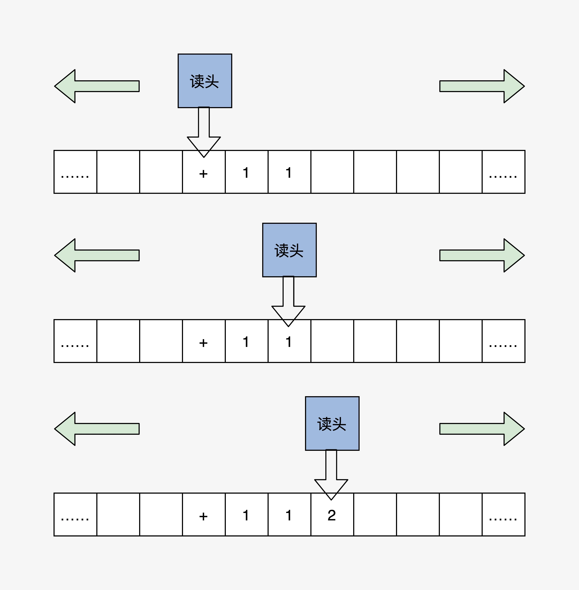
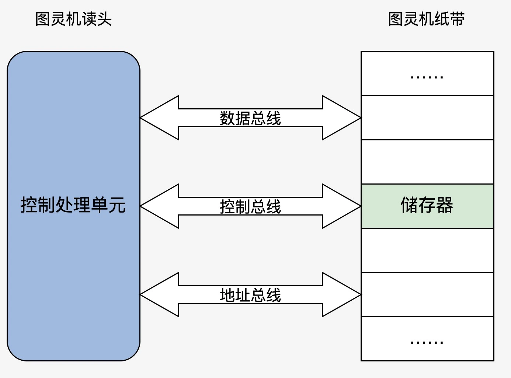
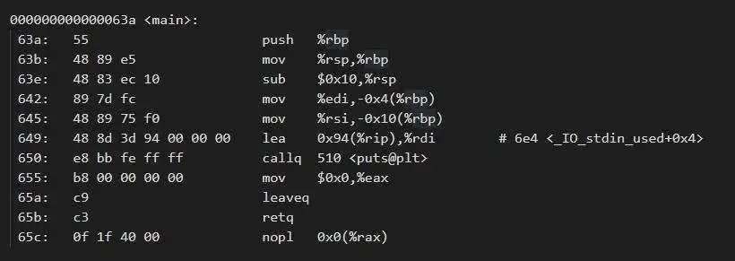
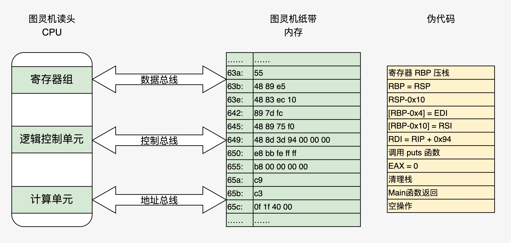

title:: 01 | 程序的运行过程：从代码到机器运行

- **扎实的基本功就像手里的指南针，你可以一步步强大到不依赖它，但是不能没有。**
- Unix之父**Ken Thompson**
- ## 程序编译过程
  heading:: true
- [[draws/2022-08-18-20-53-28.excalidraw]]
- 编译流程：
	- gcc HelloWorld.c -E -o HelloWorld.i 预处理：加入头文件，替换宏。
	- gcc HelloWorld.c -S -c -o HelloWorld.s 编译：包含预处理，将c程序转换成汇编程序。
	- gcc HelloWorld.c -c -o HelloWorld.o 汇编：包含预处理和编译，将汇编程序转换成可链接二进制程序。
	- gcc HelloWorld.c -o HelloWorld 链接：包含以上所有操作，将可链接的二进制程序和其他库链接在一起，形成可执行的程序文件。
- ## 程序装载执行
- **阿兰*图灵**，重要的一个贡献是提出一种理想中的机器：图灵机。
	- 图灵机是一个抽象的模型，它是这样的：有一条无限长的纸带，纸带上有无限个小格子，小格子中写有相关的信息，纸带上有一个读头，读头能根据纸带小格子里的信息做相关的操作并能来回移动。
	- 图灵机执行“1+1=2”的计算的过程：
		- 
- **冯诺依曼**，他提出电子计算机使用二进制数制系统和储存程序，并按照程序顺序执行，他的电子计算机理论叫冯诺依曼体系结构。
- 冯诺依曼体系结构构成的计算机，必须具有如下功能：
	- 把程序和数据装入计算机
	- 必须具有长期记住程序、数据的中间结果及最终运算结果
	- 完成各种算数、逻辑运算和数据传送等数据加工处理
	- 根据需要控制程序走向，并能根据指令控制机器的各部件协调操作
	- 能够按照要求将处理的数据结果显示给用户
- 为了完成上述的功能，计算机必须具备五大基本组成部件：
	- 装载数据和程序的输入设备；
	- 记住程序和数据的存储器；
	- 完成数据加工处理的运算器；
	- 控制程序执行的控制器；
	- 显示处理结果的输出设备。
- 根据冯诺依曼的理论，我们只要把图灵机的几个部件换成电子设备，就可以变成一个最小核心的电子计算机，如下图：
- 
- ## 更形象地将 HelloWorld 程序装入原型计算机
- 
- 以上图中，分成四列：第一列为地址；第二列为十六进制，表示真正装入机器中的代码数据；第三列是对应的汇编代码；第四列是相关代码的注释。这是 x86_64 体系的代码，由此可以看出 x86 CPU 是变长指令集。
- 接下来，我们把这段代码数据装入最小电子计算机，状态如下图：
- 
- ## 重点回顾
- 以上，对应图中的伪代码你应该明白了：现代电子计算机正是通过内存中的信息（指令和数据）做出相应的操作，并通过内存地址的变化，达到程序读取数据，控制程序流程（顺序、跳转对应该图灵机的读头来回移动）的功能。