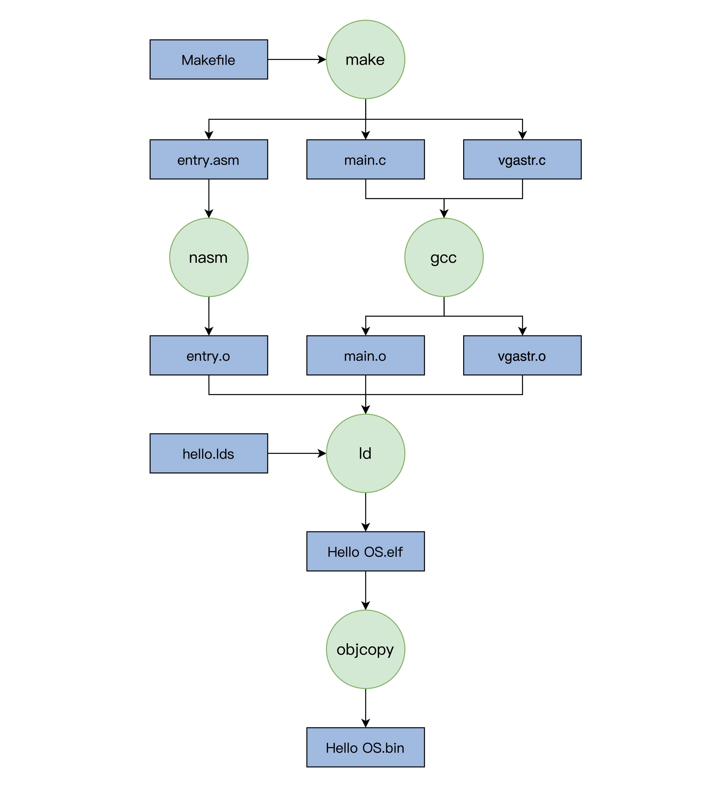

title:: 02 | 几行汇编几行C：实现一个最简单的内核

- PC 机的引导流程
	- PC机加电
	- PC机BIOS固件（固化在主板上的ROM芯片，第一条指令负责检测和初始化CPU、内存及主板）
	- 加载可引导设备中的GRUB（硬盘中的第一个扇区数据）
	- GRUB引导
	- 加载硬盘分区中的Hello OS文件
	- Hello OS
- Hello OS引导汇编代码
	- C是通用的高级语言，不能直接操作特定的硬件，C语言的函数调用、函数传参，都需要用栈。
	- 栈是一块内存空间，数据满足后进先出的特性，由CPU特定的栈寄存器指向（**寄存器是cpu内部用来存放数据的一些小型存储区域，用来暂时存放参与运算的数据和运算结果。**），需要先用汇编代码处理好C语言的工作环境。
- 编译和安装 Hello OS
- make工具
	- 它读取一个‘makefile'的文件，写好了构建软件的规则。
	- makefile的规则是：首先有一个或者多个构建目标称为“target”；目标后面紧跟着用于构建该目标所需要的文件，目标下面是构建该目标所需要的命令及参数。
- 编译
	- 
- 安装Hello OS
	- 经研究发现，GRUB 在启动时会加载一个 grub.cfg 的文本文件，根据其中的内容执行相应的操作，其中一部分内容就是启动项。
	- GRUB首先会显示启动项到屏幕，然后让我么选择启动项，最后根据启动项对应的信息，加载OS文件到内存。
	- 启动项的代码插入到你的 Linux 机器上的 /boot/grub/grub.cfg 文件末尾，然后把 Hello OS.bin 文件复制到 /boot/ 目录下，一定注意这里是追加不是覆盖。最后重启计算机，你就可以看到 Hello OS 的启动选项了。