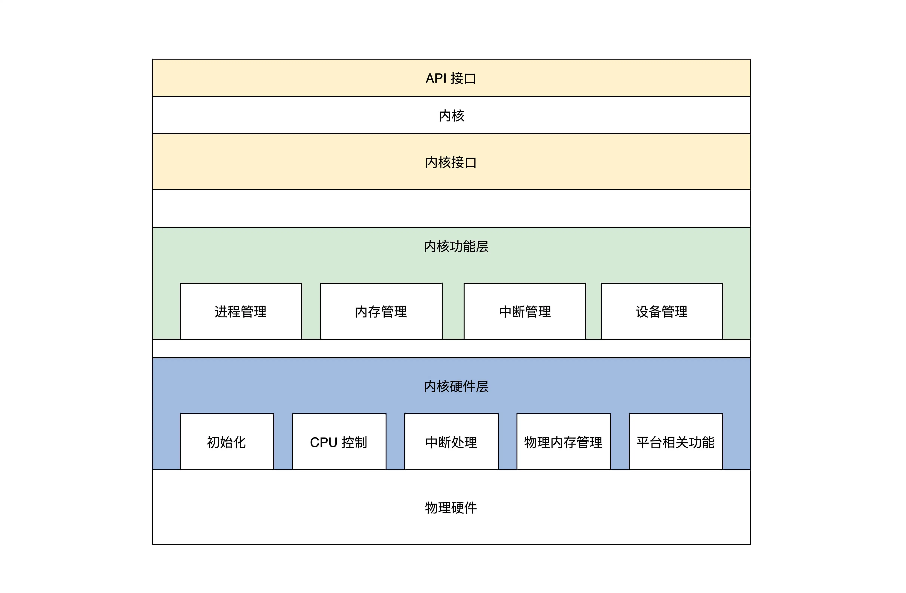

- ## 黑盒之中有什么
- 计算机中资源大致可以分为两类资源，一种是硬件资源，一种是软件资源。
- 内核作为硬件资源和软件资源的管理者，其内部组成在逻辑上大致如下：
	- 管理CPU
	- 管理内存
	- 管理硬盘
	- 管理显卡
	- 管理网卡
	- 管理各种I/O设备
- **驱动程序：**内核用来管理和控制不同型号、种类的计算机硬件所编写的代码。
- ## 宏内核结构
- 宏内核就是把以上诸如管理进程的代码、管理内存的代码、管理各种 I/O 设备的代码、文件系统的代码、图形系统代码以及其它功能模块的代码，把这些所有的代码经过编译，最后链接在一起，形成一个大的可执行程序。
- ## 微内核结构
- 提倡内核功能尽可能少：仅仅只有进程调度、处理中断、内存空间映射、进程间通信等功能。
- 微内核定义了一种良好的进程间通信的机制--**消息**。
- 缺点：
	- 性能差，内存分配和服务间切换开销大。
- 优点：
	- 结构清晰利于协作开发。
	- 移植性好。
	- 伸缩扩展性好。
- ## 分离硬件的相关性
- **分层：**主要的目的和好处是屏蔽底层细节，使上层开发更加简单。
- 分离硬件的相关性，就是要把操作硬件和处理硬件功能差异的代码抽离出来，形成一个独立的**软件抽象层**，对外提供相应的接口，方便上层开发。
- ## 我们的选择
- 大致分为三个大层：
	- 内核接口层：定义了一系列接口
		- 1. 定义了一套 UNIX 接口的子集，我们出于学习和研究的目的，使用 UNIX 接口的子集，优点之一是接口少，只有几个，并且这几个接口又能大致定义出操作系统的功能。
		- 2.  这套接口的代码，就是检查其参数是否合法，如果参数有问题就返回相关的错误，接着调用下层完成功能的核心代码。
	- 内核功能层：完成各种实际功能，按照其类别分成各种模块
		- 进程管理
		- 内存管理
		- 中断管理，把一个中断回调函数安插到相关的数据结构中，一旦发生相关的中断就会调用。
		- 设备管理，这个是最难的，需要用一系列的数据结构表示驱动程序模块、驱动程序本身、驱动程序创建的设备，最后把它们组织在一起，还要实现创建设备、销毁设备、访问设备的代码，这些代码最终会调用设备驱动程序，达到操作设备的目的。
	- 内核硬件层：包括一个具体硬件平台相关的代码
		- 初始化，内核被加载到内存中最先需要运行的代码。
		- CPU控制，提供CPU模式设定、开、关中断、读写CPU特定寄存器等功能的代码。
		- 中断处理，保存中断时机器的上下文，调用回调函数，操作中断控制器。
		- 物理内存管理，分配、释放大块内存，空间映射，操作MMU、Cache等。
		- 平台其他相关的功能。
- 内核结构：
	- 
- ## 重点回顾
- 内核作为资源管理者应该有这些组件：I/O 管理组件、内存管理组件、文件系统组件、进程管理组件、图形系统组件、网络组件、安全组件等。
- 宏内核有极致的性能，微内核有极致的可移植性、可扩展性。
- 我们的内核结构分为三层：内核硬件层，内核功能层，内核接口层，内核接口层主要是定义了一套 UNIX 接口的子集，内核功能层主要完成 I/O 管理组件、内存管理组件、文件系统组件、进程管理组件、图形系统组件、网络组件、安全组件的通用功能型代码；内核硬件层则完成其内核组件对应的具体硬件平台相关的代码。