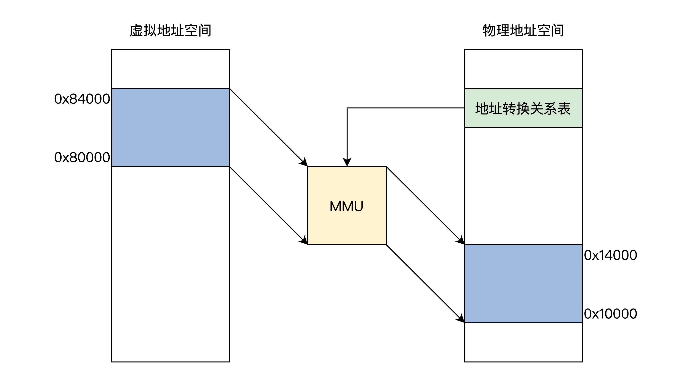
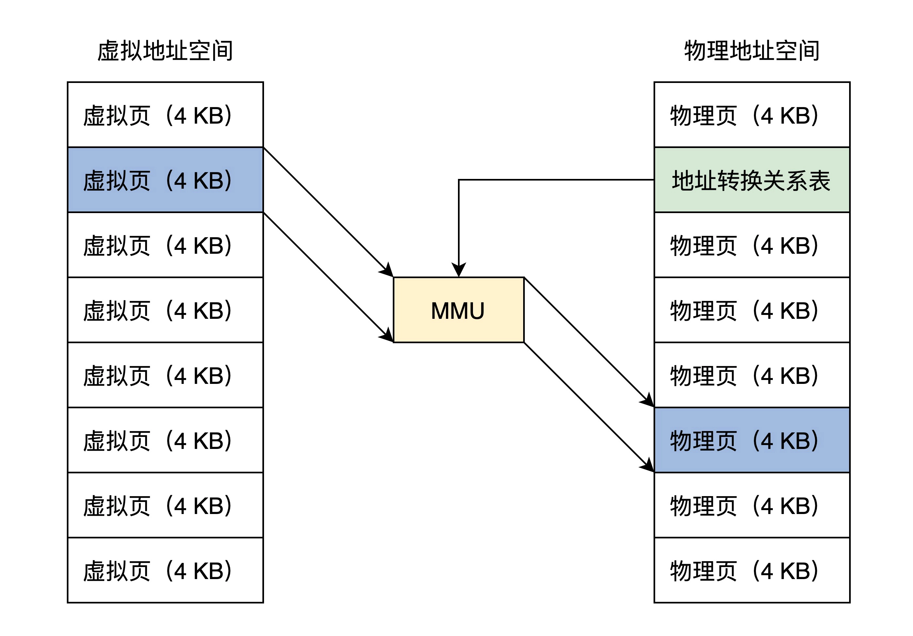

- ## 多程序并发的场景
- 程序A开始运行，内存中又放一道程序B，各自运行一秒钟，如此循环，直至其中之一结束。这会产生几个内存相关的问题：
	- 谁来保证**内存地址没有冲突？**AB协商还是操作系统决定。
	- 怎样保证**AB不会互相读写各自的内存空间？**保护模式可解决。
	- **内存容量**问题。
	- **扩展后的负责情况**。可能还有更多程序运行。
- **虚拟地址：**让所有程序都各自享有一个从0开始到最大地址的空间，这个地址空间是独立的，是该程序私有的，其他程序既看不到，也不能访问。
- ## 虚拟地址
- 虚拟地址由**链接器**产生，软件经过编译后，需要链接成可执行文件才可以运行，链接器的主要工作就是把多个代码模块组装在一起，解决模块之间的引用，即处理程序代码间的地址引用，形成程序运行的静态内存空间视图。
- ## 物理地址
- **物理地址：**作用于硬件电路的，在逻辑上也是一个数据，这个数据会被地址译码器等电子器件变成电子信号放在地址总线上。
- ## 虚拟地址到物理地址的转换
- 一种软硬件结合的实现方式：MMU(内存管理单元)。接受软件给出的地址对应关系数据，进行地址转换。
- 
- **把虚拟地址空间和物理地址空间都分成同等大小的块，也称为页，按照虚拟页和物理页进行转换**。现代内存管理模式——分页模型。
- 
- ## MMU
- 即内存管理单元，是用硬件电路逻辑实现的一个地址转换器件，负责接受虚拟地址和地址关系转换表，输出物理地址。
-
-