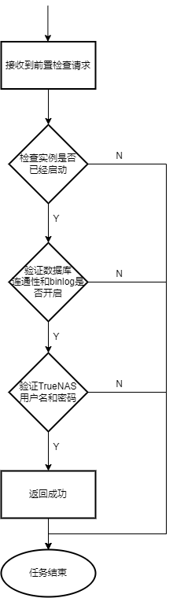

- [[ARSTOR-1508] arp mysql 前置检查 - ArcherOS-Jira](http://jira.archeros.com/browse/ARSTOR-1508)
-
- ## 功能描述
- 在全量/增量备份前，发起前置检查任务，检验待备份的数据库实例的状态和配置是否可以进行备份，主要检查内容包括：
	- 检查实例进程是否存在
	- 检查数据库连通性
	- 检查binlog是否开启
	- 检查NAS连通性
- ## 业务流程图
- 
- ## 性能要求
- ## 输入/前置条件
- ## 输出/后置条件
- ## Coding
	- DONE 参数校验
	  id:: 62e9e307-8035-4a58-962b-a1dea0b87e9b
	  :LOGBOOK:
	  CLOCK: [2022-08-03 Wed 17:31:02]
	  CLOCK: [2022-08-03 Wed 17:31:06]--[2022-08-03 Wed 17:33:22] =>  00:02:16
	  :END:
	- unit test