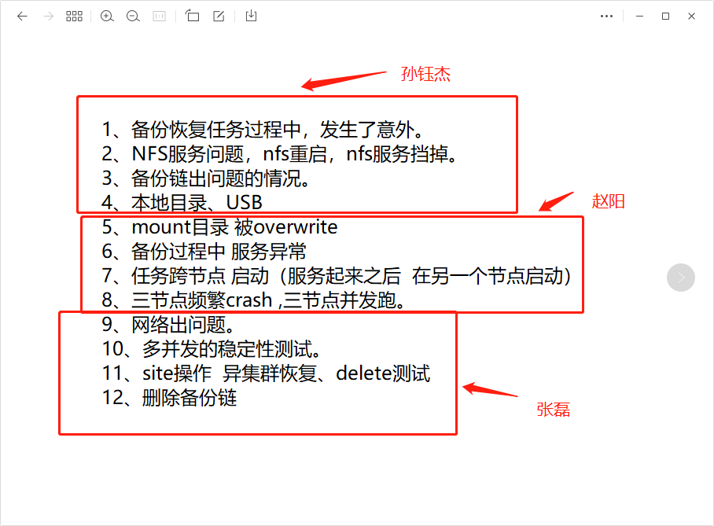

public:: false
title:: ArProtector1.4.1

- title:: ArProtector1.4.1
-
- ### 测试环境
- 10.140.28.11,12,13
- 179.19.3.11, 12, 13
-
- ### test case
- DONE [[mount目录被overwrite]] [[Aug 22nd, 2022]]
- DONE [[备份过程中服务异常]] [[Aug 22nd, 2022]]
- DONE [[任务跨节点启动（服务起来后，在另一个节点启动）]] [[Aug 23rd, 2022]]
  :LOGBOOK:
  CLOCK: [2022-08-23 Tue 10:49:12]--[2022-08-23 Tue 15:26:35] =>  04:37:23
  :END:
- DONE [[三节点频繁crash，三节点并发跑]] [[Aug 26th, 2022]] [[Aug 30th, 2022]]
  id:: 62ff2172-954b-48ad-a352-af88033af282
- 备份、恢复时注销站点
- 创建增量备份、恢复时删除依赖备份点
- [[注册到其他挂载点后删除备份点]] [[Sep 1st, 2022]]
-
-
- ## bug
- DONE [[ARSTOR-1708【ArProtecter1.4.1】transport离线，pserv等待超时后未提供错误信息]]
  id:: 630732cb-aac4-4336-95f9-9ab1b260cbbf
- DONE [[备份pause后进度条错误]]
- DONE [[【Arprotector1.4】删除nas备份点进度显示发生跳变]] [[Aug 26th, 2022]]
  id:: 63081d56-538d-404d-aa95-241ac5e8a88b
- [[当下一个备份点状态异常，删除应该退出]]
- DONE [[【Arprotector1.4】异集群注册站点同步未显示resource]]
- [[超时任务结算]]
- DONE 删除备份点任务资源互斥：vm_id与resource_id一致，无需修改
-
-
-
- 