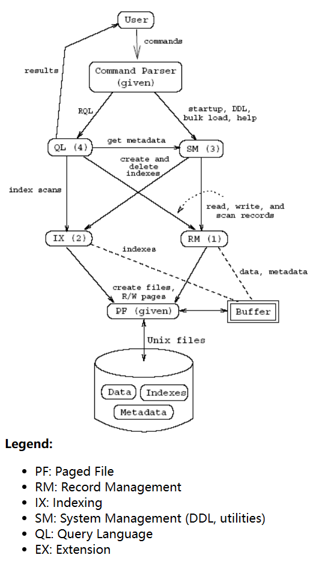

- [Database System Implementation - CS346 Spring 2015 (stanford.edu)](https://web.stanford.edu/class/cs346/2015/)
- [li-plus/redbase-cpp: A simple relational database based on Stanford CS346 RedBase, implemented in elegant modern C++14. (github.com)](https://github.com/li-plus/redbase-cpp)
-
- RedBase architecture
	- 
- Schedule & Handouts
	- [[RedBase Part 0: The Paged File Component]]
	- [[RedBase Part 1: RM: The Record Management Component]]
	-