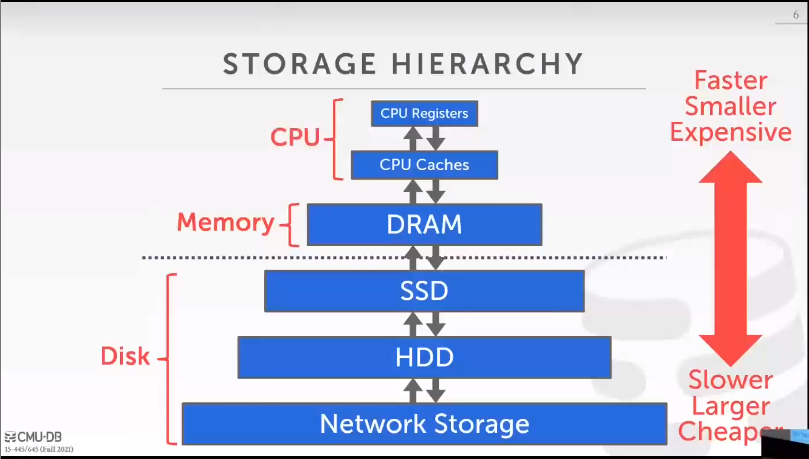

- Storage
	- We will focus on a "disk-oriented" DBMS architecture that assumes that the primary storage location of the database is on non-volatile disk(s).
	- STORAGE HIERARCHY
		- 
	- Volatile Devices:
		- data is lost after power-off
		- fast random access with byte-addressable locations.
		- as "memory".
	- Non-Volatile Devices:
		- not require continuous power
		- block/page addressable
		- better at sequential access
		- as "disk"
- Disk-Oriented DBMS Overview
	- The database is all on disk, and the data in database files is organized into pages, with the first page being the directory page. To operate on the data, the DBMS needs to bring the data into memory. It does this by having a buffer pool that manages the data movement back and forth between disk and memory. The DBMS also has an execution engine that will execute queries. The execution engine will ask the buffer pool for a specific page, and the buffer pool will take care of bringing that page into memory and giving the execution engine a pointer to that page in memory. The buffer pool manager will ensure that the page is there while the execution engine operates on that part of memory.
- DBMS vs. OS
	- A high-level design goal of the DBMS is to support databases that exceed the amount of memory available. Since reading/writing to disk is expensive, disk use must be carefully managed. We do not want large stalls from fetching something from disk to slow down everything else. We want the DBMS to be able to process
	  other queries while it is waiting to get the data from disk.
- File Storage
	- In its most basic form, a DBMS stores a database as files on disk. Some may use a file hierarchy, others may use a single file (e.g., SQLite). The OS does not know anything about the contents of these files. Only the DBMS knows how to decipher their contents, since it is encoded in a way specific to the DBMS. The DBMS’s storage manager is responsible for managing a database’s files. It represents the files as a collection of pages. It also keeps track of what data has been read and written to pages as well how much
	  free space there is in these pages.
- Database Pages
	- The DBMS organizes the database across one or more files in fixed-size blocks of data called pages. Pages can contain different kinds of data (tuples, indexes, etc). Most systems will not mix these types within pages. Some systems will require that pages are self-contained, meaning that all the information needed to
	  read each page is on the page itself.
- Database Heap
	- There are a couple of ways to find the location of the page a DBMS wants on the disk, and heap file organization is one of those ways. A heap file is an unordered collection of pages where tuples are stored in
	  random order.
	- The DBMS can locate a page on disk given a page_id by using a linked list of pages or directory.
		- 1. **Linked list:**
		  2. **Page Directory:**
- Page Layout
	- Every page includes a header that records meta-data about the page's contents:
		- Page size
		- Checksum
		- DBMS version
		- Transaction visibility
		- Self-containment
	- Slotted Pages: Page maps slots to offsets.
		- Most common approach used in DBMSs today
		- Header keeps track of the number of used slots, the offset of the starting location of the last used slot, and a slot array, which keeps track of the location of the start of each tuple.
		- To add a tuple, the slot array will grow from the beginning to the end, and the data of the tuples will grow from end to the beginning. The page is considered full when the slot array and the tuple data
		  meet.
	- Log-Structured: Instead of storing tuples, the DBMS only stores log records.
		- • Stores records to file of how the database was modified (insert, update, deletes).
		- • To read a record, the DBMS scans the log file backwards and “recreates” the tuple.
		- • Fast writes, potentially slow reads.
		- • Works well on append-only storage because the DBMS cannot go back and update the data.
		- • To avoid long reads, the DBMS can have indexes to allow it to jump to specific locations in the log. It can also periodically compact the log. (If it had a tuple and then made an update to it, it could compact it down to just inserting the updated tuple.) The issue with compaction is that the DBMS ends up with
		  write amplification. (It re-writes the same data over and over again.)
- Tuple Layout
	- A tuple is essentially a sequence of bytes. It is the DBMS's job to interpret those into attribute types and values.