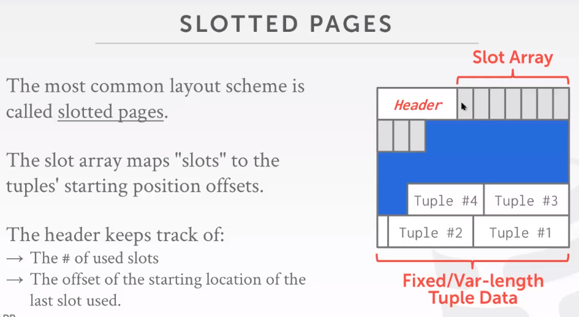
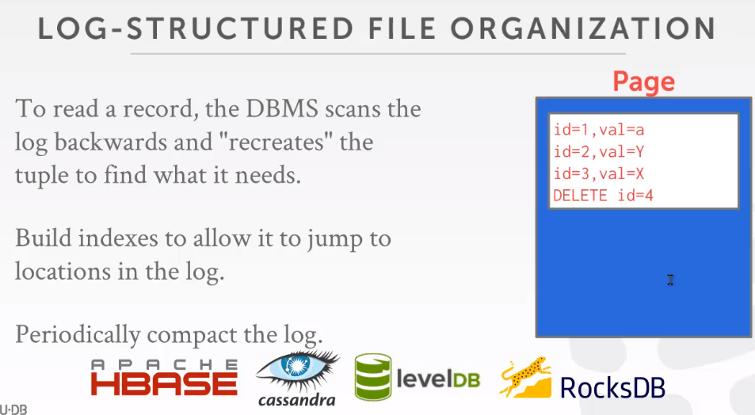

- DISK-ORIENTED 架构
	- DBMS假设数据库的主存储为非易失性磁盘
	- DBMS的组件管理易失性存储喝非易失性存储之间数据的读取
- SLOTTED PAGES
	- 最常见的布局
	- slot array映射slots到tuple的开始位点
	- 
- LOG-STRUCTURED FILE ORGANIZATION
	- 页中不存tuples，只存储log记录，数据的变化
	- 
	- 方便顺序写
- Data Representation
	- TUPLE STORAGE
		- tuple是一系列的字节
		- DBMS的catalogs包含了表的schema信息，用来表明tuple的层级
- System Catalogs
	- A DBMS 在内部目录存储了关于数据库的元数据
		- 表，列，索引，视图
		- 用户，权限
		- 内部统计
- Storage Models