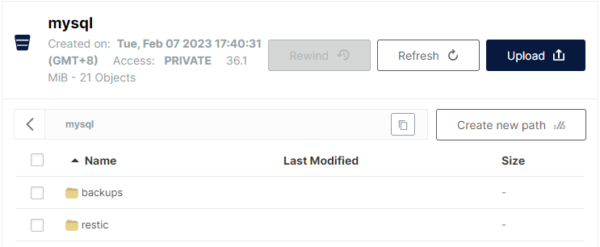

- 参考
	- [部署k8s集群（k8s集群搭建详细实践版） - 腾讯云开发者社区-腾讯云 (tencent.com)](https://cloud.tencent.com/developer/article/2160663#:~:text=Kubeadm%E6%98%AF%E4%B8%80%E4%B8%AAK8s%E9%83%A8%E7%BD%B2%E5%B7%A5%E5%85%B7%EF%BC%8C%E6%8F%90%E4%BE%9Bkubeadm,init%E5%92%8Ckubeadm%20join%EF%BC%8C%E7%94%A8%E4%BA%8E%E5%BF%AB%E9%80%9F%E9%83%A8%E7%BD%B2Kubernetes%E9%9B%86%E7%BE%A4%E3%80%82)
	- [Velero – Backup and Restore Example – vRaccoon](https://vraccoon.com/2020/09/velero-backup-and-restore-example/)
	- [Velero结合minio实现备份和恢复 - PunchLinux - 博客园 (cnblogs.com)](https://www.cnblogs.com/punchlinux/p/16543420.html)
	- [K8S学习笔记之卸载K8S集群 - 腾讯云开发者社区-腾讯云 (tencent.com)](https://cloud.tencent.com/developer/article/1856973)
- 部署minio
	- ```
	  [root@zyagent src]# wget https://dl.min.io/server/minio/release/linux-amd64/archive/min io-20230131022419.0.0.x86_64.rpm -O minio.rpm
	  [root@zyagent src]# yum install minio-20230131022419.0.0.x86_64.rpm
	  [root@zyagent src]# mkdir ~/minio
	  [root@zyagent src]# chmod -R 777 ~/minio
	  [root@zyagent src]# minio server ~/minio --console-address :9090
	  WARNING: Detected Linux kernel version older than 4.0.0 release, there are some known p otential performance problems with this kernel version. MinIO recommends a minimum of 4 .x.x linux kernel version for best performance
	  Formatting 1st pool, 1 set(s), 1 drives per set.
	  WARNING: Host local has more than 0 drives of set. A host failure will result in data b ecoming unavailable.
	  WARNING: Detected default credentials 'minioadmin:minioadmin', we recommend that you ch ange these values with 'MINIO_ROOT_USER' and 'MINIO_ROOT_PASSWORD' environment variable s
	  MinIO Object Storage Server
	  Copyright: 2015-2023 MinIO, Inc.
	  License: GNU AGPLv3 <https://www.gnu.org/licenses/agpl-3.0.html>
	  Version: RELEASE.2023-01-31T02-24-19Z (go1.19.4 linux/amd64)
	  
	  Status:         1 Online, 0 Offline.
	  API: http://10.142.144.155:9000  http://172.17.0.1:9000  http://10.244.104.0:9000  http ://127.0.0.1:9000
	  RootUser: minioadmin
	  RootPass: minioadmin
	  Console: http://10.142.144.155:9090 http://172.17.0.1:9090 http://10.244.104.0:9090 htt p://127.0.0.1:9090
	  RootUser: minioadmin
	  RootPass: minioadmin
	  
	  Command-line: https://min.io/docs/minio/linux/reference/minio-mc.html#quickstart
	     $ mc alias set myminio http://10.142.144.155:9000 minioadmin minioadmin
	  
	  Documentation: https://min.io/docs/minio/linux/index.html
	  Warning: The standard parity is set to 0. This can lead to data loss
	  ```
- k8s部署MySQL
	- [k8s实战之MySQL单实例部署 - 知乎 (zhihu.com)](https://zhuanlan.zhihu.com/p/502731000)
- Install Velero
	- 下载velero
	  ```
	  wget https://github.com/vmware-tanzu/velero/releases/download/v1.4.2/velero-v1.4.2-linux-amd64.tar.gz
	  Saving to: ‘velero-v1.4.2-linux-amd64.tar.gz’
	  velero-v1.4.2-linux-amd64.tar.gz           100%[===========================================>]  22.72M  5.70MB/s    in 5.1s
	  vraccoon@ubu:~$ tar -xvzf velero-v1.4.2-linux-amd64.tar.gz
	  velero-v1.4.2-linux-amd64/LICENSE
	  velero-v1.4.2-linux-amd64/examples/README.md
	  velero-v1.4.2-linux-amd64/examples/minio
	  velero-v1.4.2-linux-amd64/examples/minio/00-minio-deployment.yaml
	  velero-v1.4.2-linux-amd64/examples/nginx-app
	  velero-v1.4.2-linux-amd64/examples/nginx-app/README.md
	  velero-v1.4.2-linux-amd64/examples/nginx-app/base.yaml
	  velero-v1.4.2-linux-amd64/examples/nginx-app/with-pv.yaml
	  velero-v1.4.2-linux-amd64/velero
	  cp velero-v1.4.2-linux-amd64/velero /usr/local/bin/velero
	  ```
	- credentials file, for our S3 Storage
	  ```
	  [root@zyagent velero]# cat credentials-velero-minio
	  [default]
	  #aws_access_key_id = Wt2c2Nb6unKyO6de
	  #aws_secret_access_key = x9gIkIfTCNfyeqGurN2hx2cYJsIBallR
	  aws_access_key_id = minioadmin
	  aws_secret_access_key = minioadmin
	  ```
	- 准备user-csr文件：如果不创建，也可以直接使用k8s的config文件
	  ```
	  [root@zyagent velero]# cat awsuser-csr.json
	  {
	    "CN": "awsuser",
	    "hosts": [],
	    "key": {
	      "algo": "rsa",
	      "size": 2048
	    },
	    "names": [
	      {
	        "C": "CN",
	        "ST": "BeiJing",
	        "L": "BeiJing",
	        "O": "k8s",
	        "OU": "System"
	      }
	    ]
	  }
	  
	  ```
	- velero install --kubeconfig /root/.kube/config \
	  --provider aws \
	  --plugins velero/velero-plugin-for-aws:v1.3.1 \
	  --bucket mysql \
	  --secret-file ./credentials-velero-minio \
	  --use-volume-snapshots=false \
	  --backup-location-config region=minio,s3ForcePathStyle="true",s3Url=http://10.142.144.155:9000 \
	  --use-restic
	- get pods
	  ```
	  [root@zyagent velero]# kubectl get pods -n velero
	  NAME                     READY   STATUS    RESTARTS   AGE
	  restic-h85h4             1/1     Running   0          7m54s
	  restic-lsfnw             1/1     Running   0          7m54s
	  velero-586489bc5-jqxnt   1/1     Running   0          7m54s
	  ```
- Create the Backup
	- Restic will only backup volumes, which are annotated.
	  ```
	  [root@zyagent k8s]# kubectl annotate pod mysql-6f9f4bb869-cglfs backup.velero.io/backup-volumes=mysqlvolume
	  pod/mysql-6f9f4bb869-cglfs annotated
	  ```
	- Next, create the backup. We will backup the whole namespace, which is the “default” namespace.
	  ```
	  [root@zyagent k8s]# velero backup create my-mysql-backup --include-namespaces default
	  Backup request "my-mysql-backup" submitted successfully.
	  Run `velero backup describe my-mysql-backup` or `velero backup logs my-mysql-backup` for more details.
	  ```
	- more detail:
	  ```
	  [root@zyagent k8s]# velero backup describe my-mysql-backup
	  Name:         my-mysql-backup
	  Namespace:    velero
	  Labels:       velero.io/storage-location=default
	  Annotations:  velero.io/source-cluster-k8s-gitversion=v1.18.20
	                velero.io/source-cluster-k8s-major-version=1
	                velero.io/source-cluster-k8s-minor-version=18
	  
	  Phase:  Completed
	  
	  Errors:    0
	  Warnings:  0
	  
	  Namespaces:
	    Included:  default
	    Excluded:  <none>
	  
	  Resources:
	    Included:        *
	    Excluded:        <none>
	    Cluster-scoped:  auto
	  
	  Label selector:  <none>
	  
	  Storage Location:  default
	  
	  Velero-Native Snapshot PVs:  auto
	  
	  TTL:  720h0m0s
	  
	  Hooks:  <none>
	  
	  Backup Format Version:  1
	  
	  Started:    2023-02-08 13:53:57 +0800 CST
	  Completed:  2023-02-08 13:54:04 +0800 CST
	  
	  Expiration:  2023-03-10 13:53:57 +0800 CST
	  
	  Total items to be backed up:  73
	  Items backed up:              73
	  
	  Velero-Native Snapshots: <none included>
	  
	  Restic Backups (specify --details for more information):
	    Completed:  1
	  
	  ```
	- object store
	  
	- **Delete the Application**
		- delete MySQL Application.
		  ```
		  [root@zyagent k8s]# kubectl delete -f mysql-svc.yaml
		  deployment.apps "mysql" deleted
		  service "svc-mysql" deleted
		  ```
		- And confirm, that everything is gone.
		  ```
		  [root@zyagent k8s]# kubectl get deploy,pods,pv,pvc,svc
		  NAME                                     READY   UP-TO-DATE   AVAILABLE   AGE
		  deployment.apps/nfs-client-provisioner   1/1     1            1           45h
		  deployment.apps/velero                   0/1     1            0           3h6m
		  
		  NAME                                          READY   STATUS             RESTARTS   AGE
		  pod/nfs-client-provisioner-75d8d5df97-r6prn   1/1     Running            0          45h
		  pod/nfs-web-0                                 1/1     Running            0          45h
		  pod/nfs-web-1                                 1/1     Running            0          45h
		  pod/nfs-web-2                                 1/1     Running            0          45h
		  pod/restic-tlprl                              0/1     CrashLoopBackOff   9          23m
		  pod/restic-x69wg                              0/1     CrashLoopBackOff   9          23m
		  pod/velero-8dc7498d9-5tltv                    0/1     CrashLoopBackOff   9          22m
		  
		  NAME                                                        CAPACITY   ACCESS MODES   RECLAIM POLICY   STATUS      CLAIM                   STORAGECLASS          REASON   AGE
		  persistentvolume/my-local-pv                                10Gi       RWX            Retain           Available                           my-local-storage               44h
		  persistentvolume/pvc-585ce7e8-e166-4609-801e-d3f09ca31f7c   1Gi        RWO            Delete           Bound       default/www-nfs-web-1   managed-nfs-storage            45h
		  persistentvolume/pvc-d61b8cc3-43ab-470f-a1a9-fb9b0ed53db5   1Gi        RWO            Delete           Bound       default/www-nfs-web-0   managed-nfs-storage            45h
		  persistentvolume/pvc-f9b85eaf-25e9-47c8-baca-91d4d45dc4fd   1Gi        RWO            Delete           Bound       default/www-nfs-web-2   managed-nfs-storage            45h
		  
		  NAME                                    STATUS    VOLUME                                     CAPACITY   ACCESS MODES   STORAGECLASS          AGE
		  persistentvolumeclaim/minio-pvc-claim   Pending                                                                        my-local-storage      44h
		  persistentvolumeclaim/www-nfs-web-0     Bound     pvc-d61b8cc3-43ab-470f-a1a9-fb9b0ed53db5   1Gi        RWO            managed-nfs-storage   45h
		  persistentvolumeclaim/www-nfs-web-1     Bound     pvc-585ce7e8-e166-4609-801e-d3f09ca31f7c   1Gi        RWO            managed-nfs-storage   45h
		  persistentvolumeclaim/www-nfs-web-2     Bound     pvc-f9b85eaf-25e9-47c8-baca-91d4d45dc4fd   1Gi        RWO            managed-nfs-storage   45h
		  
		  NAME                 TYPE        CLUSTER-IP   EXTERNAL-IP   PORT(S)   AGE
		  service/kubernetes   ClusterIP   10.96.0.1    <none>        443/TCP   2d
		  service/nginx        ClusterIP   None         <none>        80/TCP    45h
		  
		  ```
## Restore the Backup
	- First, display existing backups.
	  ```
	  [root@zyagent k8s]# velero get backup
	  NAME              STATUS      ERRORS   WARNINGS   CREATED                         EXPIRES   STORAGE LOCATION   SELECTOR
	  my-mysql-backup   Completed   0        0          2023-02-08 13:53:57 +0800 CST   29d       default            <none>
	  ```
	- create restore
	  ```
	  [root@zyagent k8s]# velero restore create mysql-restore --from-backup my-mysql-backup
	  Restore request "mysql-restore" submitted successfully.
	  Run `velero restore describe mysql-restore` or `velero restore logs mysql-restore` for more details.
	  ```
	- check the details of the process.
	  ```
	  [root@zyagent k8s]# velero restore describe mysql-restore
	  Name:         mysql-restore
	  Namespace:    velero
	  Labels:       <none>
	  Annotations:  <none>
	  
	  Phase:  Completed
	  
	  Warnings:
	    Velero:     <none>
	    Cluster:    <none>
	    Namespaces:
	      default:  could not restore, persistentvolumeclaims "www-nfs-web-0" already exists. Warning: the in-cluster version is different than the backed-up version.
	                could not restore, persistentvolumeclaims "www-nfs-web-1" already exists. Warning: the in-cluster version is different than the backed-up version.
	                could not restore, persistentvolumeclaims "www-nfs-web-2" already exists. Warning: the in-cluster version is different than the backed-up version.
	                could not restore, pods "nfs-client-provisioner-75d8d5df97-r6prn" already exists. Warning: the in-cluster version is different than the backed-up version.
	                could not restore, pods "nfs-web-0" already exists. Warning: the in-cluster version is different than the backed-up version.
	                could not restore, pods "nfs-web-1" already exists. Warning: the in-cluster version is different than the backed-up version.
	                could not restore, pods "nfs-web-2" already exists. Warning: the in-cluster version is different than the backed-up version.
	                could not restore, pods "restic-tlprl" already exists. Warning: the in-cluster version is different than the backed-up version.
	                could not restore, pods "restic-x69wg" already exists. Warning: the in-cluster version is different than the backed-up version.
	                could not restore, pods "velero-8dc7498d9-5tltv" already exists. Warning: the in-cluster version is different than the backed-up version.
	                could not restore, endpoints "fuseim.pri-ifs" already exists. Warning: the in-cluster version is different than the backed-up version.
	                could not restore, services "kubernetes" already exists. Warning: the in-cluster version is different than the backed-up version.
	                could not restore, services "nginx" already exists. Warning: the in-cluster version is different than the backed-up version.
	  
	  Backup:  my-mysql-backup
	  
	  Namespaces:
	    Included:  all namespaces found in the backup
	    Excluded:  <none>
	  
	  Resources:
	    Included:        *
	    Excluded:        nodes, events, events.events.k8s.io, backups.velero.io, restores.velero.io, resticrepositories.velero.io
	    Cluster-scoped:  auto
	  
	  Namespace mappings:  <none>
	  
	  Label selector:  <none>
	  
	  Restore PVs:  auto
	  
	  Restic Restores (specify --details for more information):
	    Completed:  1
	  ```
	- ```
	  
	  NAME                 TYPE        CLUSTER-IP       EXTERNAL-IP   PORT(S)          AGE
	  service/kubernetes   ClusterIP   10.96.0.1        <none>        443/TCP          2d
	  service/nginx        ClusterIP   None             <none>        80/TCP           45h
	  service/svc-mysql    NodePort    10.102.179.181   <none>        3306:31452/TCP   110s
	       113s
	  ```
	- Let’s confirm that the mysql tables are still there.
	  ```
	  [root@archcnstcm3612 ~]# mysql -uroot -p'Huayun@123' -h10.142.144.246 -P31452
	  Welcome to the MariaDB monitor.  Commands end with ; or \g.
	  Your MySQL connection id is 2
	  Server version: 5.7.36 MySQL Community Server (GPL)
	  
	  Copyright (c) 2000, 2018, Oracle, MariaDB Corporation Ab and others.
	  
	  Type 'help;' or '\h' for help. Type '\c' to clear the current input statement.
	  
	  MySQL [(none)]> use test;
	  Reading table information for completion of table and column names
	  You can turn off this feature to get a quicker startup with -A
	  
	  Database changed
	  MySQL [test]> select * from TestTable;
	  +----+-----------+----------+---------------------+
	  | id | firstname | lastname | reg_date            |
	  +----+-----------+----------+---------------------+
	  |  1 | Aulus     | Augerius | 2023-02-08 02:19:45 |
	  |  2 | Numerius  | Negidius | 2023-02-08 02:19:58 |
	  |  3 | John      | Doe      | 2023-02-08 02:20:10 |
	  +----+-----------+----------+---------------------+
	  3 rows in set (0.002 sec)
	  
	  ```
-
- Uninstalling Velero
	- If you would like to completely uninstall Velero from your cluster, the following commands will remove all resources created by `velero install`:
	  ```
	  kubectl delete namespace/velero clusterrolebinding/velero
	  kubectl delete crds -l component=velero
	  ```
-