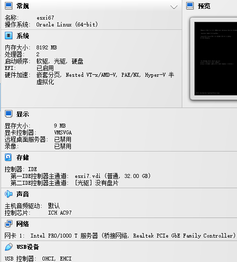
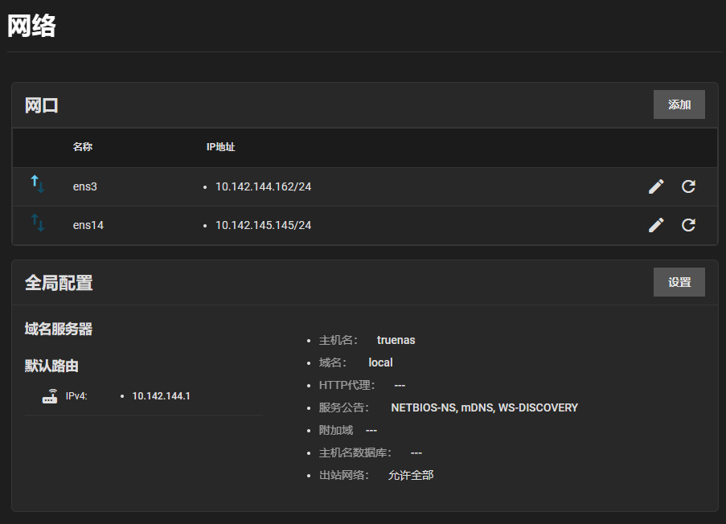

title:: esxi6.7安装

- ## virtualbox安装esxi6.7
	- ### 启用嵌套虚拟化
		- ```
		  VBoxManage modifyvm vm-name --nested-hw-virt on
		  ```
	- 
	- esxi新建虚拟机后开机显示此主机不支持intel vt-x
- ## truenas scale vm
	- 
- ## test backup vmware
	- ```
	  Running tool: /usr/local/go/bin/go test -timeout 600s -run ^TestGetVirtualMachines$ transport/repository/vmware/external_client/virtualmachines
	  
	  === RUN   TestGetVirtualMachines
	  [Name]: centos7 [Uuid]: 564dd406-286f-2d2e-fa5b-3aa7f5a5881f [Vm]: VirtualMachine:1 Datastore: 66042f04-f5909364-793d-0800270f58d8
	  [GuestOS]: CentOS 7 (64-bit) [HostName]:  [IP]:  [Vcpus]: 1 [MemoryMB]: 2048 [NumVirtualDisks]: 1 [Vmx]: [datastore1] centos7/centos7.vmx [Host]: HostSystem:ha-host [Snapshots] :
	  [disk]: (key 2000, label Hard disk 1, Size 16,777,216 KB)(key 2000, path [datastore1] centos7/centos7.vmdk)
	  cbt: false
	  ```
-