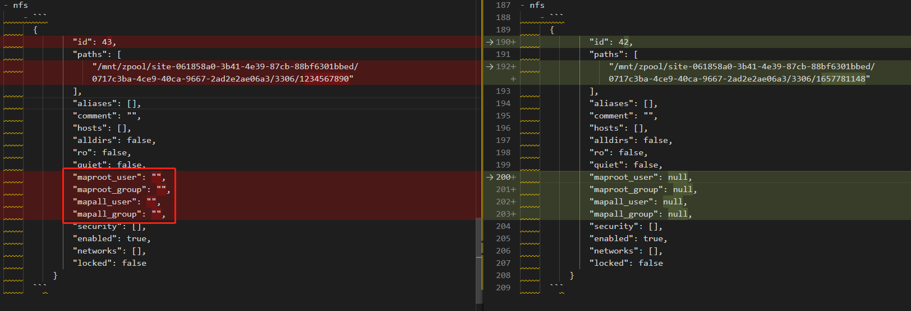

- mount nfs failed: exit status 32, mount.nfs: mounting 10.142.192.69:/mnt/zpool/site-061858a0-3b41-4e39-87cb-88bf6301bbed/0717c3ba-4ce9-40ca-9667-2ad2e2ae06a3/3306/1657781148 failed, reason given by server: No such file or directory
	-
	- [[此dataset和nfs参数]]
	- [[手工创建dataset和nfs参数]]
	- 
	- CANCELED **result:** 将参数如上图左边一样赋值为""后挂载成功，推断是不能没有初始值
	-
	- ## 对比clonedataset
	- ### 代码创建
	- zpool/site-061858a0-3b41-4e39-87cb-88bf6301bbed/0717c3ba-4ce9-40ca-9667-2ad2e2ae06a3/3306/1657849697-1658493162884284086
	- ## 查看ganesha
		- ### /etc/ganesha/ganesha.conf
		- ```
		  EXPORT {
		      Export_Id = 7;
		      Path = /mnt/zpool/site-061858a0-3b41-4e39-87cb-88bf6301bbed/608f9b6a-94a0-466
		  ff-a7bc-19bab556ed5f/0717c3ba-4ce9-40ca-9667-2ad2e2ae06a3/3306/1658997775;
		      Protocols = 3, 4;
		      Pseudo = /mnt/zpool/site-061858a0-3b41-4e39-87cb-88bf6301bbed/608f9b6a-94a0--
		  46ff-a7bc-19bab556ed5f/0717c3ba-4ce9-40ca-9667-2ad2e2ae06a3/3306/1658997775;
		      Transports = TCP;
		      Access_Type = RW;
		      Squash = None;
		      FSAL {
		          Name = VFS;
		      }
		  }
		  
		  EXPORT {
		      Export_Id = 8;
		      Path = /mnt/zpool/site-061858a0-3b41-4e39-87cb-88bf6301bbed/608f9b6a-94a0-466
		  ff-a7bc-19bab556ed5f/0717c3ba-4ce9-40ca-9667-2ad2e2ae06a3/3306/1658997775-2;
		      Protocols = 3, 4;
		      Pseudo = /mnt/zpool/site-061858a0-3b41-4e39-87cb-88bf6301bbed/608f9b6a-94a0--
		  46ff-a7bc-19bab556ed5f/0717c3ba-4ce9-40ca-9667-2ad2e2ae06a3/3306/1658997775-2;
		      Transports = TCP;
		      Access_Type = RW;
		      Squash = None;
		      FSAL {
		          Name = VFS;
		      }
		  }
		  ```
		- ### /var/log/ganesha/ganesha.log
			- ```
			  25/07/2022 14:26:12 : epoch 62d91ef4 : truenas.local : ganesha.nfsd-230407[sigmgr] mdcache_fsal_create_export :FSAL :MAJ :Failed to call create_export on underlying FSAL VFS
			  25/07/2022 14:26:12 : epoch 62d91ef4 : truenas.local : ganesha.nfsd-230407[sigmgr] fsal_cfg_commit :CONFIG :CRIT :Could not create export for ((null)) to (/mnt/zpool/site-061858a0-3b41-4e39-87cb-88bf6301bbed/0717c3ba-4ce9-40ca-9667-2ad2e2ae06a3/3306/1657849697-1658493162884284086)
			  ...skipping...
			  e9-40ca-9667-2ad2e2ae06a3/3306/1658997775) returned No such file or directory (2)
			  28/07/2022 20:00:07 : epoch 62de426a : truenas.local : ganesha.nfsd-331723[sigmgr] mdcache_fsal_create_export :FSAL :MAJ :Failed to call create_export on underlying FSAL VFS
			  28/07/2022 20:00:07 : epoch 62de426a : truenas.local : ganesha.nfsd-331723[sigmgr] fsal_cfg_commit :CONFIG :CRIT :Could not create export for (/mnt/zpool/site-061858a0-3b41-4e39-87cb-88bf6301bbed/608f9b6a-94a0-46ff-a7bc-19bab556ed5f/0717c3ba-4ce9-40ca-9667-2ad2e2ae06a3/3306/1658997775) to (/mnt/zpool/site-061858a0-3b41-4e39-87cb-88bf6301bbed/608f9b6a-94a0-46ff-a7bc-19bab556ed5f/0717c3ba-4ce9-40ca-9667-2ad2e2ae06a3/3306/1658997775)
			  28/07/2022 20:00:07 : epoch 62de426a : truenas.local : ganesha.nfsd-331723[sigmgr] config_errs_to_log :CONFIG :CRIT :Config File (/etc/ganesha/ganesha.conf:118): 1 validation errors in block FSAL
			  28/07/2022 20:00:07 : epoch 62de426a : truenas.local : ganesha.nfsd-331723[sigmgr] config_errs_to_log :CONFIG :CRIT :Config File (/etc/ganesha/ganesha.conf:118): Errors processing block (FSAL)
			  28/07/2022 20:00:07 : epoch 62de426a : truenas.local : ganesha.nfsd-331723[sigmgr] config_errs_to_log :CONFIG :CRIT :Config File (/etc/ganesha/ganesha.conf:110): 1 validation errors in block EXPORT
			  28/07/2022 20:00:07 : epoch 62de426a : truenas.local : ganesha.nfsd-331723[sigmgr] config_errs_to_log :CONFIG :CRIT :Config File (/etc/ganesha/ganesha.conf:110): Errors processing block (EXPORT)
			  ```
-
- ## guess:
- 删除nfs共享导致export_id未及时更新，可能得减少频繁删除nfs
-
- ## reference
- [nfs sharing in scale](https://www.truenas.com/community/threads/nfs-sharing-in-scale.89893/)
- [luminous : ganesha.nfsd : 1 validation errors in block FSAL](https://github.com/ceph/ceph-ansible/issues/1994)
- [Nfs Ganesha fail to load export after changing export ID.](https://github.com/nfs-ganesha/nfs-ganesha/issues/556)
- [How to Configure NFS Share in TrueNAS CORE](https://xpertstec.com/how-to-configure-nfs-share-in-truenas-core/)
-