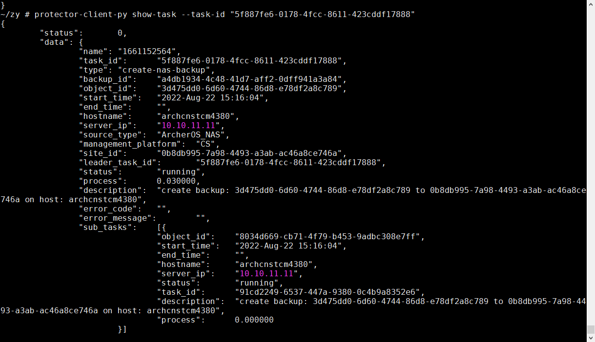
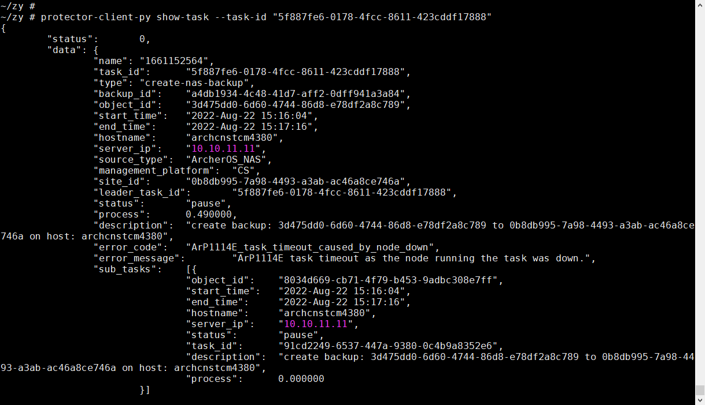
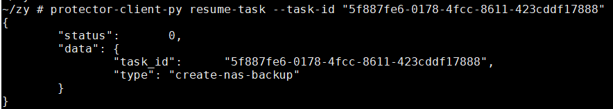
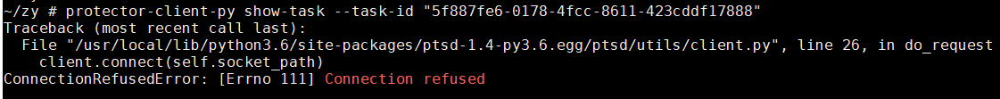
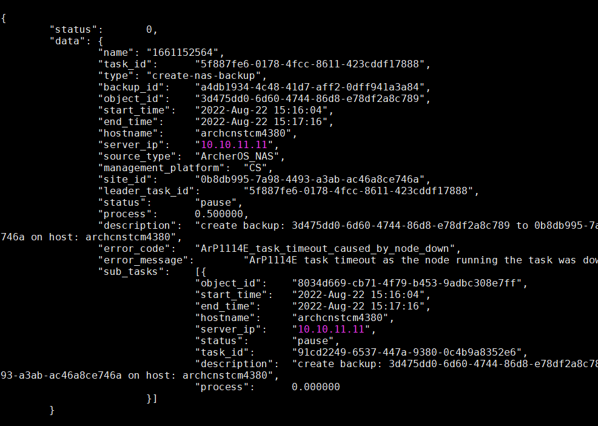
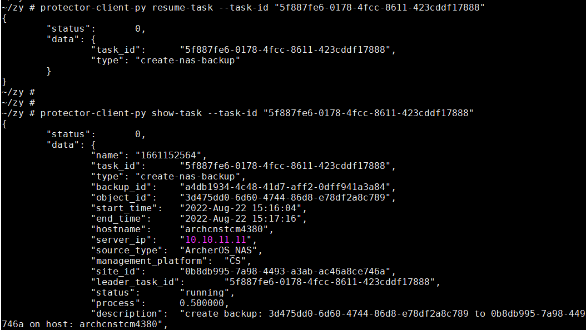
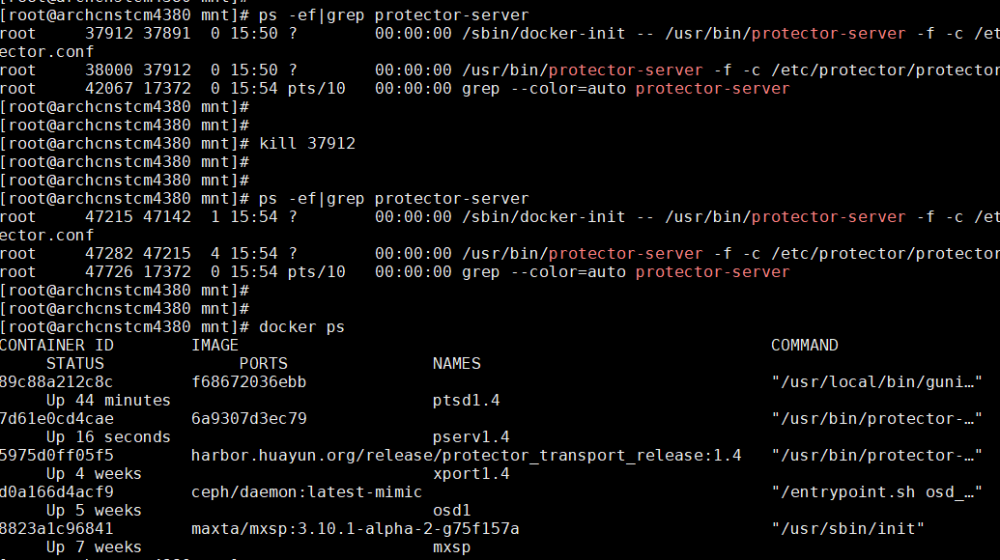
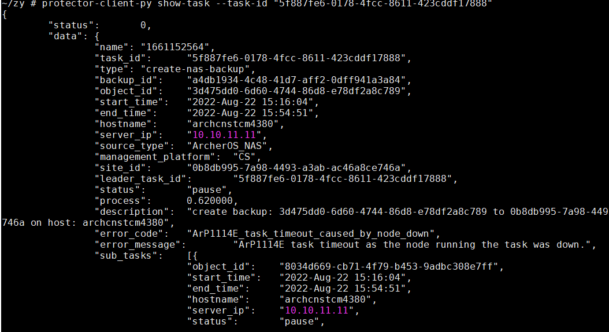
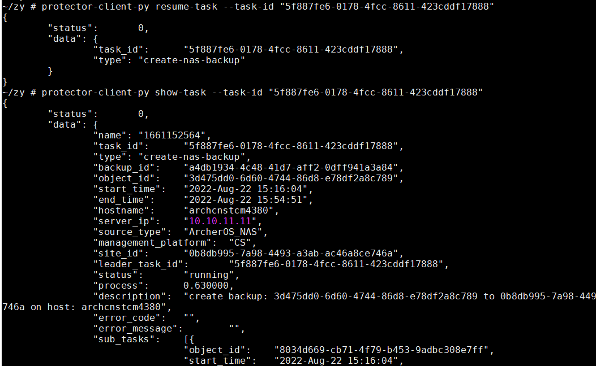
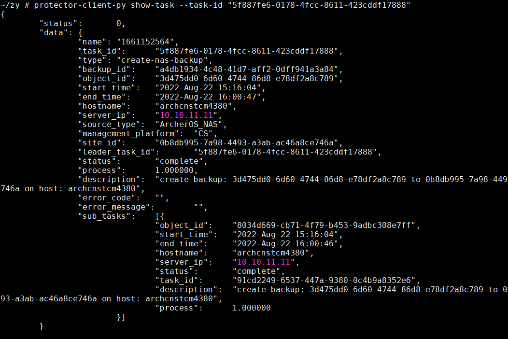

- create backup
  
- restart pserv
  
- resume task
  
- stop pserv
	- show task
	  
	- 半个小时超时后切换节点show task
	  
- resume task
  
- kill pserv
  
- task pause
  
- resume task
  
- task complete
  
-