- 12 create backup
  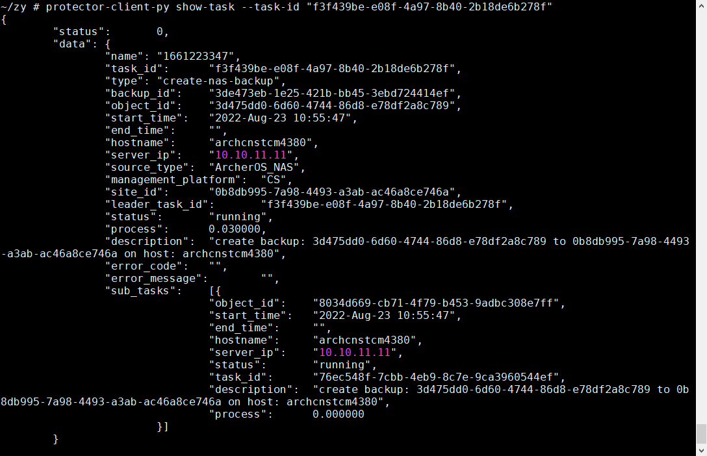
- 12 restart pserv
  `[root@archcnstcm4380 ~]# docker restart pserv1.4`
  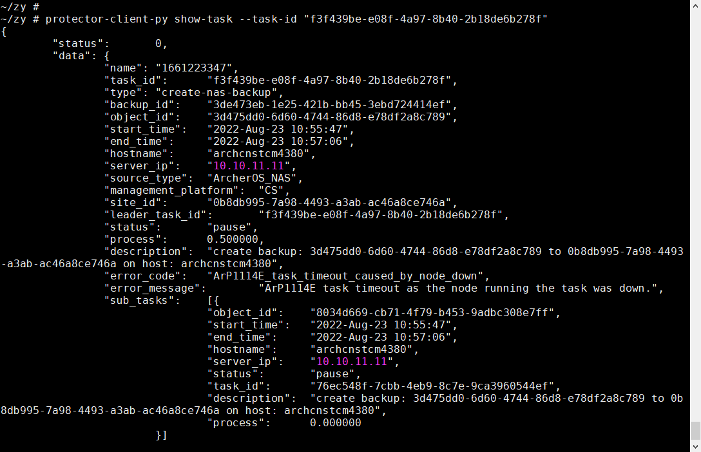
- 13 resume task
  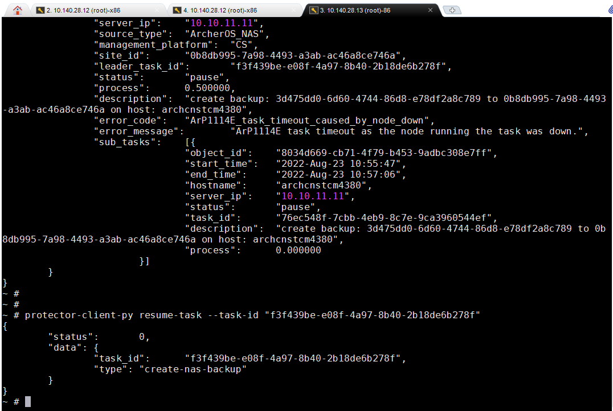
  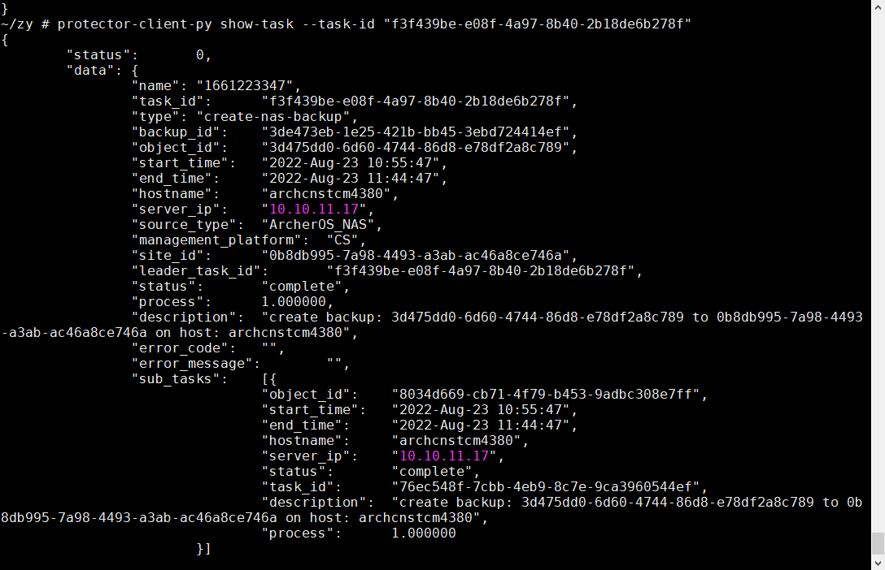
- 12 create backup
  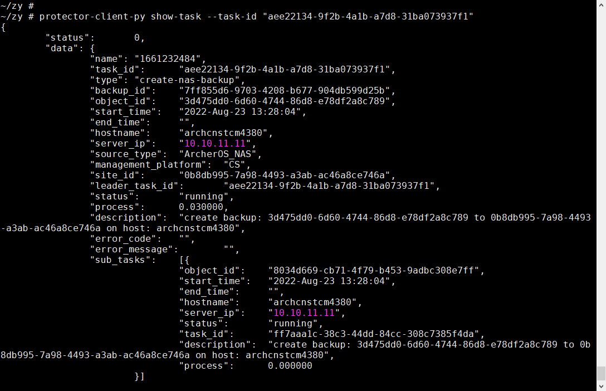
- 12 stop pserv
  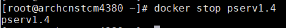
- 13 resume task
  
  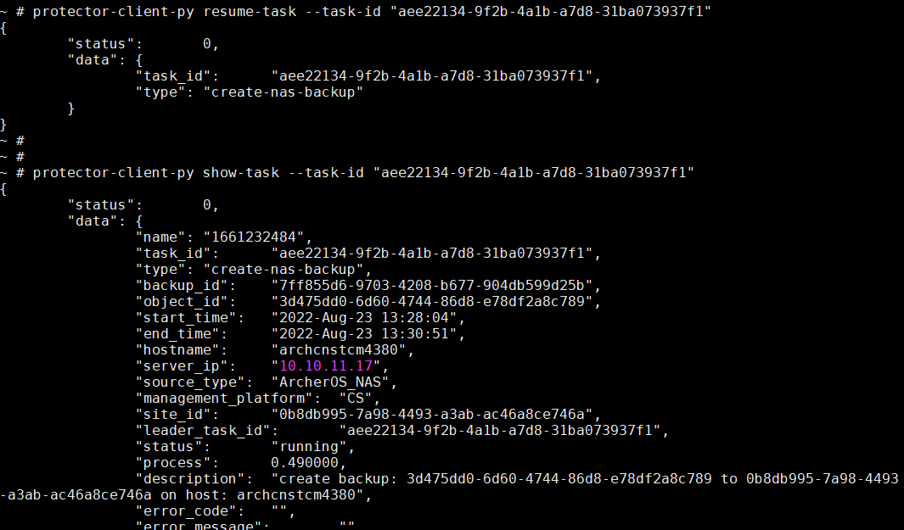
  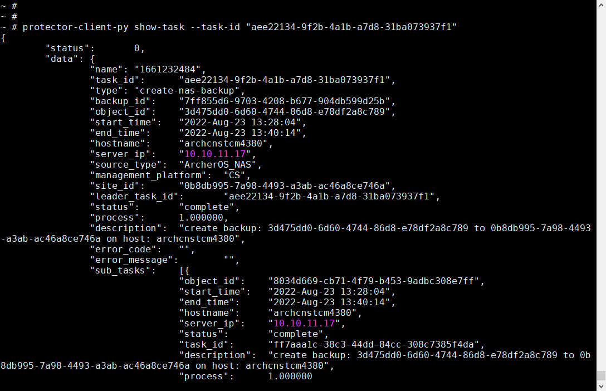
- 12 create backup
  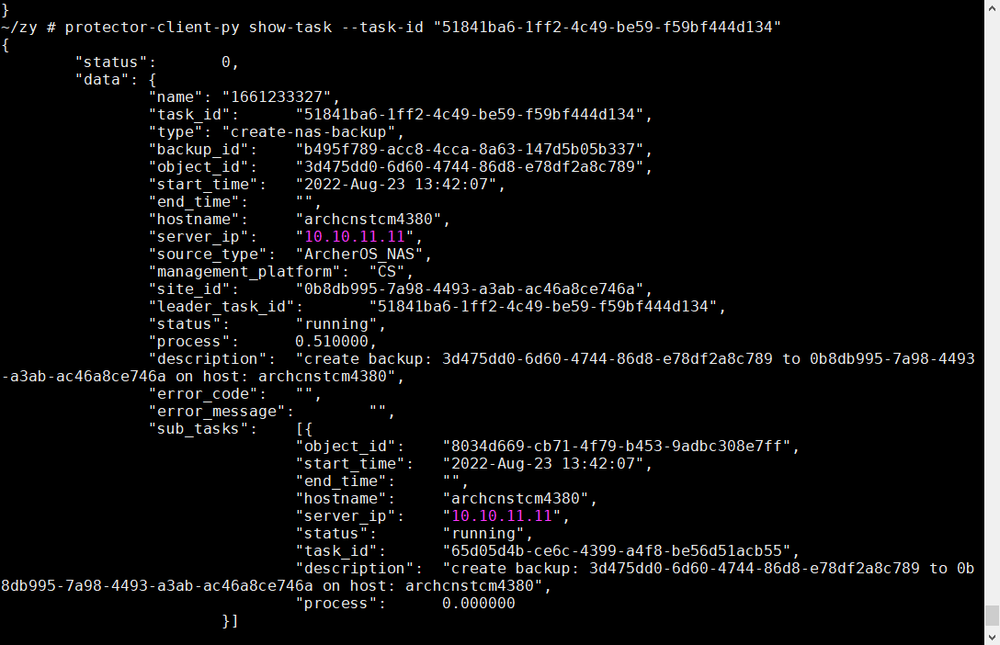
- 12 kill pserv
  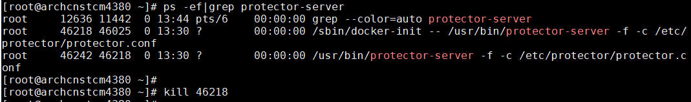
- 13 resume task
  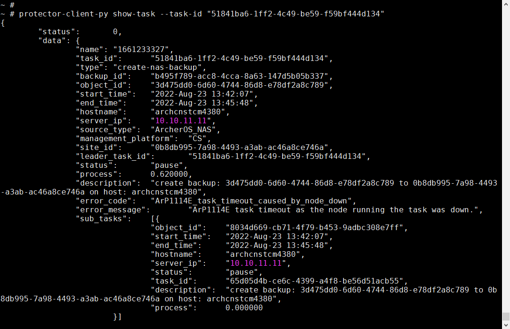
  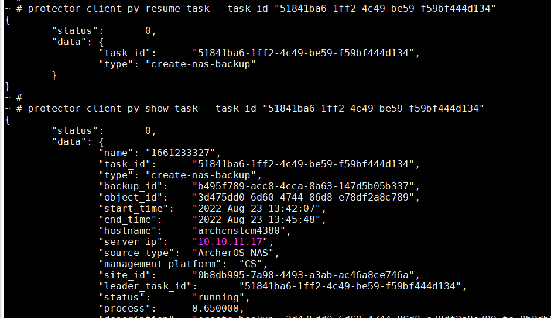
  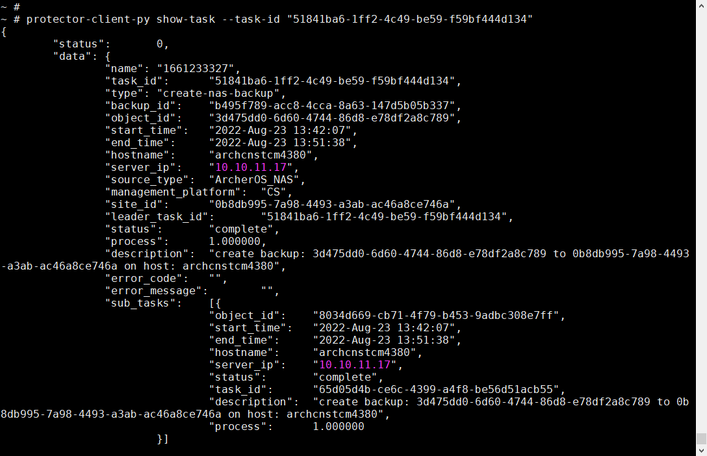
-