- 12 create backup
  
- 12 restart transport
  `docker restart xport1.4`
  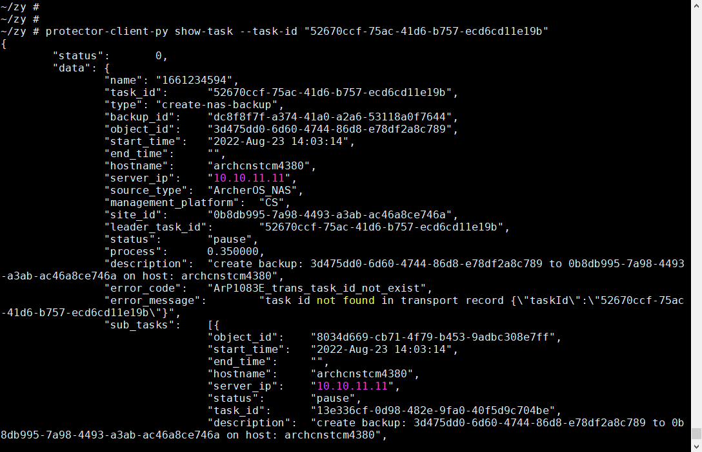
- 13 resume task
  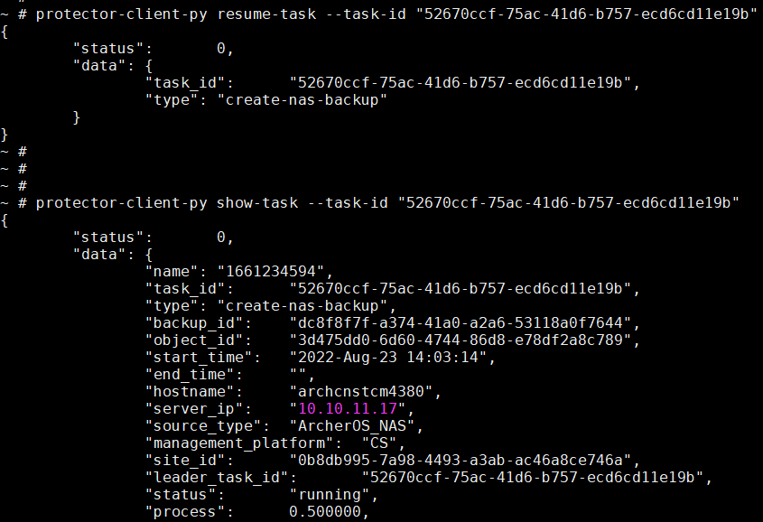
  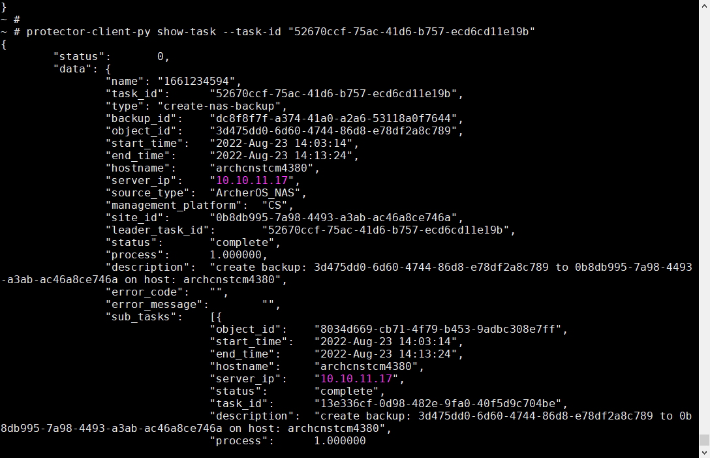
- 12 create backup
  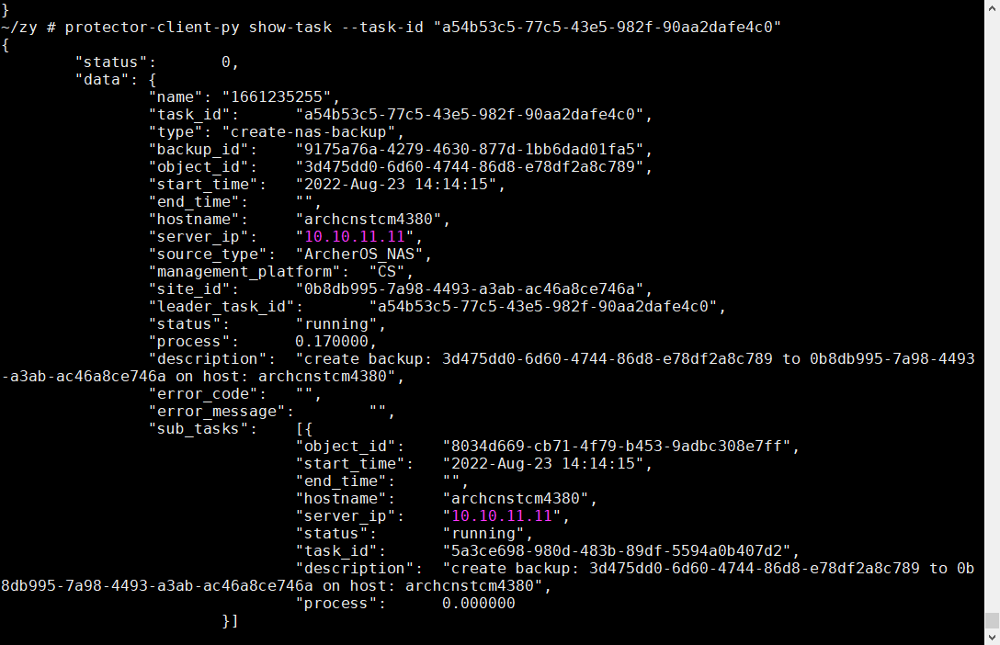
- 12 stop transport
  `docker stop xport1.4`
  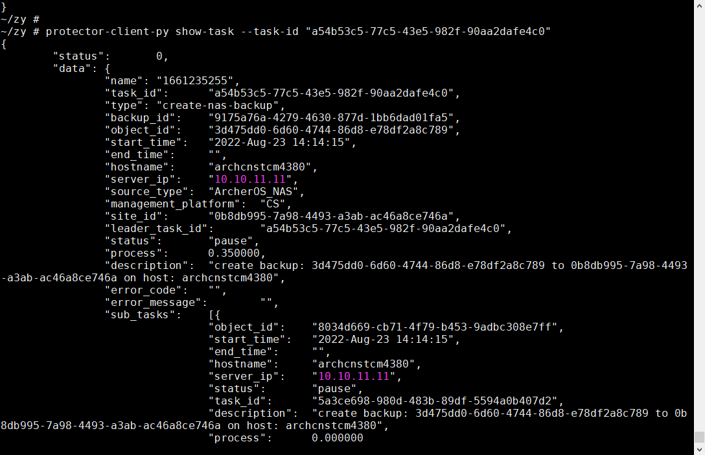
- 13 resume task
  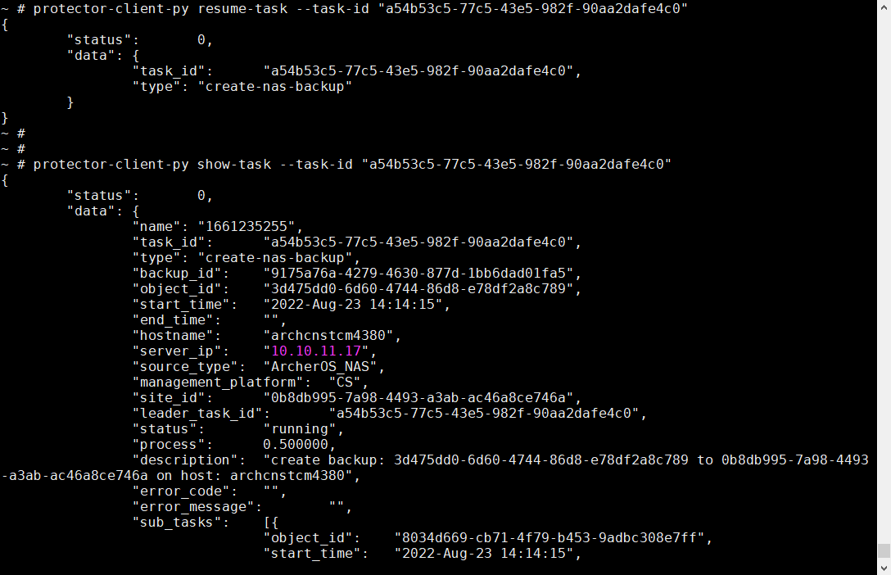
  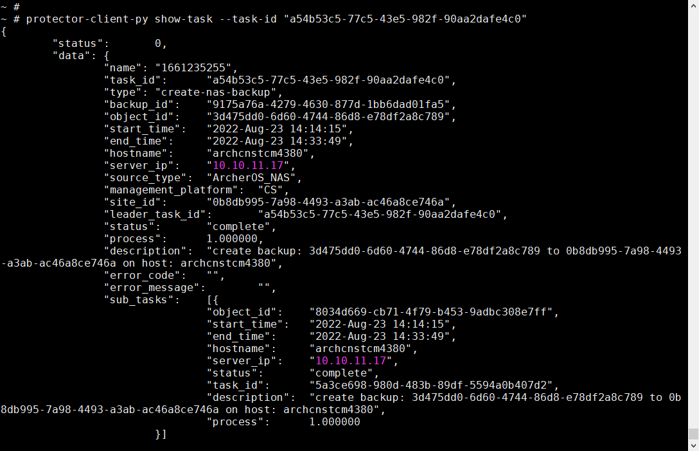
- 12 create backup
  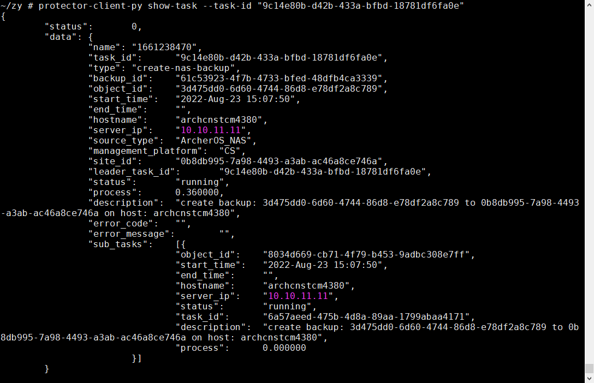
- 12 kill transport
  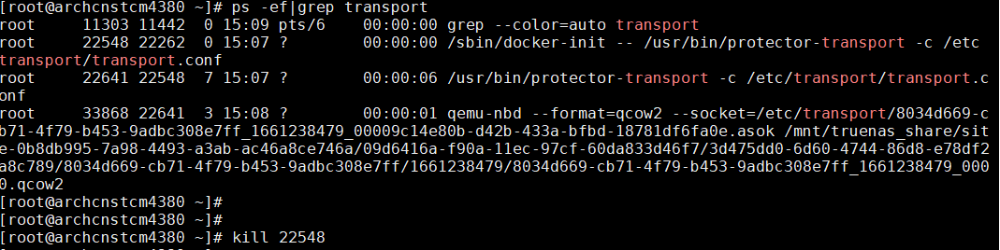
  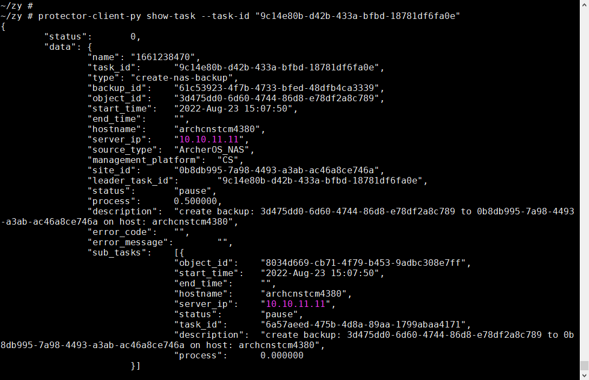
- 13 resume task
  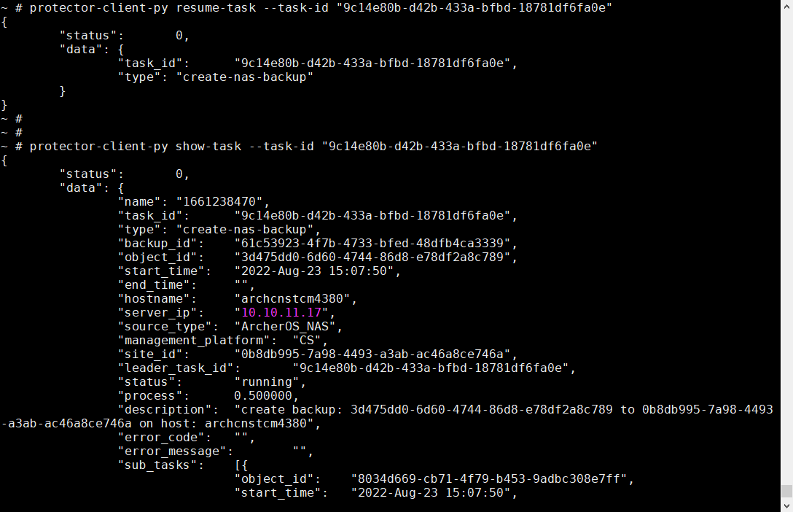
  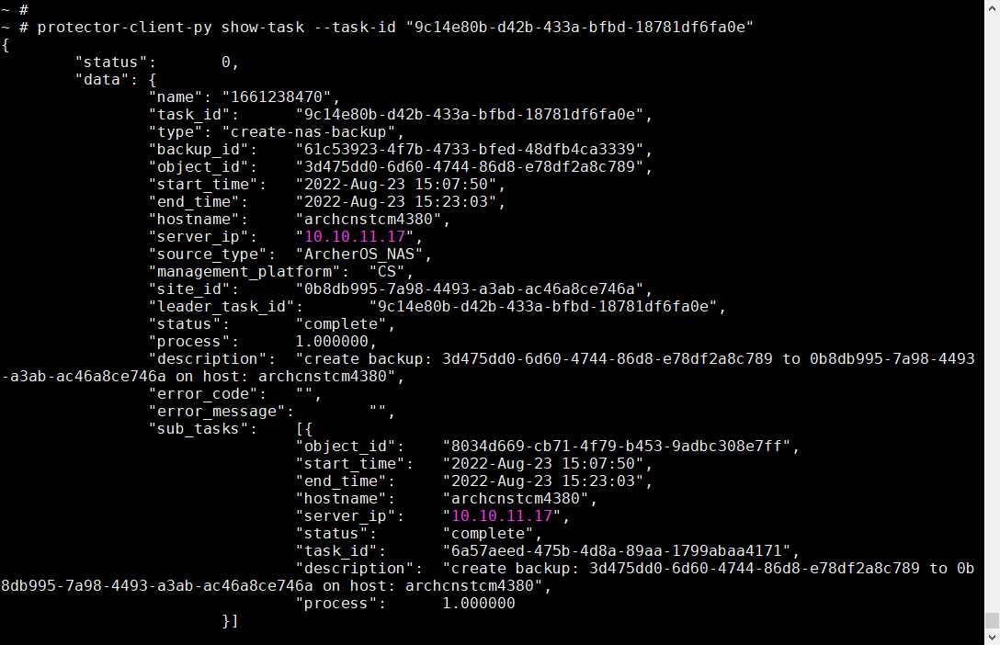
-