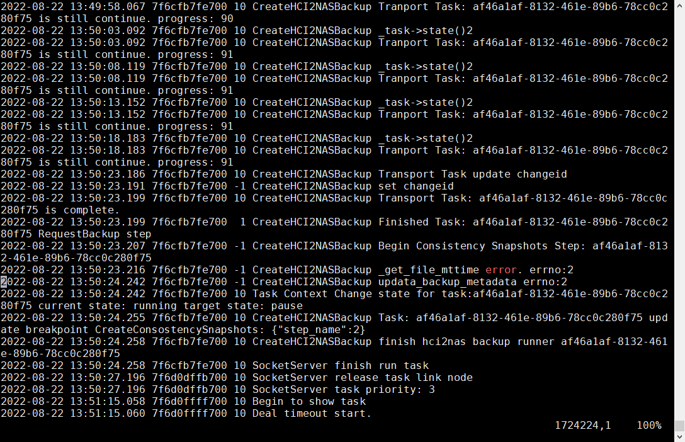
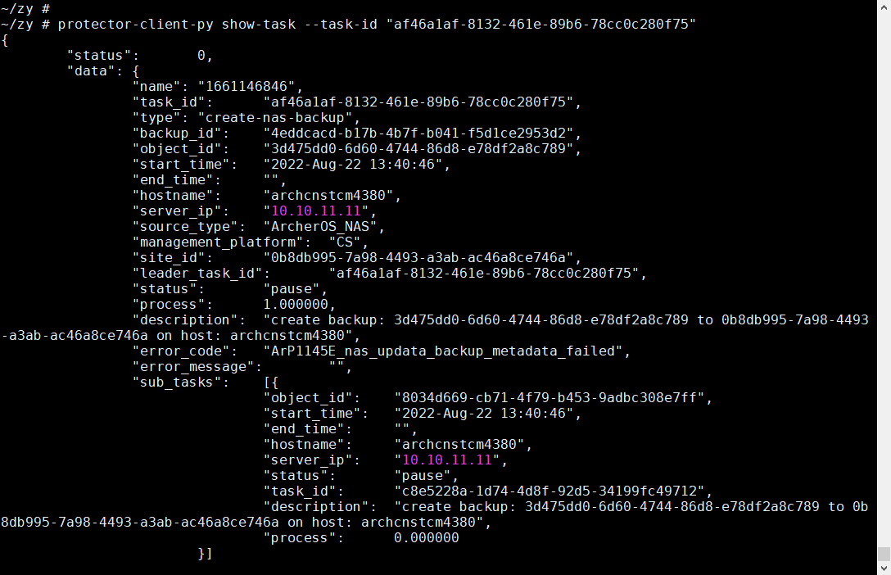

- 备份到10.142.192.38:/mnt/zpool/share  178G  128K  178G   1% /mnt/truenas_share
- 发起备份：
  ~/zy # sh backup.sh
  {
          "status":       0,
          "data": {
                  "task_id":      "af46a1af-8132-461e-89b6-78cc0c280f75"
          }
  }
- 挂载新目录覆盖：
  `[root@archcnstcm4380 ~]# mount -t nfs 10.142.192.69:/mnt/zpool/test /mnt/truenas_share/`
- 结果：
  
  
- 实际文件已写入
  `du -sh /mnt/truenas_share/ 16G  /mnt/truenas_share/`
- 卸载后resume完成：
  ```
  umount /mnt/truenas_share
  protector-client-py resume-task --task-id "af46a1af-8132-461e-89b6-78cc0c280f75"
  
  ~/zy # protector-client-py show-task --task-id "af46a1af-8132-461e-89b6-78cc0c280f75"
  {
          "status":       0,
          "data": {
                  "name": "1661146846",
                  "task_id":      "af46a1af-8132-461e-89b6-78cc0c280f75",
                  "type": "create-nas-backup",
                  "backup_id":    "4eddcacd-b17b-4b7f-b041-f5d1ce2953d2",
                  "object_id":    "3d475dd0-6d60-4744-86d8-e78df2a8c789",
                  "start_time":   "2022-Aug-22 13:40:46",
                  "end_time":     "2022-Aug-22 13:59:52",
                  "hostname":     "archcnstcm4380",
                  "server_ip":    "10.10.11.11",
                  "source_type":  "ArcherOS_NAS",
                  "management_platform":  "CS",
                  "site_id":      "0b8db995-7a98-4493-a3ab-ac46a8ce746a",
                  "leader_task_id":       "af46a1af-8132-461e-89b6-78cc0c280f75",
                  "status":       "complete",
                  "process":      1.000000,
                  "description":  "create backup: 3d475dd0-6d60-4744-86d8-e78df2a8c789 to 0b8db995-7a98-4493-a3ab-ac46a8ce746a on host: archcnstcm4380",
                  "error_code":   "",
                  "error_message":        "",
                  "sub_tasks":    [{
                                  "object_id":    "8034d669-cb71-4f79-b453-9adbc308e7ff",
                                  "start_time":   "2022-Aug-22 13:40:46",
                                  "end_time":     "2022-Aug-22 13:59:52",
                                  "hostname":     "archcnstcm4380",
                                  "server_ip":    "10.10.11.11",
                                  "status":       "complete",
                                  "task_id":      "c8e5228a-1d74-4d8f-92d5-34199fc49712",
                                  "description":  "create backup: 3d475dd0-6d60-4744-86d8-e78df2a8c789 to 0b8db995-7a98-4493-a3ab-ac46a8ce746a on host: archcnstcm4380",
                                  "process":      1.000000
                          }]
          }
  }
  
  ```