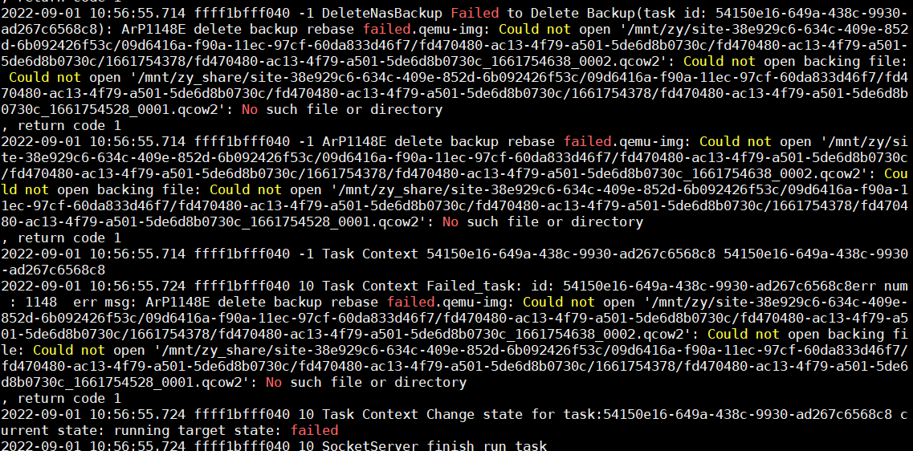

- {:height 279, :width 549}
- full "ee78a7b9-8674-4232-829b-469adfd364ee"
- inc1 "71e63e41-4a31-413b-b04d-43e29bfa3c78"
	- ```
	  [root@archcnstcm4380 ~]# qemu-img info /mnt/zy_share/site-0b8db995-7a98-4493-a3ab-ac46a8ce746a/09d6416a-f90a-11ec-97cf-60da833d46f7/b372ee2b-f70d-4433-8c1c-8dfd2c641a42/fd470480-ac13-4f79-a501-5de6d8b0730c/1662014920/fd470480-ac13-4f79-a501-5de6d8b0730c_1662015170_0001.qcow2
	  image: /mnt/zy_share/site-0b8db995-7a98-4493-a3ab-ac46a8ce746a/09d6416a-f90a-11ec-97cf-60da833d46f7/b372ee2b-f70d-4433-8c1c-8dfd2c641a42/fd470480-ac13-4f79-a501-5de6d8b0730c/1662014920/fd470480-ac13-4f79-a501-5de6d8b0730c_1662015170_0001.qcow2
	  file format: qcow2
	  virtual size: 20 GiB (21474836480 bytes)
	  disk size: 10.1 MiB
	  cluster_size: 65536
	  backing file: /mnt/zy_share/site-0b8db995-7a98-4493-a3ab-ac46a8ce746a/09d6416a-f90a-11ec-97cf-60da833d46f7/b372ee2b-f70d-4433-8c1c-8dfd2c641a42/fd470480-ac13-4f79-a501-5de6d8b0730c/1662014920/fd470480-ac13-4f79-a501-5de6d8b0730c_1662014920_0000.qcow2
	  Format specific information:
	      compat: 1.1
	      lazy refcounts: false
	      refcount bits: 16
	      corrupt: false
	  
	  ```
- 切换挂载点到/mnt/truenas_share
- 删除第一个备份点`protector-client-py delete-nas-backup --backup-id "ee78a7b9-8674-4232-829b-469adfd364ee"`
	- ```
	  2022-09-01 14:57:30.046 7fa5677fe700 10 DeleteNasBackup Begin to delete-nas-backup
	  2022-09-01 14:57:30.061 7fa5677fe700 10 DeleteNasBackup Checking status of site 0b8db995-7a98-4493-a3ab-ac46a8ce746a
	  2022-09-01 14:57:30.062 7fa5677fe700 10 DeleteNasBackup Deal timeout start.
	  2022-09-01 14:57:30.065 7fa5677fe700 10 Timeout Found running/pausing/canceling leader tasks counts:  0
	  2022-09-01 14:57:30.066 7fa5677fe700 10 DeleteNasBackup Deal timeout end.
	  2022-09-01 14:57:30.073 7fa5677fe700 10 DeleteNasBackup Check next backup 71e63e41-4a31-413b-b04d-43e29bfa3c78 is ready for delete.
	  2022-09-01 14:57:30.087 7fa5677fe700 10 Task Context Change state for task:a9acd501-7940-4af8-8fec-b30ed8ce7c1a current state: prepare target state: queue
	  2022-09-01 14:57:30.089 7fa5677fe700 10 DeleteNasBackup Put Delete task into queue: a9acd501-7940-4af8-8fec-b30ed8ce7c1a
	  2022-09-01 14:57:30.089 7fa5677fe700 10 SocketServer Put task into order queue: delete-nas-backup
	  2022-09-01 14:57:30.188 7fa5667fc700 10 SocketServer start run task: delete-nas-backup
	  2022-09-01 14:57:30.192 7fa5667fc700 10 Task Context Change state for task:a9acd501-7940-4af8-8fec-b30ed8ce7c1a current state: queue target state: running
	  2022-09-01 14:57:30.195 7fa5667fc700  1 DeleteNasBackup Delete Task: a9acd501-7940-4af8-8fec-b30ed8ce7c1a is going to runnning
	  2022-09-01 14:57:30.226 7fa5667fc700 10 DeleteNasBackup Success to update backup ee78a7b9-8674-4232-829b-469adfd364ee
	  2022-09-01 14:57:30.244 7fa5667fc700 10 DeleteNasBackup Success to update backup_metafile: /mnt/truenas_share/site-0b8db995-7a98-4493-a3ab-ac46a8ce746a/09d6416a-f90a-11ec-97cf-60da833d46f7/b372ee2b-f70d-4433-8c1c-8dfd2c641a42/backuplist.json
	  2022-09-01 14:57:30.246 7fa5667fc700 -1 object not persistent
	  2022-09-01 14:57:30.253 7fa5667fc700 10 DeleteNasBackup execute cmd: qemu-img rebase -t writeback -T writeback -p -b '' /mnt/truenas_share/site-0b8db995-7a98-4493-a3ab-ac46a8ce746a/09d6416a-f90a-11ec-97cf-60da833d46f7/b372ee2b-f70d-4433-8c1c-8dfd2c641a42/fd470480-ac13-4f79-a501-5de6d8b0730c/1662014920/fd470480-ac13-4f79-a501-5de6d8b0730c_1662015170_0001.qcow2 2>&1
	  2022-09-01 14:57:30.354 7fa5667fc700 10 DeleteNasBackup The current progress of the rebase:     (0.00/100%)
	  2022-09-01 14:57:30.381 7fa5667fc700 10 DeleteNasBackup The current progress of the rebase: qemu-img: Could not open '/mnt/truenas_share/site-0b8db995-7a98-4493-a3ab-ac46a8ce746a/09d6416a-f90a-11ec-97cf-60da833d46f7/b372ee2b-f70d-4433-8c1c-8dfd2c641a42/fd470480-ac13-4f79-a501-5de6d8b0730c/1662014920/fd470480-ac13-4f79-a501-5de6d8b0730c_1662015170_0001.qcow2': Could not open backing file: Could not open '/mnt/zy_share/site-0b8db995-7a98-4493-a3ab-ac46a8ce746a/09d6416a-f90a-11ec-97cf-60da833d46f7/b372ee2b-f70d-4433-8c1c-8dfd2c641a42/fd470480-ac13-4f79-a501-5de6d8b0730c/1662014920/fd470480-ac13-4f79-a501-5de6d8b0730c_1662014920_0000.qcow2': No such file or directory
	  
	  2022-09-01 14:57:30.381 7fa5667fc700 -1 DeleteNasBackup rebase failed, result is qemu-img: Could not open '/mnt/truenas_share/site-0b8db995-7a98-4493-a3ab-ac46a8ce746a/09d6416a-f90a-11ec-97cf-60da833d46f7/b372ee2b-f70d-4433-8c1c-8dfd2c641a42/fd470480-ac13-4f79-a501-5de6d8b0730c/1662014920/fd470480-ac13-4f79-a501-5de6d8b0730c_1662015170_0001.qcow2': Could not open backing file: Could not open '/mnt/zy_share/site-0b8db995-7a98-4493-a3ab-ac46a8ce746a/09d6416a-f90a-11ec-97cf-60da833d46f7/b372ee2b-f70d-4433-8c1c-8dfd2c641a42/fd470480-ac13-4f79-a501-5de6d8b0730c/1662014920/fd470480-ac13-4f79-a501-5de6d8b0730c_1662014920_0000.qcow2': No such file or directory
	  , return code 1
	  2022-09-01 14:57:30.401 7fa5667fc700 -1 ArP1148E delete backup rebase failed.qemu-img: Could not open '/mnt/truenas_share/site-0b8db995-7a98-4493-a3ab-ac46a8ce746a/09d6416a-f90a-11ec-97cf-60da833d46f7/b372ee2b-f70d-4433-8c1c-8dfd2c641a42/fd470480-ac13-4f79-a501-5de6d8b0730c/1662014920/fd470480-ac13-4f79-a501-5de6d8b0730c_1662015170_0001.qcow2': Could not open backing file: Could not open '/mnt/zy_share/site-0b8db995-7a98-4493-a3ab-ac46a8ce746a/09d6416a-f90a-11ec-97cf-60da833d46f7/b372ee2b-f70d-4433-8c1c-8dfd2c641a42/fd470480-ac13-4f79-a501-5de6d8b0730c/1662014920/fd470480-ac13-4f79-a501-5de6d8b0730c_1662014920_0000.qcow2': No such file or directory
	  , return code 1
	  2022-09-01 14:57:30.401 7fa5667fc700 -1 DeleteNasBackup Failed to Delete Backup(task id: a9acd501-7940-4af8-8fec-b30ed8ce7c1a): ArP1148E delete backup rebase failed.qemu-img: Could not open '/mnt/truenas_share/site-0b8db995-7a98-4493-a3ab-ac46a8ce746a/09d6416a-f90a-11ec-97cf-60da833d46f7/b372ee2b-f70d-4433-8c1c-8dfd2c641a42/fd470480-ac13-4f79-a501-5de6d8b0730c/1662014920/fd470480-ac13-4f79-a501-5de6d8b0730c_1662015170_0001.qcow2': Could not open backing file: Could not open '/mnt/zy_share/site-0b8db995-7a98-4493-a3ab-ac46a8ce746a/09d6416a-f90a-11ec-97cf-60da833d46f7/b372ee2b-f70d-4433-8c1c-8dfd2c641a42/fd470480-ac13-4f79-a501-5de6d8b0730c/1662014920/fd470480-ac13-4f79-a501-5de6d8b0730c_1662014920_0000.qcow2': No such file or directory
	  , return code 1
	  2022-09-01 14:57:30.401 7fa5667fc700 -1 ArP1148E delete backup rebase failed.qemu-img: Could not open '/mnt/truenas_share/site-0b8db995-7a98-4493-a3ab-ac46a8ce746a/09d6416a-f90a-11ec-97cf-60da833d46f7/b372ee2b-f70d-4433-8c1c-8dfd2c641a42/fd470480-ac13-4f79-a501-5de6d8b0730c/1662014920/fd470480-ac13-4f79-a501-5de6d8b0730c_1662015170_0001.qcow2': Could not open backing file: Could not open '/mnt/zy_share/site-0b8db995-7a98-4493-a3ab-ac46a8ce746a/09d6416a-f90a-11ec-97cf-60da833d46f7/b372ee2b-f70d-4433-8c1c-8dfd2c641a42/fd470480-ac13-4f79-a501-5de6d8b0730c/1662014920/fd470480-ac13-4f79-a501-5de6d8b0730c_1662014920_0000.qcow2': No such file or directory
	  , return code 1
	  2022-09-01 14:57:30.402 7fa5667fc700 -1 Task Context a9acd501-7940-4af8-8fec-b30ed8ce7c1a a9acd501-7940-4af8-8fec-b30ed8ce7c1a
	  2022-09-01 14:57:30.407 7fa5667fc700 10 Task Context Failed_task: id: a9acd501-7940-4af8-8fec-b30ed8ce7c1aerr num : 1148  err msg: ArP1148E delete backup rebase failed.qemu-img: Could not open '/mnt/truenas_share/site-0b8db995-7a98-4493-a3ab-ac46a8ce746a/09d6416a-f90a-11ec-97cf-60da833d46f7/b372ee2b-f70d-4433-8c1c-8dfd2c641a42/fd470480-ac13-4f79-a501-5de6d8b0730c/1662014920/fd470480-ac13-4f79-a501-5de6d8b0730c_1662015170_0001.qcow2': Could not open backing file: Could not open '/mnt/zy_share/site-0b8db995-7a98-4493-a3ab-ac46a8ce746a/09d6416a-f90a-11ec-97cf-60da833d46f7/b372ee2b-f70d-4433-8c1c-8dfd2c641a42/fd470480-ac13-4f79-a501-5de6d8b0730c/1662014920/fd470480-ac13-4f79-a501-5de6d8b0730c_1662014920_0000.qcow2': No such file or directory
	  , return code 1
	  2022-09-01 14:57:30.407 7fa5667fc700 10 Task Context Change state for task:a9acd501-7940-4af8-8fec-b30ed8ce7c1a current state: running target state: failed
	  2022-09-01 14:57:30.409 7fa5667fc700 10 SocketServer finish run task
	  ```
-
- ## 切换挂载点后删除中间备份点
- 备份点
	- DONE "92b9b442-26e2-46b6-836c-fabd662788d5"
	- DONE "9d278463-2828-442a-b05c-f202e057a71a"
	- DONE "d866de0d-7575-4cd8-a21f-3342bb01bac4"
-
- 切换挂载点
- 删除备份点
- ```
  /mnt/truenas_share/site-0b8db995-7a98-4493-a3ab-ac46a8ce746a/09d6416a-f90a-11ec-97cf-60da833d46f7/b372ee2b-f70d-4433-8c1c-8dfd2c641a42/fd470480-ac13-4f79-a501-5de6d8b0730c/1662034830/fd470480-ac13-4f79-a501-5de6d8b0730c_1662035936_0003.qcow2
  ```