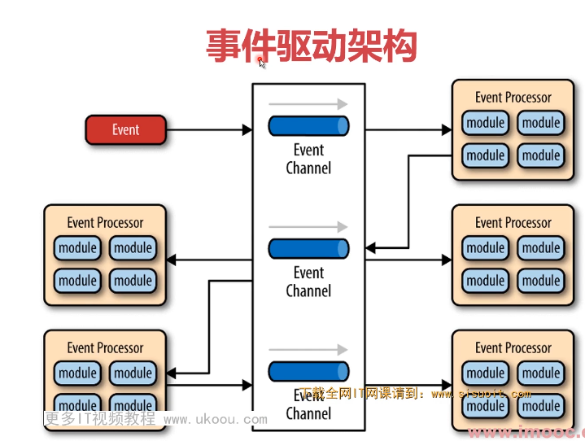
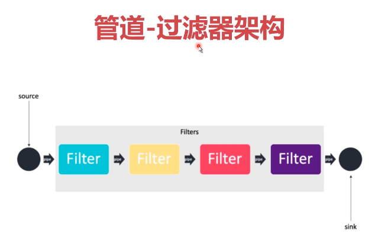
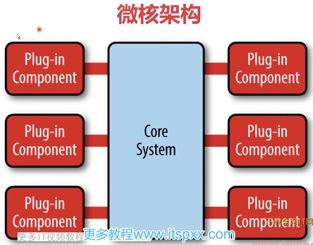
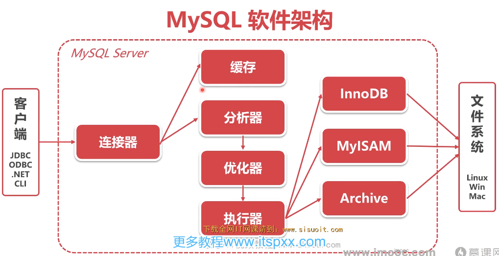
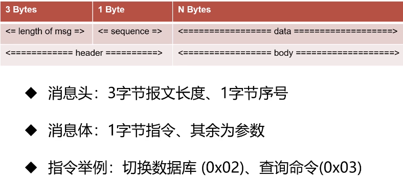
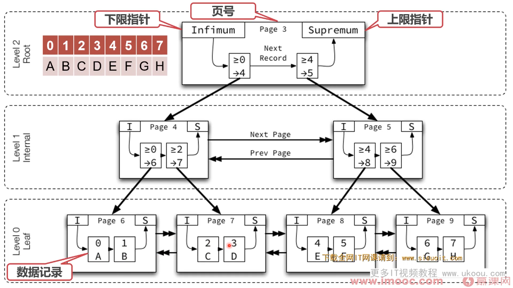
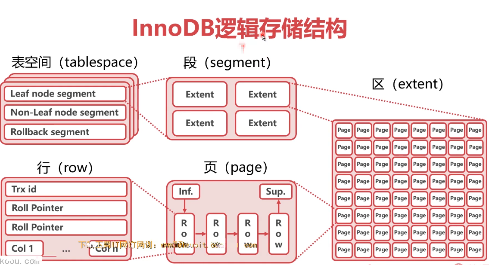

- ## 一个SQL语句如何执行
  collapsed:: true
	- 数据库软件的典型架构
	  collapsed:: true
		- 分层架构
			- Presentation Layer
			- Business Layer
			- Persistence Layer
			- Database Layer
		- 事件驱动架构
			- 
		- 管道-过滤器架构
			- 
		- 微核架构
			- 
		-
	- MySQL软件架构
		- 
		- 分析-优化-执行
	- 客户端如何连接MySQL数据库
		- 连接方式
			- TCP/IP连接
				- 任何平台都提供的连接方法
				- 步骤：
					- 三次握手建立TCP连接
					- 认证连接
						- 服务端->客户端：发送握手初始化包
						- 客户端->服务端：发送验证
						- 服务段->客户端：认证结果消息
					- 认证通过，客户端与服务段之间交互（命令执行）
						- 客户端->服务端：发送命令包（Command Packet）
						- 服务段->客户端：发送回应包
					- 断开连接
						- 客户端->服务端：发送推出命令包
					- 四次挥手断开TCP连接
				- MySQL TCP报文格式
					- 
					- 抓包
						- wireshark(win)
						- tcpdump(linux)
			- 命名管道
				- 命名管道：同一台服务器通讯（win）
			- 共享内存
				- 服务端：配置--shared-memory
				- 客户端：配置--protocol=memory
			- UNIX域套接字
				- 服务端：配置--socket=/tmp/mysql.sock
				- 客户端：配置-S=/tmp/mysql.sock
		- 总结：
			- TCP/IP连接是MySQL最常用的连接方式
			- TCP/IP连接报文可以作为其他C/S架构的参考
			- 其他连接方式均限于本机连接，使用范围有限
	- 一个SQL语句是怎么执行的？
		- 查询缓存
			- 之前执行过的语句会以KV的形式缓存在内存中
			- 查询先前查找过的相同语句
			- 不推荐使用缓存：数据表修改后，会删除所有相关缓存
			- MySQL8.0已经去掉查询缓存
		- 分析器
			- 作用是知道你要干什么
			- 先做词法分析，识别sql语句中的关键字
			- 再做句法分析，识别sql语句是否符合语法
		- 优化器
			- 作用是知道怎么做
			- 主要工作是决定如何使用索引
		- 执行器
			- 校验权限、调用存储引擎
			- 首先校验此用户对目标数据有无权限
			- 以行为力度，调用存储引擎，执行SQL
			- 在没有索引的情况下，执行器会循环查询所有行
		- 存储引擎
			- 任务是将执行器的指令落实在数据文件上
	- MySQL常见存储引擎
		- InnodDB
			- 5.5.5之后的默认
			- 支持事务、外键
		- MyISAM
			- MySQL5.5.5之前的默认存储引擎
			- 插入数据块
			- 空间利用率高
			- 不支持事务
		- Memory
			- 所有的数据都在内存中，速度快
			- 数据安全性差
		- Archive
			- 数据压缩、空间利用率高
			- 插入速度快
			- 不支持索引，查询性能差
	- 为什么需要数据库？
		- 面向软件
		- 支持事务
		- 有SQL语言
		- 可扩展
- ## 如何建表更适合业务
	- 什么叫索引组织表？
		- 索引组织表(Index Organized Table)
			- 索引组织表不是一种“组织表”
			- 由索引组织起来的表
			- InnoDB中，表都是根据主键顺序组织存放的
		- 索引（Index）
			- 索引是数据库中对某一列或多个列的值进行预排序的数据结构
			- 可以理解为数据的“目录”
			- InnoDB中，主键是一个特殊索引字段
		- 主键（Primary Key）
			- 每张表都有一个主键
			- 若表中有一个非空唯一索引（Unique NOT NULL），即为主键
			- 若多个，选择第一个
			- 若无，自动创建一个6字节的指针作为主键
		- 总结
			- InnoDB数据表均为索引组织表
			- 索引组织表中的数据，被主键的索引组织起来
	- B+树的“B”是什么意思？
		- 主流索引查找算法
			- 线性查找Linear Search，N
			- 二分查找Binary Search，logN
			- 二叉查找树Binary Search Tree，logN
			- 平衡二叉树AVL Tree
			- B树B Tree
			- B+树 B+ Tree
				- 由线性表、二叉树、B树发展而来
				- 所有数据均在叶子节点
				- 所有数据形成一个线性表，适合范围查找，磁盘利用效率高
	- 为什么说InnoDB索引即数据
		- 索引
			- B+树的高度一般为2-4层，查找速度非常快
			- InnoDB索引分为聚簇索引（主索引）和辅助索引
			- 同层B+树节点之间，为双向链表
			- 在B+树节点之内，数据条目之间为单向链表
		- 聚簇索引Clustered Index
			- 根据表的主键构造一个B+树
			- 叶子节点直接存放行数据，而不是指针
			- 索引组织表中，数据也是B+树的一部分
			- 
		- 辅助索引Secondary Index
			- 每张表可以有多个辅助索引
			- 叶子节点记录了行数据的主键，用来指示数据位置
		- InnoDB数据表如何存储
			- 
			- 表空间（tablespace）
				- 表空间指的是数据表在硬盘上的存储空间
				- 段（segment）
					- 数据段：Leaf node segment
					- 索引段：Non-Leaf node segment
					- Rollback segment
				- 区（extent）
					- 由连续页组成的空间，大小为1MB，64page（16KB）
					- 一次磁盘申请4-5个区
				- 页（page）
					- InnoDB中磁盘读写的最小逻辑单位，默认为16KB
					- 一个数据页就是一个B+树的节点
					- 页的大小充分考虑了机械硬盘和SSD的最小单元（512B和4KB)
					- 页不能太大，考虑磁盘读写效率压力，线性搜索效率低和内存空间占用
					- 页不能太小，数据浪费
			- InnoDB数据行
				- 变长列
					- 长度不固定的数据类型：
						- VARCHAR, VARBINARY, BLOB, TEXT
					- 占用空间大鱼768Byte的不变长类型：
						- CHAR
					- 变长编码下（utf8）的CHAR
				- 行溢出数据
					- 当数据字段过大时，InnoDB会使用行溢出机制
					- 行溢出机制会把超长字段放入单独开辟的数据页
				- 行记录格式
					- Redundant/Compact(Antelop)
					- Dynamic/Compressed(Barracuda)
					- 总结
						- 行记录格式进化的核心需求是节约行记录空间，B+树节点存更多数据
						- 节约行记录空间从而增加每个页的数据行数，提高查询效率
			- 索引有哪些“左侧用法”
				- 联合索引
					- 使用两个或以上字段生成的索引
					- 联合索引也可以加速“最左前缀”的查询
					- 可以代替最左侧字段的单独索引
					- “带头大哥不能死，中间兄弟不能丢”
				- 字符串的前缀索引
					- 如果字符串过长，可以使用前缀索引节约空间
					- 如果前缀区分度太小，可以考虑：
						- 倒序存储
						- 新建Hash字段
						- alter table user add index index2(email(6))
					- 字符串like
						- (like %关键字%)(like %关键字)会使索引失效
						- 左模糊才可以使用索引
			- 如何约束数据？
				- Primary Key/ Unique Key
				- Foreign Key
				- Default /NOT NULL
				- 触发器（插入修改数据时，校验数据，容易干扰业务，使用很少）
			- 如何使用不存在的数据表？
				- 视图View
					- 视图可以创建不存在的虚拟表
					- 原理是预设一个SELECT语句
					- SELECT语句的查询结果作为虚拟表的数据
				- 视图算法的选择
					- MERGE，将视图SQL合并到著查询SQL中（一般性能更优）
					- TEMPTABLE，将视图作临时师表（中间结果）来处理
		- 本章小结
			- 理论-实践
				- 增加每页数据量
					- 冷热数据分离，减小表的宽度
					- 选择符合存储需要的最小的数据类型
				- 避免行溢出：
					- BLOB或是TEXT列分离到单独的扩展表中
					- 禁止在数据库中存储图片，文件等大的二进制数据
				- 控制B+树高度：
					- 控制单表数据量的大小，建议控制在500万以内